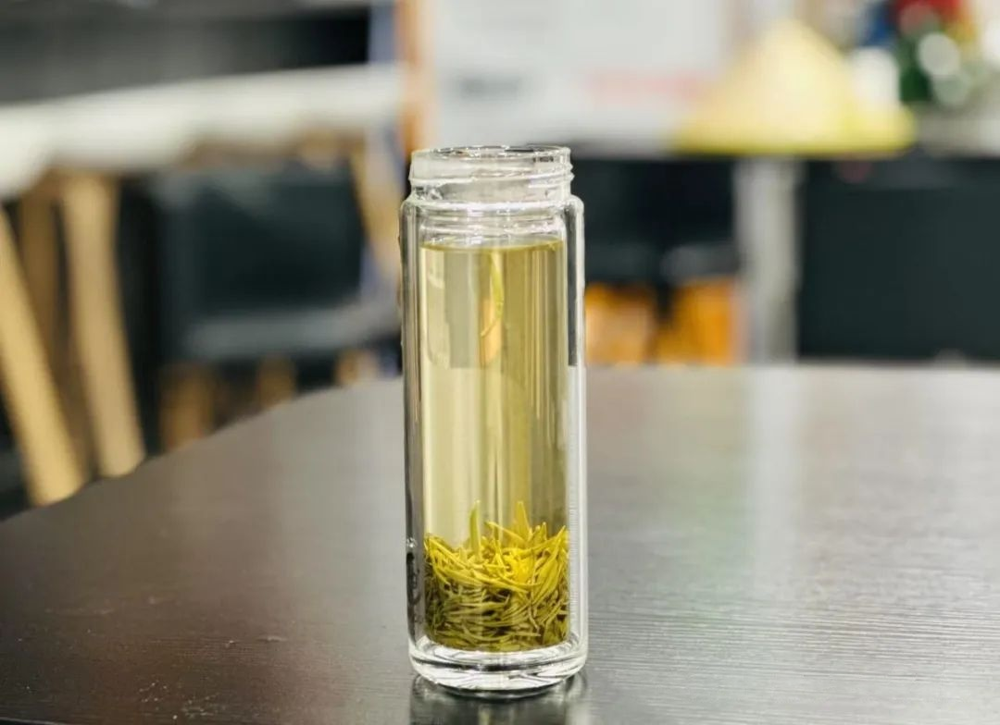

  

作为中国人，对绿茶一定不陌生。相传远古时期神农尝百草，便有了绿茶的雏形。作为中国最早出现的茶类，绿茶也是产量最大、产区最广、品种最多的茶种。2023 年，其产量占全国茶叶总产量的 51.48%，18 个主要产茶省几乎都有绿茶产出，品种已超 300 种。
生活中，不少朋友都爱喝绿茶。看翠绿的茶叶在玻璃杯中上下沉浮，既品味鲜爽茶香，又能感受视觉享受。
  
然而，很多人误以为绿色的茶就是绿茶。本文将从制作工艺、分类、品鉴方法、冲泡技巧入手，还会分享茶点搭配与茶席布置心得，助你深度领略绿茶之美，把茶喝懂、喝透!
  绿茶的特征
  

绿茶属于不发酵茶，讲究外形和色泽，追求清新鲜爽，多采用嫩芽制成。绿茶茶性偏寒凉，在防衰老、防癌、杀菌、消炎等方面作用突出，适合上火、抽烟等人群经常饮用；脾胃虚弱者则要适量饮用；忌空腹或睡前饮用。
 # 3绿特征
***①干茶绿***
常见干茶颜色有嫩绿、黄绿、翠绿、苍绿等
***②汤色绿***
常见茶汤颜色有嫩绿、浅绿、杏绿、黄绿等
***③叶底绿***
常见叶底颜色有嫩绿、黄绿等
  

  

  绿茶的工艺
  

新鲜采摘的茶叶会进行一定时间的“摊放”，目的是让茶叶失水，同时散掉一定青草气。接下来就进入绿茶制作最主要的三个步骤，如下：
  

  01杀青：锁住绿色的秘密
是绿茶制作的关键环节
目的是通过高温破坏酶的活性、阻止茶叶氧化变色；去青草气、提茶香；同时为下一步揉捻做准备(高温汽化使叶片变得柔软）
杀青的方式有：锅炒、热风、蒸气、滚筒
杀青的温度在200～300°C，时间约4～5分钟，杀青后叶子变暗变软、青气消失、茶香溢出。
  02揉捻：塑造茶叶的形状
目的是塑造外形，如条形、针形、颗粒等、同时揉出茶汁粘附叶表(有利于提升冲泡时茶汤浓度和滋味)
揉捻方式有: 手揉、机揉
揉捻会根据叶子老嫩不同而区分，嫩叶轻揉20～25分钟，老叶重揉约40分钟。
  03干燥：定型与提升香气
目的是进一步散去水分、固形、提香
干燥方法有炒干、烘干、晒干或烘炒结合，温度通常控制在50～60°C。
  

  绿茶的分类
根据上述制作工艺，绿茶可分为4类

  

  绿茶的冲泡
***茶水比例：1:50***
***水温控制：80～85°C***
***出汤时间：第一泡15s～30s, 后每次递增10s，可泡3～4泡***
 # 用盖碗冲泡方法：
温杯-投茶-注水(沿盖碗边缘缓缓注入）-出汤
 # 用玻璃杯的方法：
  3种投茶法
  ***下投法*** 适合叶片较大、嫩度较低的，如太平猴魁、六安瓜片等
  ***中投法*** 适合大部分绿茶，如龙井、雀舌等
  ***上投法*** 适合叶片细小、茶毫多的，如碧螺春、信阳毛尖

  绿茶的品鉴
  倘若喝茶时，您仅能给出诸如 “好喝”“一般”“不好喝”“有点甜”“有点苦” 这类流于表面的评价，那么不妨静下心来，听听接下来这些品鉴建议。将从干茶外形（嫩度、色泽、整碎、净度）到汤色、香气、滋味以及叶底多维度，全方位带您喝懂一款茶。
  

从此，每一口茶汤入喉，您都能深切领略到色、香、味交融的美妙，全身心沉浸在喝茶这件事上，让品鉴能力稳步提升，进而对生活萌发出更精致的追求。
  

 # 01看外形 
 ***嫩度：芽头多且肥壮，芽叶匀齐、细嫩的绿茶品质优。***
 ***条索：卷曲形的碧螺春要求条索紧结、卷曲如螺；扁平形的龙井需扁平光滑、挺直。***
 ***色泽：优质绿茶的色泽应绿润鲜活。若色泽灰暗、枯黄或有杂色，则品质较差。***
 ***整碎：好的绿茶要求茶叶完整，断碎茶少***
 ***净度：纯净无杂质，不含梗、片、末及非茶类夹杂物的绿茶，净度高，品质较好***
 # 02闻香气
优质绿茶的香气通常为鲜嫩的毫香、栗香、兰花香、豆香等，香气清高、持久。例如，碧螺春有花果香，龙井有豆香和板栗香，黄山毛峰有兰花香。如果有烟味、焦味、陈味、霉味等异味，则表明茶叶品质有问题。
  03辩汤色
汤色以浅绿、黄绿、嫩绿清澈明亮为好。例如，西湖龙井的汤色黄绿明亮，安吉白茶的汤色嫩绿明亮。若汤色深黄、暗浊、有沉淀，则可能是鲜叶不新鲜、加工工艺不当或储存时间过长，导致茶汤品质下降。
  04品滋味
  品质好的绿茶滋味鲜爽回甘，醇厚饱满。如碧螺春滋味鲜醇甘厚，回甘持久；滋味淡薄、苦涩或有异味，则茶叶品质不佳。
  05观叶底
 ***嫩度：鲜嫩、质地柔软，说明茶叶的原料好且制作工艺过硬。***
 ***色泽：绿亮、匀整为佳。若色泽花杂有红变可能是制作工艺不过关。***
 ***匀度：大小、老嫩均匀，说明鲜叶采摘标准一致，加工工艺稳定。***
  

  

  

  

  

  如何储存
 绿茶易氧化变色，需遵循“密封、避光、防潮、低温、避异味”的原则。
 短期储存：
 3月以内：密封、阴凉、干燥处存放
 长期储存：
 6月以上：抽真空后放入冰箱冷场，避免与食物混放
 注意事项：
 开封后尽快饮用，避免反复开合
 冷藏取出后需静置至室温再开封，防止水汽凝结
  

  常见误区
  1.  # 安吉白茶是白茶？
安吉白茶是绿茶，是由一种特殊的白叶茶品种 —“白叶一号” 茶树鲜叶制成。这种茶树在特定的环境条件下，会出现白化现象。安吉白茶是氨基酸含量最高的绿茶。
  

  2.  # 铁观音是绿茶？
铁观音属于乌龙茶，也就是青茶类。因制作工艺的特性，既有绿茶的清香，又有红茶的甘醇，集红茶、绿茶优点为一身的半发酵茶。
  

  3.  # 绿茶茶汤中有小绒毛，需要洗茶？
小绒毛不是脏东西，是茶毫，其富含丰富的茶氨酸。在多数情况下茶毫可作为茶叶嫩度的一个重要指标，绿茶、白茶、红茶若原料中有芽头，那冲泡时多可见茶汤中显茶毫。
  

  4.  # 绿茶可以减肥？
虽然绿茶中的茶多酚等成分有助于促进新陈代谢，但过量饮用绿茶可能会刺激肠胃，影响身体健康。建议减肥还是要“管住嘴、“迈开腿”
  

  5.  # 隔年绿茶不能喝？
隔年绿茶并非绝对不能喝，只是其品质和口感不如新茶。因茶多酚会会随之时间逐渐氧化，导致茶汤的色泽由嫩绿变为黄褐，滋味不再鲜爽，香气也会变淡。

  绿茶适合搭配的茶点？
绿茶口感清新、鲜爽，适合搭配一些口味清淡、甜咸适中的茶点，比如苏式月饼、绿豆糕、荷花酥、马卡龙、手指饼干、抹茶大福等。
如果想搭配水果，可选择口感清甜、果香清新的，比如橙子、柚子、草莓、青提等。
如果搭配坚果可选择杏仁、腰果等。
  增添情调，如何设计茶席？
茶席的布置可综合考虑茶具、茶点、装饰等元素与绿茶的适配性，营造出清新、自然、雅致的氛围，以下设计可参考。

  

以上绿茶干货知识，皆源于我对茶的热爱与探索。深知品茶之路，众行致远，期待茶友在评论区畅所欲言，一同解锁绿茶魅力。
  

