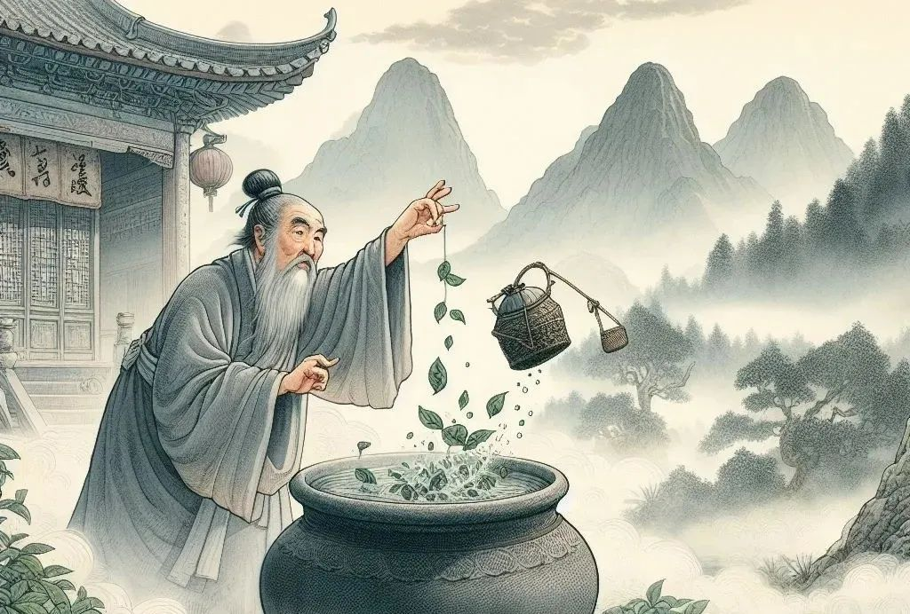
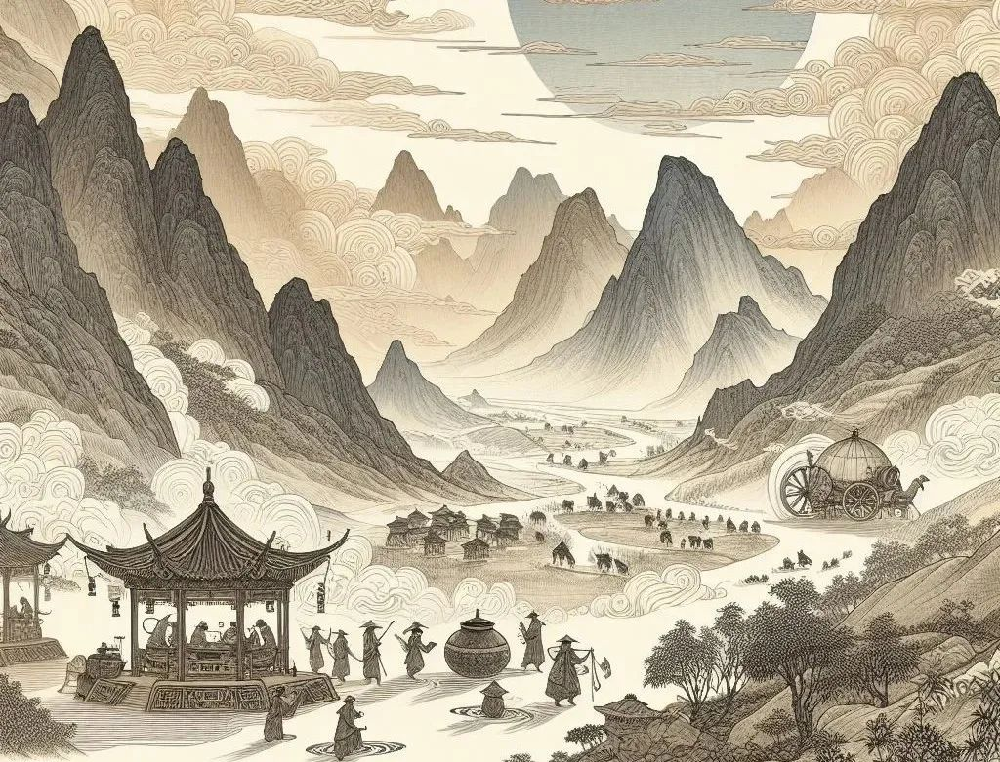
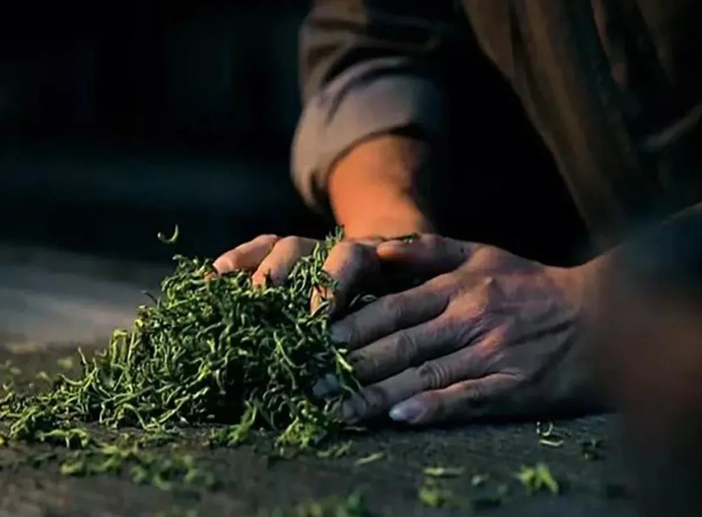
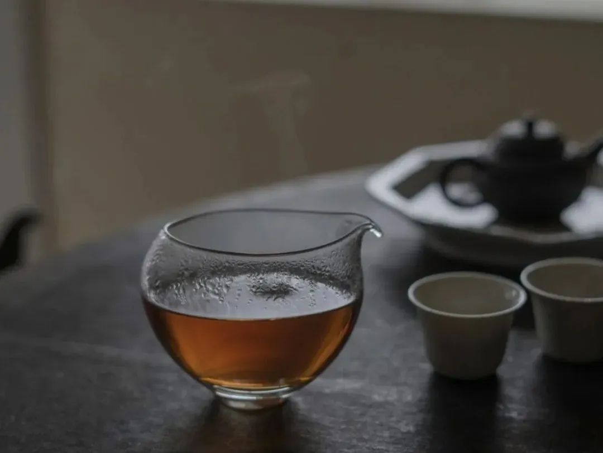
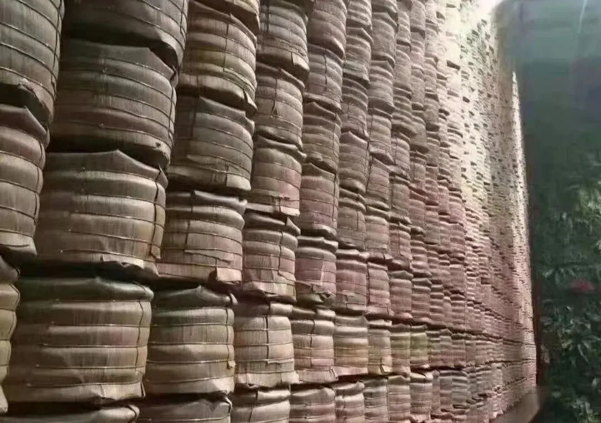
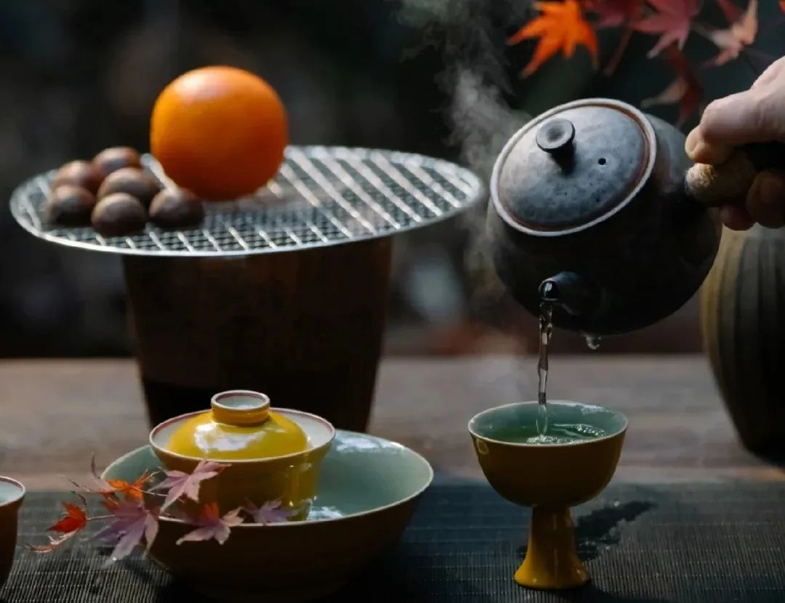
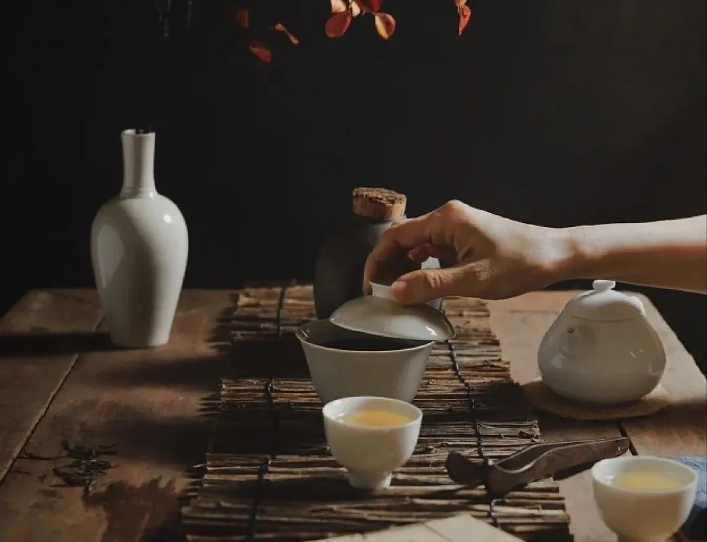
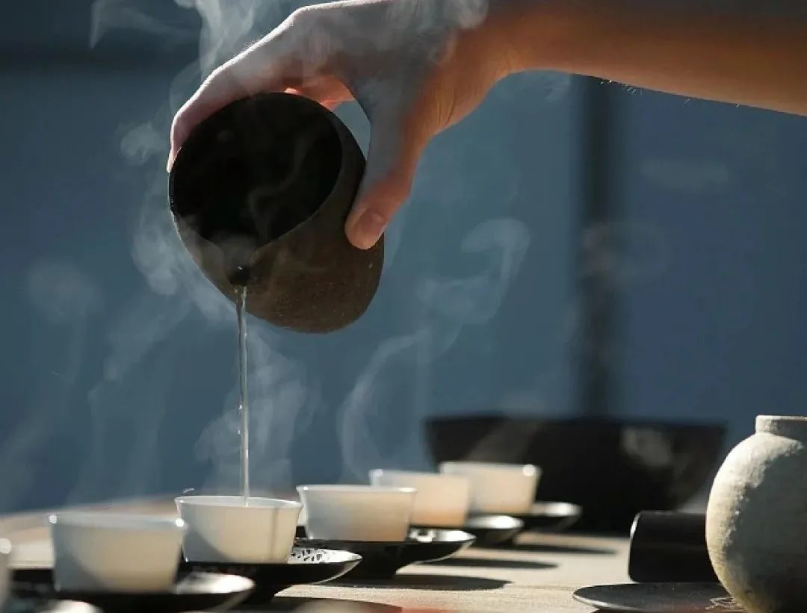

# 一次性把中国茶讲清楚，建议收藏！

你好呀，我是Wen Young。热衷于品茗赏茶，致力于传播茶文化的博大精深。在这里，我将与您分享关于茶的一切。希望通过我的分享，让您感受到茶的魅力，共同品味这份来自东方的独特韵味。  
茶，这股源自古老东方的清香，不仅浸润了中华民族的历史长河，更在全球范围内绽放其独特的魅力。中国作为茶的发源地，以其深厚的茶文化，在全球占据了举足轻重的地位。  
  
从皇室贡品到百姓日常，从静谧的茶室到繁华的市井，茶文化的多样性和丰富性，在中国大地上得到了淋漓尽致的展现。  
  

# 01.中国茶的历史
## 起源：
相传，神农氏在尝百草时发现了茶叶，这一发现开启了茶的历史篇章。最初，茶叶被用作药材，后来逐渐演变成为日常饮品。  
  

## 发展：
茶文化经历了数千年的发展。唐代的茶道、宋代的点茶、明清的泡茶，每个朝代都有其独特的饮茶风尚，茶文化随着社会的进步而不断演变。
## 影响：
通过丝绸之路，中国的茶文化和茶叶传播到了世界各地，影响了全球的饮茶习惯。茶，成为了文化交流的使者。  
  

# 02.中国六大茶类
## 绿茶：
以其清新的口感和丰富的营养价值著称。西湖龙井，产自杭州西湖区，以其扁平光滑的茶叶形态和独特的豆香闻名。碧螺春，产自江苏太湖，以其卷曲如螺的形态和清新的香气著称。
## 红茶：
全发酵的红茶，如祁门红茶，产自安徽祁门县，以其醇厚的口感和温暖的色泽受到人们的喜爱。正山小种，产自福建武夷山，是世界上最早的红茶之一。
## 乌龙茶（青茶）：
半发酵的乌龙茶，如铁观音，产自福建安溪县，以其香气浓郁和滋味多变而闻名。大红袍，产自福建武夷山，以其独特的“岩韵”著称。
## 白茶：
微发酵的白茶，如白毫银针，产自福建福鼎，以其清雅的口感和保健功效受到青睐。白牡丹，产自福建政和，以其形似牡丹花的茶叶形态而闻名。
## 黄茶：
独特的闷黄工艺，如君山银针，产自湖南岳阳，赋予了黄茶独特的香气和味道。蒙顶黄芽，产自四川雅安，以其黄亮的茶叶和醇厚的口感而受到喜爱。
## 黑茶：
后发酵的黑茶，如普洱茶，产自云南，以其陈化潜力和独特的风味而受到追捧。六堡茶，产自广西梧州，以其独特的渥堆工艺和陈年风味而闻名。  
  

# 03.制茶工艺
## 采摘：
不同茶类的采摘标准和时节各异，从春茶到秋茶，每一片茶叶都承载着季节的精华。
## 杀青：
杀青是绿茶和乌龙茶制作中的关键步骤，目的是停止茶叶的酶促氧化，保持茶叶的绿色。这一过程通常在高温下进行，以迅速杀死茶叶中的酶。
## 发酵：
发酵程度的不同决定了茶叶的类别。绿茶不发酵，红茶全发酵，乌龙茶半发酵。发酵过程中，茶叶中的化学成分发生变化，影响茶叶的色泽、香气和口感。
## 干燥：
干燥是茶叶保存的关键，通过控制水分含量，确保茶叶的品质和风味。干燥过程中，茶叶的水分被去除，以防止霉变和氧化。
## 特殊工艺：
如黄茶的闷黄、黑茶的渥堆等，这些特殊工艺赋予了茶叶独特的风味。闷黄工艺通过控制湿度和温度，使茶叶在氧化过程中产生独特的香气。渥堆工艺则是普洱茶特有的发酵过程，通过堆叠和翻堆，促进茶叶的后发酵。  
  

# 04.茶的品鉴与冲泡
  
  

## 品鉴：
品鉴茶叶，需观其色、闻其香、品其味、赏其形。每一道工序都是对茶的深刻理解。绿茶：注重清新香气和鲜爽口感，色泽鲜绿，形态完整。冲泡：80-85℃水温，2-3分钟，适合玻璃杯或瓷壶。红茶：追求醇厚口感和温暖色泽，香气浓郁。冲泡：90-95℃水温，3-5分钟，适合瓷壶或紫砂壶。乌龙茶：香气馥郁多变，滋味醇厚，回甘明显。冲泡：95-100℃水温，5-45秒，逐泡递增10秒，紫砂壶或盖碗为佳。白茶：清雅香气，鲜爽甘甜，形似银针或牡丹。冲泡：85-90℃水温，3-5分钟，玻璃杯或瓷壶适宜。黄茶：香气清新，滋味鲜爽，色泽黄亮。冲泡：80-85℃水温，2-3分钟，玻璃杯或瓷壶为宜。黑茶：陈香显著，滋味醇厚，适合长时间陈化。冲泡：95-100℃水温，1-2分钟，紫砂壶或瓷壶适合。不同茶类的适宜水温、冲泡器具和冲泡方法各异。正确的冲泡方式能够最大程度地展现茶叶的风味。  
  

# 05.茶的储存
## 储存原则：
干燥、避光、密封是储存茶叶的基本原则，它们共同保护茶叶免受外界环境的影响。
## 各类茶的储存方法：
绿茶：储存条件：绿茶最好存放在密封的容器中，并置于冰箱的冷藏室中。这样可以减缓茶叶的氧化过程，保持其鲜爽的口感和绿色的外观。注意事项：避免与有异味的食物一起存放，因为绿茶容易吸收周围的气味。红茶：储存条件：红茶应存放在干燥、阴凉、通风良好的地方。使用密封罐可以保护红茶不受湿气和异味的影响。注意事项：由于红茶已经完全发酵，不需要冷藏，但应避免阳光直射和高温。乌龙茶（青茶）：储存条件：乌龙茶最好存放在密封的容器中，避免阳光直射和潮湿。一些高品质的乌龙茶，如铁观音，可以在冰箱中冷藏，以保持其香气。注意事项：乌龙茶的香气较为浓郁，应避免与其他气味强烈的物品混放。白茶：储存条件：白茶可以存放在密封的容器中，置于阴凉干燥的地方。白茶的微发酵特性使其可以在适当的条件下缓慢陈化，逐渐发展出更复杂的风味。注意事项：白茶的储存环境应保持清洁，避免潮湿和异味。黄茶：储存条件：黄茶的储存方法与绿茶相似，最好存放在密封的容器中，并置于冰箱的冷藏室中，以保持其独特的香气和口感。注意事项：黄茶的闷黄工艺使其对湿度和温度较为敏感，应避免高温和潮湿环境。黑茶：储存条件：黑茶，尤其是普洱茶，需要在通风、干燥、无异味的环境中陈化。适当的湿度和温度有助于茶叶的后发酵过程，发展出更丰富的风味。注意事项：避免将黑茶存放在密封的容器中，因为这会阻碍其陈化过程。同时，应避免阳光直射和高温。  
  
通过这些详细的储存方法，我们可以更好地保护和保存各种茶叶，确保它们在饮用时能够展现出最佳的品质和风味。正确的储存不仅能够延长茶叶的保质期，还能增强其独特的风味特性。

# 06.茶的功效与健康
## 不同茶类的健康益处：
绿茶：  
抗氧化剂：绿茶富含抗氧化剂，尤其是EGCG（表没食子儿茶素没食子酸酯），有助于降低心血管疾病的风险。抗癌效果：一些研究表明，绿茶中的抗氧化剂可能有助于预防某些类型的癌症。提神醒脑：含有适量的咖啡因，可以提神醒脑，提高注意力。红茶：降低胆固醇：红茶含有茶黄素，有助于降低胆固醇水平，对心血管健康有益。增强心脏功能：红茶可以帮助增强心脏功能，改善血液循环。提神效果：红茶中的咖啡因含量较高，有助于提高精神集中度。乌龙茶（青茶）：降脂减肥：乌龙茶含有的茶多酚有助于降低血脂，对减肥有一定的辅助作用。抗氧化：乌龙茶中的抗氧化剂有助于抵抗自由基，减缓衰老过程。改善消化：乌龙茶可以帮助消化，减轻油腻感。白茶：提高免疫力：白茶中的抗氧化剂有助于增强免疫系统，对抗感染。抗炎作用：白茶具有抗炎作用，可能有助于减轻炎症性疾病的症状。促进皮肤健康：白茶中的抗氧化剂有助于保护皮肤免受环境伤害。黄茶：助消化：黄茶有助于促进消化，特别适合饭后饮用。提神效果：黄茶含有适量的咖啡因，可以提神醒脑。抗氧化：黄茶中的抗氧化剂有助于抵抗自由基，保护身体细胞。黑茶：肠道健康：黑茶，尤其是普洱茶，有助于改善肠道菌群，促进消化。降低血脂：黑茶可以帮助降低血脂，对心血管健康有益。减肥效果：黑茶中的微生物发酵产物可能有助于体重管理。每种茶类都有其独特的健康益处，这些益处部分来自于茶叶中特定的化学成分，如抗氧化剂、茶多酚、咖啡因等。适量饮用不同类型的茶，可以为身体带来多种健康益处。当然，个体对茶叶的反应可能不同，因此在饮用时应考虑个人体质和健康状况。  
  

# 07.茶文化与生活
## 茶道与茶艺：
中国的茶道精神和茶艺表演，不仅是饮茶的艺术，更是一种生活哲学。茶道精神中的“和敬清寂”体现了和谐、尊重、清洁和宁静的价值观。
## 茶与社交：
在商务洽谈、家庭聚会等社交场合，茶总是扮演着重要的角色。茶的分享和品鉴成为了人们交流和沟通的桥梁。
## 茶与艺术：
茶与诗歌、绘画等艺术形式的结合，展现了茶文化的深厚底蕴。唐代诗人卢仝的《七碗茶歌》和宋代的茶画，都是茶文化与艺术结合的典范。  
  

# 08.茶的国际传播
## 全球影响：
中国茶文化对世界饮茶习惯有着深远的影响。随着茶叶的国际贸易，中国的茶文化也被带到了世界各地。比如，英国的下午茶传统就是在与中国茶叶贸易的过程中逐渐形成的。现在，下午茶已经成为英国文化的一部分，人们在这个时候享受茶点，放松交流。
## 文化交流活动：
为了促进不同国家之间的茶文化交流，会举办各种国际茶文化节。这些活动不仅是展示各国茶文化的舞台，也是茶文化爱好者学习和体验不同茶文化的好机会。通过这些活动，茶文化得以在全球范围内传播，同时也促进了茶文化的发展和创新。简而言之，中国的茶文化不仅影响了全球的饮茶习惯，还通过国际交流得到了更广泛的传播和认可。这些交流让茶文化变得更加丰富多彩，也让世界各地的人们有机会分享和体验茶的美好。  
  

 **结语**  
  
茶，这东方的神秘液体，不仅滋养了身体，也丰富了灵魂。它的故事，从古至今，从东到西，一直在继续。让我们在每一次品茗中，不仅回味它的香气，也感受它带来的宁静与和谐。  
  
茶，是连接过去与未来的桥梁，是文化交流的纽带。愿这杯茶，永远温暖人心。  
  

