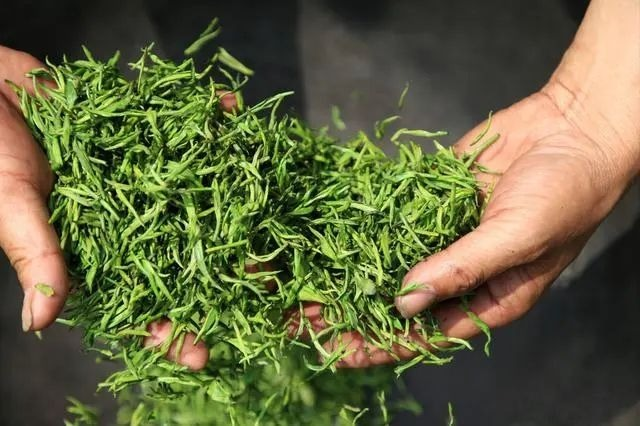
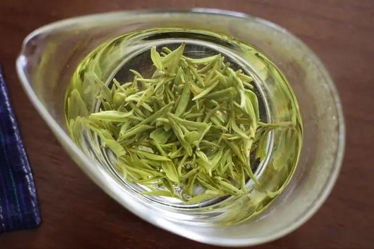
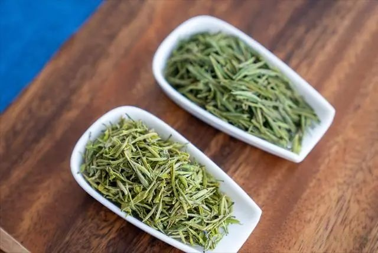

中国是茶叶的故乡，用茶叶制成的茶饮，也是世界三大饮料之一。从历史角度出发，茶叶最早是作为祭祀用品的，到了春秋后期，才逐渐被人们当作菜来食用，后来又发展为药用和宫廷饮品。 **根据茶叶品种不同，还可以将其分为绿茶、黄茶、乌龙茶、红茶、黑茶、白茶这6大茶类。**

要提到这6大茶类中，最为清新的茶叶代表，那一定非绿茶莫属。绿茶给人的整体感觉，色泽淡雅，茶味清新，茶汤清爽。据现有史料推测， **中国最早的绿茶，应该出自四川和陕西一带。**

如今，全国产绿茶的地方，还真不少，但要论哪的绿茶最好喝， **就不得不提到下面这8种绿茶，都是名扬全国的绿茶代表，喝过6种以上的算“茶霸”。** 下面，就一起来看看。
  一、浙江西湖龙井（绿茶皇后）
“院外风荷西子笑，明前龙井女儿红”，作为中国十大名茶之一，西湖龙井可以说是家喻户晓的绿茶代表。
并不是所有的龙井茶，都能称之为西湖龙井，它对产区和茶树品种，有着非常严格的要求。 **正宗的西湖龙井，必须产自杭州市政府划定的西湖龙井茶保护基地，茶树品种必须为龙井群体、龙井43或龙井长叶。** 买西湖龙井时，一定要认清包装上的防伪标识。

西湖龙井
 # 二、江苏碧螺春
碧螺春产自江苏苏州的吴中区一带，距今已有1000多年的历史，也是中国十大名茶之一。据悉，早在唐代时期，碧螺春就已经是当时进贡给皇帝的宫廷贡品。
碧螺春的产区，不光种树，还种有多种水果，茶树和果树的枝桠相连， **因此产出来的碧螺春，带有一股独特的果香味。** 碧螺春采摘的时间比较早，一般谷雨前后就结束了，并以明前茶的品质最为珍贵。

 碧螺春
  三、四川峨眉山茶
作为中国国家地理标志产品的峨眉山茶，产自四川省乐山市， **也是绿茶中的一大代表茶叶，具有3000余年的历史。**
早在古籍《昭明文选注》中，就有记载道，“峨山多药草，茶尤好，异于天下”。峨眉山一带的地理位置很特别，以低云、多雾为主，雨量充沛，土壤丰富，给茶树的生长，提供了得天独厚的地理环境。

峨眉山茶
  四、浙江安吉白茶
乍一看到“安吉白茶”这四个字，很多人都以为这是一种白茶，其实，从茶叶属性来说，安吉白茶属于绿茶里的一种，产自浙江省湖州市安吉县，也是中国国家地理标志产品。
 **之所以名称里带“白茶”，是因为它的茶树品种为“白叶一号”，是一种比较珍稀的变异茶树品种。** 还有一个特别之处在于，安吉白茶的芽叶颜色，会随着温度的变化，而发生一定的改变。

安吉白茶
  五、安徽六安瓜片
六安瓜片的名气，可以说是响彻古今，也是中国十大名茶之一，具有非常悠久的历史。六安瓜片这个名字，最早始于明朝，在唐朝时，它曾被称作“庐州六安茶”。
六安瓜片主要产自安徽六安大别山一带地区，也是绿茶中的一种特种茶类， **是世界上唯一一种，没有芽也没有梗的茶叶，由单片生叶采制而成。**

六安瓜片
  六、安徽黄山毛峰
产自安徽黄山的黄山毛峰，同样是中国十大名茶之一，也是徽茶的代表。据当地县志记载， **“ 黄山产茶始于宋之嘉佑，兴于明之隆庆”**，由此可见，这个地方古时候就是一个茶叶胜地。
黄山地区生态环境非常好，土壤多为黄土和红土，山高雾大湿度大，夏不热，冬不寒，非常适宜茶树的生长。黄山毛峰的出众品质，离不开这块土地的孕育。

  七、江西婺源绿茶
婺源不光有油菜花，还是中国国家地理标志产品“婺源绿茶”的产地。在唐代茶圣陆羽著的世界上第一本茶叶专著《茶经》中，曾提到过， **“ 歙州（茶）生婺源山谷”**。这里的“歙州”，指的就是历史上早期的徽州。由此可见，早在唐朝时期，婺源就已经是大名鼎鼎的茶叶产区。

婺源绿茶
  八、河南信阳毛尖
根据2002年《香港文汇报》的评选， **中国十大名茶包括西湖龙井、洞庭碧螺春、黄山毛峰、君山银针、信阳毛尖、安徽祁门红茶、六安瓜片、都匀毛尖、武夷岩茶、安溪铁观音。这其中，有一半以上是绿茶** ，也包括产自河南信阳的信阳毛尖。
 **信阳毛尖向来有“绿茶之王”的美誉** ，早在唐朝时期，信阳地区就已经成为了当时赫赫有名的“淮南茶区”。考古学家曾在信阳固始县出土的古墓中，发现了茶叶，距今已有2000多年的历史。北宋大文豪苏东坡，还曾称赞道，“淮南茶信阳第一”。
