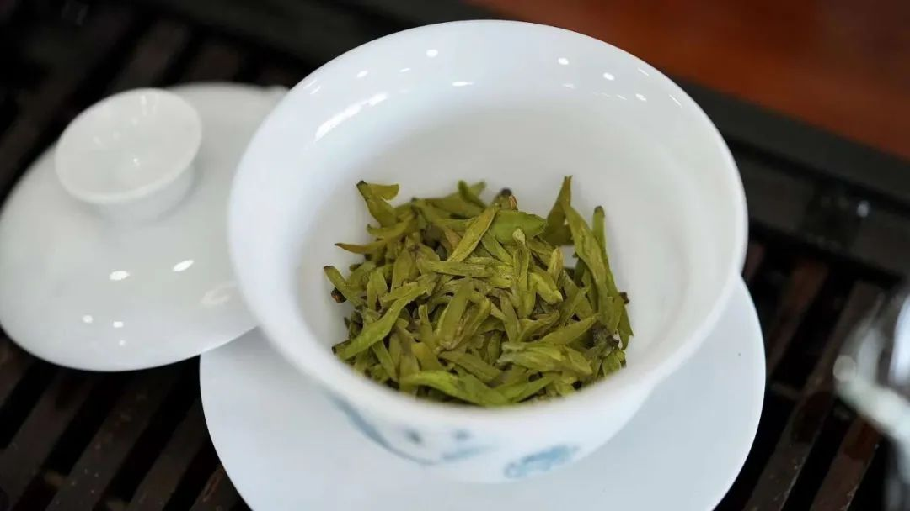

**#茶墨文化#**
* * *
  

 **喝茶，真的只是一种生活方式。** ****常会遇到一些朋友，提及茶总是小心地说：自己不懂，即便是喝茶，也是随便喝喝。 不管这谨慎的态度是不是谦虚，其实懂不懂茶对大多数人来说，真的不那么重要。如果喝了某款茶感觉还不错，能接着喝下去就足够了。茶叶的种类繁多，最常见的以色泽和发酵程度为标准分为绿茶、红茶、乌龙茶、白茶和黑茶等。它们的制作方法和气候等因素有很大的关系。例如，乌龙茶需要经过复杂的制作工序，而白茶则要求采收后尽快制作，保证其清香爽口。
 # 茶树分类：
  
按树形分：灌木型，小乔木型，乔木型。按叶型分：特大叶种，大叶种，中叶种，小叶种。
 # 茶叶分类：
基本茶类：绿茶、红茶、白茶、黄茶、黑茶、乌龙茶。加工茶类：花茶、紧压茶，萃取茶、香味果味茶、药用保健茶及含茶饮料等。  
  
  
喝了那么多茶，面对茶的类别，还是一知半解。除了绿红黄青黑白六大类茶之外，还有一类就是花茶。花茶，又名香片， 即将植物的花或叶或其果实泡制而成的茶，是中国特有的一类再加工茶。花茶主要以绿茶、红茶或者乌龙茶作为茶坯、配以能够吐香 的鲜花作为原料，采用窨制工艺制作而成的茶叶。  
  
 **NO.1 发酵篇** 六大茶类的划分基础是在制作中，由茶叶发酵的不同程度决定的。 **发酵程度同时影响着茶的口感和功效** ，这就是为什么你要了解它的原因所在。  
  
 **发酵程度越高的茶，茶性更温和** ，比如红茶、黑茶就适合胃不太好的人喝；相反， **不发酵或是轻度发酵的茶，茶性微寒，适合降火去燥，但脾胃较弱的人应适量。** ****

  
而花茶属于再加工茶类，我们一般喝的花茶其实是自然阴干的。在水分干掉后密闭阴凉保存的。没有发酵这个过程。
 # 六大茶类的大致分布图：
  

  
 **NO.2 品类篇**  
  
  
  
 **绿茶** | 叶绿汤清，清香、醇美、鲜爽 **白茶** | 色白隐绿，汤色黄白，清香甘美 **黄茶** | 叶黄汤黄、金黄明亮，甘香醇爽 **青茶** | 也叫乌龙茶，青绿金黄，清香醇厚 **红茶** | 香高色艳味浓，叶红汤红，浓厚甘醇 **黑茶** | 茶色粗大黑褐、口感陈香醇厚 **花茶** | 种类繁多，香味浓郁，茶汤色深以上这些都是形容词，最重要是亲自体验，才能感受茶的美妙有趣之处。 **NO.3 冲泡篇**  
  
不同的茶叶有不同的茶性，顺应茶性泡出来的茶，才能最大发挥茶的口感、香气、汤色。 **NO.4 储存篇** 虽然是干茶，为了保持茶叶的活性和口感，储存起来也是稍稍需要讲究一些。茶叶储存三大原则：干燥、避光、密封。 **绿茶、黄茶 **| 密封后，放冰箱冷藏 **白茶、乌龙茶** | 常温密封保存；个别种类长时间不喝，放冰箱冷藏  
  
 **红茶 **| 常温密封保存，切记防潮 **黑茶** | 常温保存，阴凉通风、切忌日晒 **花茶** **** | 常温防潮，阴凉干燥、无异味 **NO.5 功效篇**  
  
 **绿茶** 六大茶类之首。零发酵，茶多酚最多。性微寒，微苦，回甘。清热祛燥，提神醒脑。不适合肠胃较弱的人群。  
  
 **白茶** 茶中珍品。轻度发酵，茶性清凉。滋味清淡、回甘。富含茶多糖，适合降糖需求人群。  
  
 **黄茶** 中国独有茶类。汤色杏黄清澈。轻微发酵，口感清爽香醇。富含茶多酚和咖啡因。提神醒脑，消食化滞。  
  
 **青茶** 绿叶镶红边，绿茶+红茶之和。又叫青茶，属半发酵茶。降血脂、胆固醇，适合三高人群。提神醒脑，不宜空腹饮用。  
  
 **红茶** 世界人民最爱。茶性温润，无刺激。口感甜醇。调节脾胃功能，适宜肠胃不好的人群。  
  
 **黑茶** 红、浓、陈、醇。后发酵茶类，微生物发酵。香气独特，口感醇厚。改善肠道环境，调节脂肪代谢。  
  
 **花茶** 分为花草茶和花果茶。种类繁多，各有不同。气味芬芳，且具有养生疗效 **茶，不是功课，不是束缚，不是只有“懂”的人才有资格爱茶。** 喝茶是享受，本着享受和放松的心态去喝茶，暂时不必想着去弄懂它，反而会越喝越懂。要是一开始就认定自己不懂，对茶有隔阂感，岂不是越来越不懂？  
  
你或许认为，那些每天和茶打交道的人，或者那些一开口就很专业的人，肯定很懂茶。可真正追问起来，也多会说自己“所知有限”。这不是谦虚。 **茶文化博大精深，每一种茶，都有自己的特性** ，宛如芸芸众生，有谁敢说：能看懂每一个人？懂茶？不懂茶？有那么重要么？  
  
 **其实懂不懂茶，真的不重要；重要的是，每天喝茶。** ****千利休禅师说：“须知道茶之本，不过是烧水点茶”。 一款茶入了手，多用不同的方式方法去尝试，才成为泡茶高手。 **喝什么茶也不重要，适合自己的茶才是好茶。** 茶在手，一人得幽，二人得趣，三人成品。于尘世偷来闲暇时间，不乏人生之乐趣。  
  
都说，“茶品可清心”，那么喝茶时，把身份放一边，把虚荣放一边，把贪欲放一边，茶百科说“心清可品茶”，茶，无法承受之轻。 **以平常之心，喝盏中清茶，尝惬意时光。** 得半日之闲，可抵十年尘梦。喝茶，真的，只是一种生活方式。  
  
不同季节或一日之中不同的时间，对应着不同的茶或茶道具，像极了生命中或凉或暖的时光。不同的是， **生命中的平淡时光占大多数，而心静下来，茶里，却总有滋味。
  

