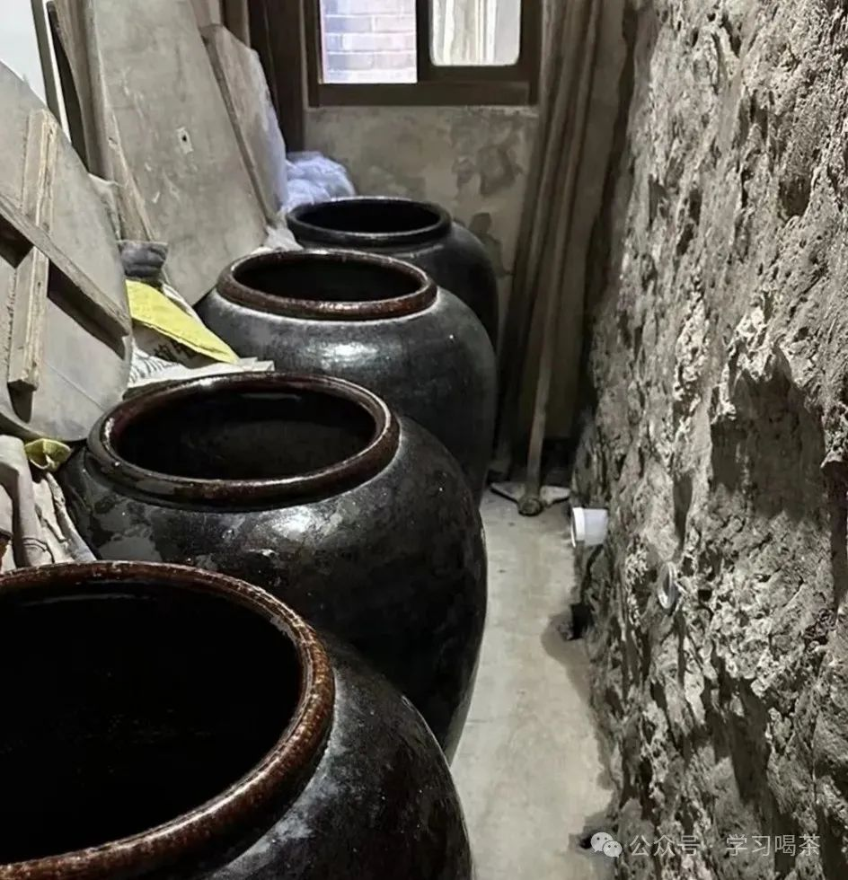
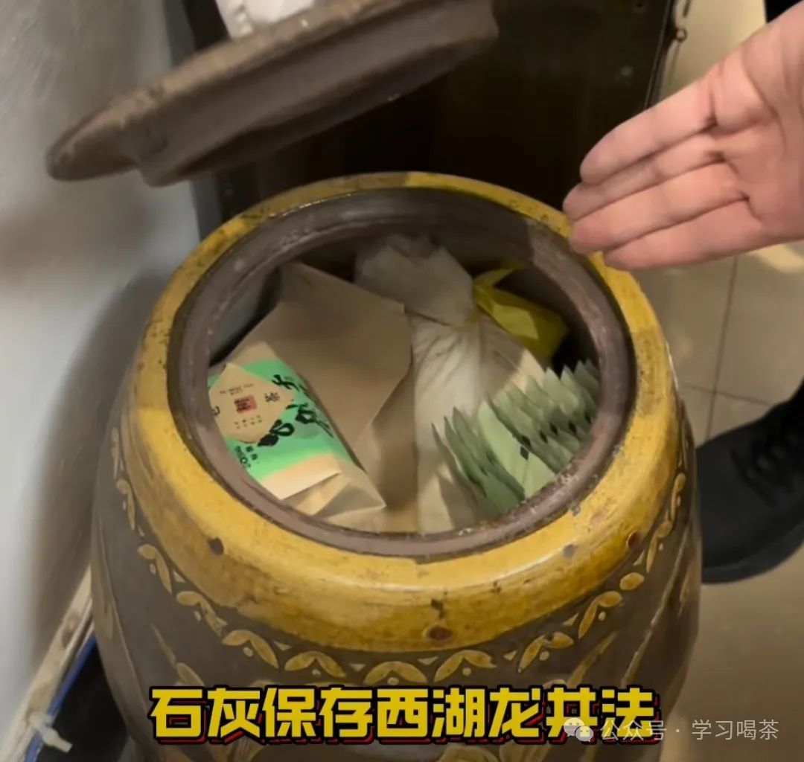
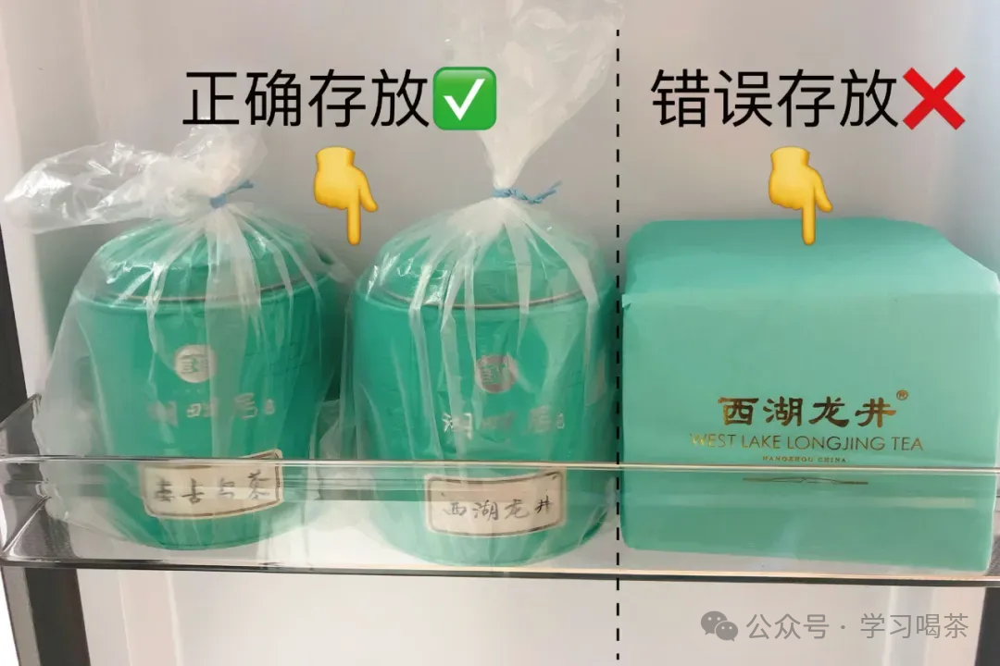
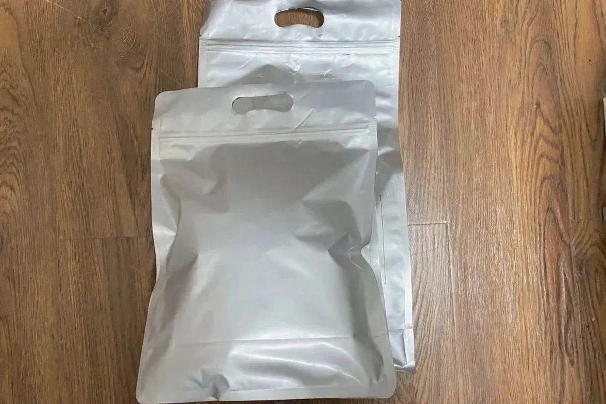

林语堂说，春天要做三件事：“赏花、踏青，品西湖龙井。”
春天的暖风，润绿了江南，也让人愈发期盼尝一口春的味道。
那么在喝西湖龙井茶的同时，我们也不得不面对的是，如何保存像西湖龙井这类高端绿茶呢？
其实每一种绿茶总体来讲都有它独到的保存办法。比如西湖龙井，刚刚做出来的龙井茶，很多人趁着新鲜马上就喝，那一定会特别好喝，这其实不非完全是的。
我们以西湖龙井为例。传统的西湖龙井，在加工的过程中，最后一道叫“收灰”，就是把炒好的龙井茶，放进生石灰的次瓷缸里，大约要放上一个礼拜，叫做去火气收火，也就是说，龙井茶其实是有一个后熟的一个作用。

经过收灰的西湖龙井，不管是香气，滋味都会表现的淋漓尽致。收灰之后，龙井茶是可以直接在石灰缸里继续存放一年的。
这就是老传统的的农家存储龙井茶的方法。
那么龙井茶的存储办法，到了现在，家庭里面并不具备石灰收灰的条件。

现在也有人用，炭储存法。就是以木炭代替生石灰为干燥剂，将1千克木炭装入布袋中，每隔一两个月更换一次。如果木炭吸潮，需先将木炭烧红，冷却后装入布袋。这种方法也能有效保持茶叶的干燥，防止变质。
**随着科技的发展，一般是采用冷柜储存了。**
经过反复的实验，当前最可靠的储存办法是，把茶叶小包装的密封好，放在干净无异味的冰箱里，0~5或者8度冷藏就可以。
关于是否可以冷冻呢？应该讲，是可以的，冷冻更保鲜，但是有一个问题，就是说比如说在夏天里拿出来喝的时候，这个冷冻跟常温的温差过大，产生的小水珠，如果及时喝，那没有问题，但是如果反复拿出来和存进去，茶叶就会把小水珠吸进去，一是影响口感，二是容易变质。如果非要冷冻方式保存的话，我们的建议是，将茶叶的包装按泡进行分装。而且每次取茶时，不影响到其他茶叶。

可以选择罐藏，比如瓷罐、锡罐，切记一定要避光、密封、防潮。不过，如果是茶叶较多，我们还是建议容器不要太大，密封袋包装，方便分次开装分次饮用。  

**1、罐藏法，将西湖龙井茶叶整理好，装入铝箔袋密封，之后放入铁罐、瓷罐内，盖好盖子，放置于阴凉处存放。**
**2、袋藏法，用食品级铝箔袋将龙井茶装好，挤掉多余的空气，之后密封好，常温存放。**
**3、冷藏法，用铝箔袋与铁罐将西湖龙井装好，并密封，最后放入冰箱0~10℃温度保存。**

那如果大家是如何如何存放你的宝贝茶西湖龙井的呢？

