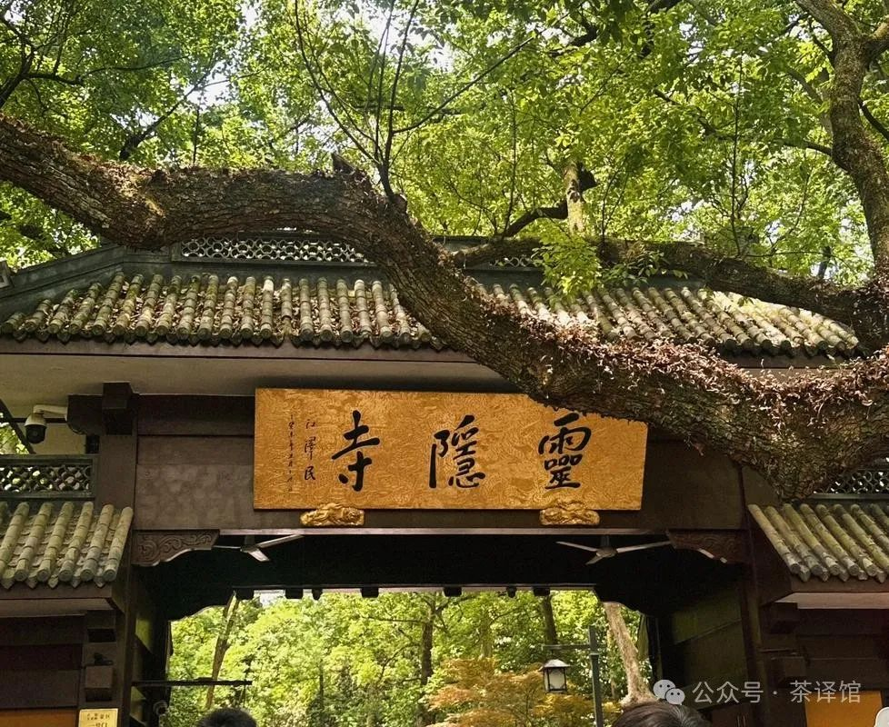
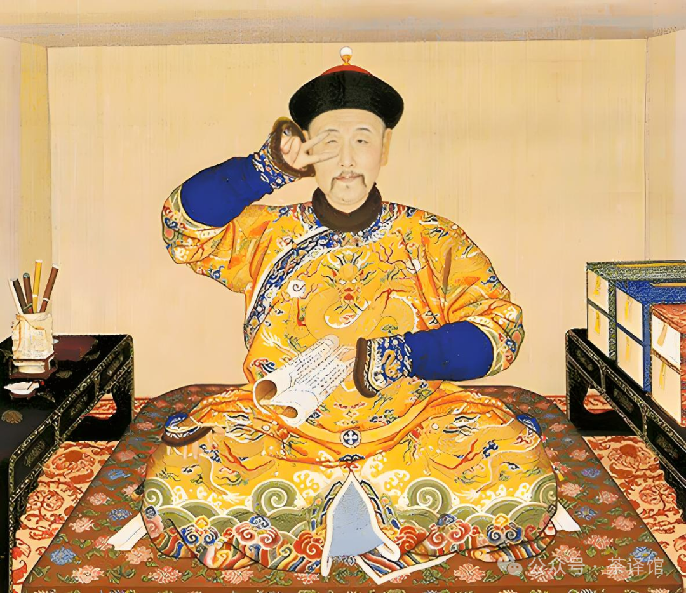
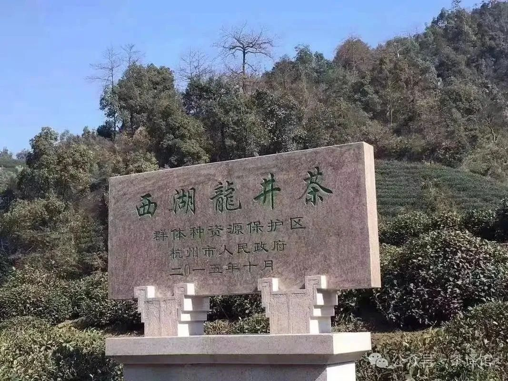
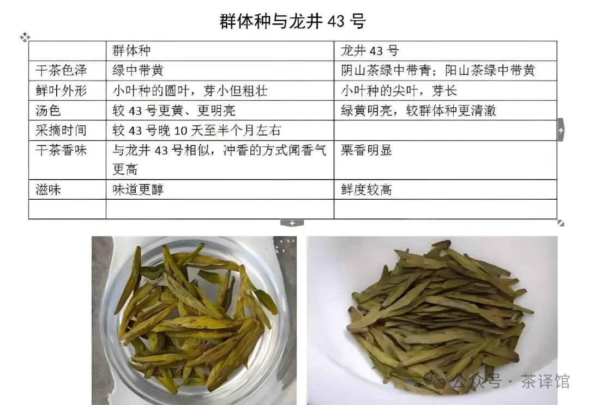
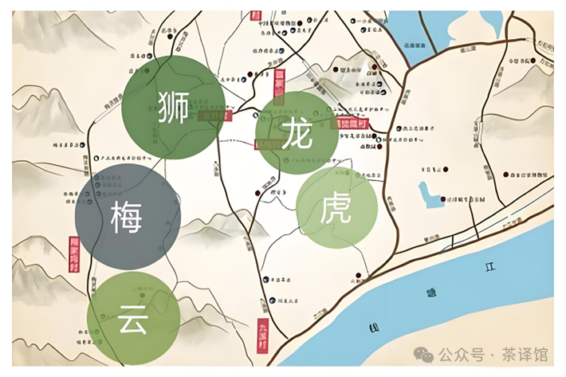
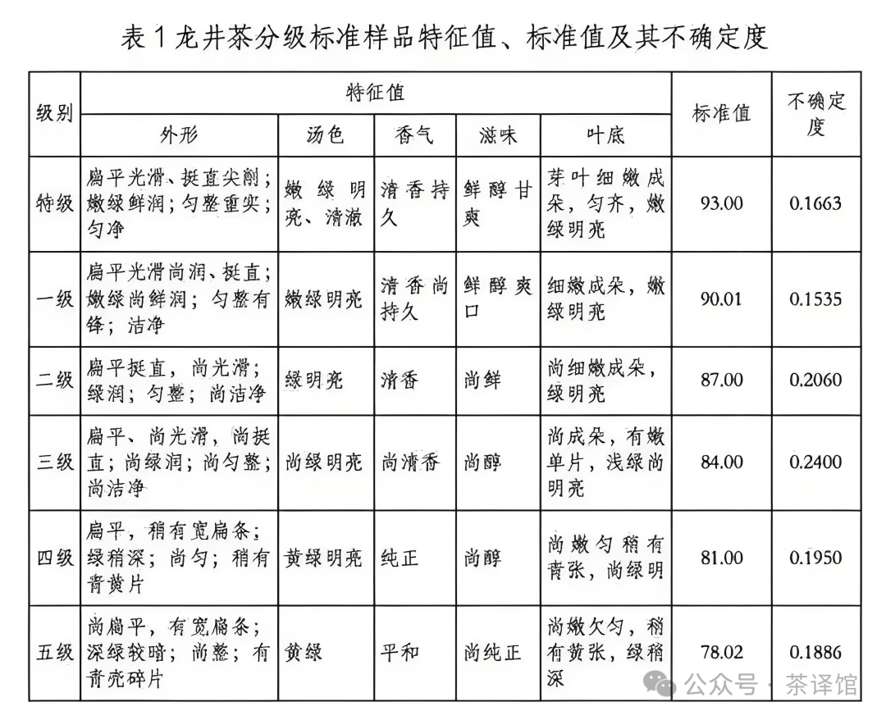
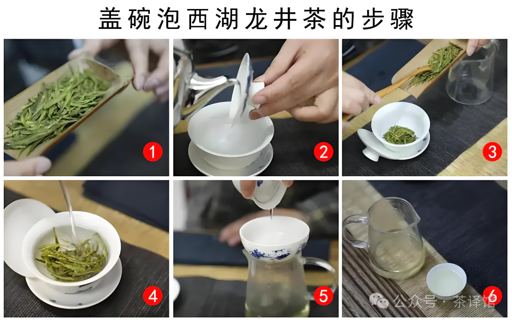
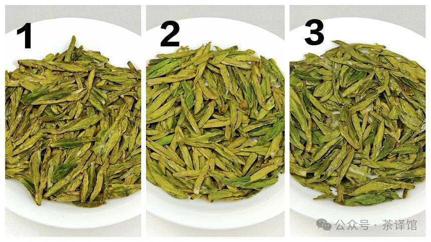
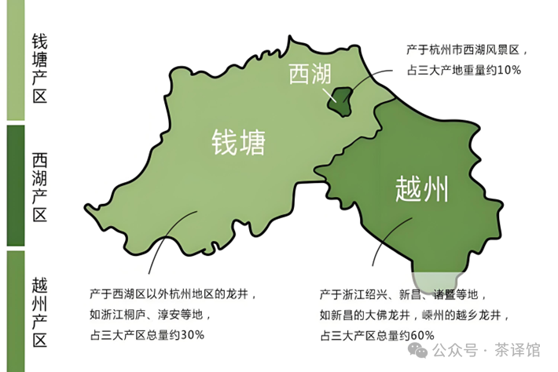

西湖龙井茶，作为中国名茶之首，承载着千年的茶文化底蕴，以其独特的品质和深厚的历史内涵闻名于世。接下来，我们将从历史由来、品种差异、产区划分、等级划分、冲泡技巧、鉴别技巧以及消费注意事项等方面，为你全面解读这一茶中珍品。

  

  历史由来：千年传承，人文浸润 丨
 # 历史起源 
西湖龙井茶的历史可追溯至唐代。唐代茶圣陆羽所著的《茶经》中，就有关于杭州天竺、灵隐二寺产茶的记载，这是西湖龙井茶最早的文字记录。到了宋代，西湖一带的茶叶生产已颇具规模，苏轼任杭州知州时，曾写下 "白云峰下两旗新，腻绿长鲜谷雨春" 的诗句，盛赞西湖茶的鲜嫩品质。
 # 重要人文故事 
   1、乾隆与龙井茶
 **清代乾隆皇帝六下江南，四次来到西湖龙井茶区，亲自采茶，并将胡公庙前的十八棵茶树封为 "御茶"，从此龙井茶声名远播。传说乾隆在品饮龙井茶时，恰逢皇后生病，他便将随身携带的龙井茶赐予皇后，皇后饮用后病情好转，龙井茶的神奇功效也随之传开。**
   2、文人墨客的青睐
历代文人墨客对龙井茶情有独钟，留下了许多赞美之作。明代文学家高濂在《四时幽赏录》中写道："谷雨前采茶旋焙，烹之蟹目乍开，重绿满盏，清香高爽，味同甘露。" 清代诗人龚自珍也有 "茶以西湖龙井为最，清香雅韵，卓绝群品" 的美誉。

  知名度高的原因 -
 

 # 1、品质卓越
西湖龙井茶外形扁平光滑、色泽翠绿鲜嫩，香气清高持久，滋味鲜爽甘醇，汤色嫩绿明亮，叶底细嫩成朵，独特的品质使其在众多茶叶中脱颖而出。
 # 2、文化底蕴深厚
千年的历史传承，无数文人墨客的赞美，以及乾隆皇帝的推崇，赋予了龙井茶丰富的文化内涵，使其成为中国茶文化的象征之一。
 # 3、地理环境优越
西湖产区独特的气候、土壤和地形条件，为茶树的生长提供了理想的环境，造就了龙井茶独特的品质。
  品种差异：各有特色，品质不同  
西湖龙井茶的品种主要有群体种、龙井 43、乌牛早等，不同品种在外形、口感、香气等方面存在一定差异。
 # 1、群体种
群体种是西湖龙井茶的传统品种，又称老茶树，树龄较长，一般在几十年以上。其茶叶外形较粗老，叶片稍大，色泽绿中带黄，香气浓郁，滋味醇厚，回甘明显，耐冲泡。群体种茶叶的内含物质丰富，具有独特的 "糙米色" 和 "豆花香"，是西湖龙井茶中最具代表性的品种之一。
 # 2、龙井 43
龙井 43 是中国农业科学院茶叶研究所在群体种的基础上选育出来的无性系良种，树姿半开张，分枝密，叶片呈长椭圆形，色泽嫩绿，叶面光滑。龙井 43 发芽早，一般在清明前一周左右即可开采，比群体种早 10-15 天。其茶叶外形扁平光滑，挺秀尖削，香气清高鲜嫩，滋味鲜爽甘醇，汤色嫩绿明亮，叶底细嫩柔软。龙井 43 产量高，品质稳定，是目前西湖龙井茶产区种植面积最广的品种。
 # 3、乌牛早
乌牛早原产于浙江省永嘉县乌牛镇，是一种早生品种，发芽期比龙井 43 更早，一般在 2 月底至 3 月初即可开采。其茶叶外形扁平光滑，色泽翠绿，香气高锐，滋味鲜爽，汤色黄绿明亮，叶底嫩绿匀整。乌牛早虽然开采早，但由于生长期短，茶叶内含物质相对较少，滋味较淡，香气不够持久，品质略逊于群体种和龙井 43。

  产区划分：核心产区，品质差异 

西湖龙井茶的产区分为核心产区和非核心产区，核心产区包括杭州市西湖区的狮峰山、龙井村、云栖、虎跑、梅家坞等地，也就是通常所说的 "狮、龙、云、虎、梅" 五大核心产区。
 # 1、狮峰山
狮峰山是西湖龙井茶核心产区中海拔最高的地方，平均海拔 300-400 米，气候湿润，昼夜温差大，土壤肥沃，富含矿物质和有机质，非常适合茶树的生长。狮峰山产的龙井茶外形扁平光滑，色泽绿中带黄，香气浓郁持久，滋味醇厚回甘，被誉为 "龙井之巅"。
 # 2、龙井村
龙井村是西湖龙井茶的发源地，有着悠久的种茶历史，村里至今仍保留着许多古老的茶树。龙井村产的龙井茶外形挺秀，色泽翠绿，香气清高鲜嫩，滋味鲜爽甘醇，汤色嫩绿明亮，叶底细嫩成朵，是西湖龙井茶中的上品。
 # 3、云栖
云栖位于西湖区西南山区，这里竹林茂密，溪水潺潺，气候宜人，土壤呈酸性，非常适合茶树的生长。云栖产的龙井茶外形扁平光滑，色泽嫩绿，香气清幽，滋味鲜爽，汤色清澈明亮，叶底细嫩柔软，具有独特的 "云栖香"。
 # 4、虎跑
虎跑泉是西湖三大名泉之一，虎跑产区的龙井茶因靠近虎跑泉而得名。虎跑产的龙井茶外形扁平光滑，色泽翠绿，香气清高，滋味鲜爽，汤色嫩绿明亮，叶底细嫩成朵，用虎跑泉水冲泡，更能体现出龙井茶的独特风味。
 # 5、梅家坞
梅家坞是西湖龙井茶的主产区之一，这里茶园连片，风景秀丽，气候温和，土壤肥沃，产的龙井茶外形扁平光滑，色泽翠绿，香气鲜嫩，滋味鲜爽，汤色嫩绿明亮，叶底细嫩匀整，是深受消费者喜爱的品种。
非核心产区包括杭州市其他区县以及周边地区，虽然也产龙井茶，但由于地理环境、气候条件等因素的影响，品质与核心产区存在一定差异。

  等级划分：严格标准，品质区分 

西湖龙井茶的等级划分主要根据茶叶的外形、汤色、香气、滋味、叶底等因素，分为特级、一级、二级、三级、四级五个等级。

  冲泡技巧：掌握方法，尽显风味  

 # 1、茶具选择
冲泡西湖龙井茶最好选用透明的玻璃杯或瓷杯，这样可以欣赏到茶叶在水中舒展的优美姿态，同时也能更好地感受茶汤的色泽和香气。
 # 2、水温控制
西湖龙井茶属于绿茶，鲜嫩的茶叶对水温要求较高，一般以 80-85℃为宜。水温过高会破坏茶叶中的营养成分和香气，水温过低则无法充分激发茶叶的滋味。
 # 3、投茶量
投茶量根据个人口味和茶具大小而定，一般来说，每 100 毫升的水投放 3-5 克茶叶即可。
 # 4、冲泡方法  
  温杯： 先用热水冲洗茶具，提高茶具的温度，有利于茶叶香气的散发。
  投茶： 将茶叶投入杯中。
  注水： 采用 "高冲低斟" 的方法，将水从高处冲入杯中，使茶叶在水中翻滚，充分舒展。注水至杯的三分之一处，等待 1-2 分钟，让茶叶初步浸润。
  品饮： 待茶汤温度适宜后，即可品饮。品饮时，先闻香气，再观汤色，最后尝滋味，感受龙井茶的独特魅力。**
  鉴别技巧：慧眼识茶，避免受骗 丨
 # 1、外形鉴别
优质的西湖龙井茶外形扁平光滑，挺秀尖削，色泽翠绿鲜嫩，匀整重实，无夹杂物；劣质的龙井茶外形粗松，色泽黄绿欠润，匀整度差，夹杂物较多。
 # 2、香气鉴别
优质的西湖龙井茶香气清高持久，有鲜嫩馥郁的嫩香或豆花香；劣质的龙井茶香气淡薄，有青草味或杂味。
 # 3、汤色鉴别
优质的西湖龙井茶汤色嫩绿明亮，清澈透明；劣质的龙井茶汤色黄绿，明亮度差，有浑浊现象。
 # 4、滋味鉴别
优质的西湖龙井茶滋味鲜爽甘醇，口感丰富，回甘明显；劣质的龙井茶滋味醇和，略带苦涩，口感平淡。
 # 5、叶底鉴别
优质的西湖龙井茶叶底细嫩成朵，匀齐明亮，芽叶肥壮；劣质的龙井茶叶底较粗老，有对夹叶和碎叶，匀齐度差。

  消费注意事项：理性消费，保障权益
   

 # 1、购买渠道
购买西湖龙井茶时，应选择正规的茶叶专卖店、品牌电商平台或产地直销点，避免在流动摊位或不明渠道购买，以免买到假冒伪劣产品。
 # 2、价格判断
西湖龙井茶的价格因品种、产区、等级、采摘时间等因素而异，一般来说，核心产区的特级龙井茶价格较高，非核心产区的低等级龙井茶价格相对较低。消费者应根据自己的需求和预算，理性选择，不要盲目追求高价或低价。
 # 3、保存方法
西湖龙井茶属于绿茶，容易氧化变质，应注意保存。保存时，应将茶叶放在干燥、通风、避光、无异味的地方，最好用锡罐、铁罐或瓷罐密封保存，也可以将茶叶放入冰箱冷藏，温度控制在 0-5℃左右。
 # 4、饮用禁忌
西湖龙井茶性凉，脾胃虚寒者不宜过量饮用；失眠者应避免在睡前饮用；服药期间应避免饮用龙井茶，以免影响药效。

西湖龙井茶是大自然的馈赠，是中国茶文化的瑰宝。通过了解它的历史由来、品种差异、产区划分、等级划分、冲泡技巧、鉴别技巧和消费注意事项，我们可以更好地欣赏和品味这一茶中珍品，感受它独特的魅力和深厚的文化内涵。在购买和饮用西湖龙井茶时，我们应保持理性，选择正规渠道，注重品质和口感，让这杯香茗为我们的生活增添更多的美好。

  

