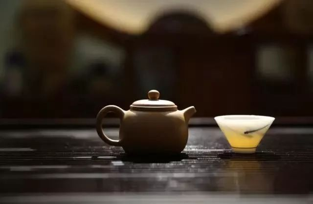
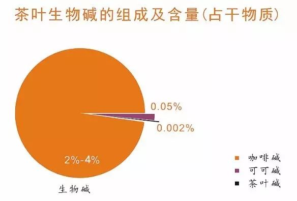

你是不是几乎每天喝茶？是不是一天不喝就难受？是不是喝的茶越来越好，有一种要破产的恐惧？恭喜你，你上瘾了！
  

我们通常说的喝茶成瘾，在专业上有一个名词叫“渴求”（craving），俗称想瘾或心瘾，在药物滥用领域是指一种内在的，对特定物质或经历的强烈渴望。对食物的渴求，也被称为“食物成瘾”。
  

Hetherington编撰的《食物渴求与成瘾》认为，大部分食物成瘾与心理因素、药理作用、生理因素、社会文化因素有关。也有研究表明， **包括喝茶成瘾在内的食物成瘾，与毒品成瘾具有相似性** 。
  

一项利用饮酒调查模型，调查了咖啡、茶的大量消费原因，结果发现：在18种饮用咖啡、茶的动机中，确定了4种动机类型，即两种社会动机为 **“社交需要”、“作为饮料”** ；两种个人感受为 **“刺激感”、“解脱感”** 。对比分析发现，该项研究结果和酒精消费中所产生的问题与消费原因结果是一致的。
  

## 哇，茶和酒果然是一家的！

  

奖赏系统被劫持
  

研究表明， **过量进食会使大脑中的奖赏系统更加活跃** ——在一些人中，奖赏系统甚至活跃到，让人们不顾大脑的警告：当人们喝茶到一定量之后，大脑会发出信号，让自己停止喝茶，但此时常喝茶的人就会像酗酒者、吸毒者一样，越想喝茶。  

  

控制食欲的激素会影响下丘脑中摄食回路，也会作用于大脑中控制奖赏感、产生美妙感觉的系统。如果你每天喝茶，但是某天突然停止喝茶，你就会花费大量的时间、精力和金钱去找茶，并且会感觉这样喝起茶来更加美味！
  

饥渴时，激素会使大脑中与食物相关的奖赏回路，尤其是纹状体的活跃程度增强。纹状体中，内啡肽的含量很高，这种化学物质能够提升快感和奖赏感。也就是说， **口渴时，饮茶人群对茶的需求会尤其强烈。**
  

多项研究，都比较肯定地表明，成瘾是由某种脂肪或糖类导致的。另一项研究也表明，精加工的、可被迅速消化的碳水化合物会刺激食欲。但从整体上看，没有哪一种食物成分可以单独诱发类似成瘾的行为。茶，也是其所含的多种成分给人带来的“享受”，让人逐渐成瘾的。
  

## 但不可否认的是，茶中有一种成分——咖啡因，是让人成瘾的最重要的因素。

  

咖啡因的作用

研究表明，长期饮用含咖啡因的食物，会增加腺苷感受器的数量（因为咖啡因会压制腺苷感受器，这种反应不足造成神经系统认为细胞需要更多腺苷感受器）。  

  

因为腺苷主要是促进休息和疲劳这种感觉的神经递质，因此当长期饮用咖啡的人离开咖啡后，腺苷的影响会增加（毕竟感受器多了嘛），就使人更容易疲劳、头晕、不开心、无力感，常常还伴随着头疼、平滑肌僵硬。这就使人对咖啡因产生渴求和依赖，瘾就这么出现了。

一般来说，如果每天喝2-3杯星巴克煮咖啡（600mg咖啡因，约6-10杯速溶咖啡），一至两周就可能产生生理成瘾。目前尚没有研究表明喝多少茶会上瘾，但以我们的日常经验看，饮茶成瘾的现象还是普遍存在的。
  

当然，大家也不用太担心，很多研究都认为， **大部分有食物渴求和食物“成瘾”的行为，都不应被视为成瘾行为。** 包括茶和咖啡，人们突然停止摄入后的戒断症状，是温和的、短暂的。所以也有人说，茶是唯一会让人上瘾的健康饮料。大家还是可以放心喝茶滴！
  

以上是关于饮茶成瘾的一个粗浅的分析，由于目前这方面的文献较少，可能会有疏漏之处，也欢迎业内高手多多补充哦！
## 参考资料：
1、《被忽视的食品安全问题：食物渴求与成瘾》，陈淑宝（综述）、曹进（审校），《国外医学医学地理分册》，2010年第2期。
2、《咖啡因——神药科普4》，程毅男，首发于《遗世独立的理想乡》。
3、《食物成瘾》，保罗·J·肯尼，《环球科学》2014年。
  

