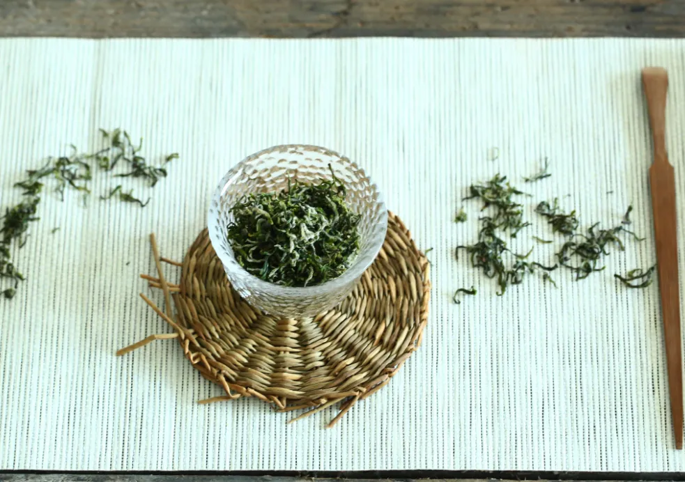

喝茶前，洗茶是可以去尘，还有醒茶，润茶的作用，一起来看看六大茶类包含有什么关洗茶的基本知识。
  六大茶类中有的茶叶是不用洗茶的，例如品质好的绿茶是比较细嫩的，是不用洗茶，白茶也不需要洗茶，乌龙茶只要清洗一次就行。

## 1、绿茶
绿茶是泡两三次就没有味道了，绿茶是少杂质的茶，用温水洗茶就好，品质较好的绿茶，较细嫩的茶，是比其他等级的茶叶品质好，干净，不耐泡，是不用洗茶的。
  

  

## 2、乌龙茶
乌龙茶通常清洗一遍就可以，也有醒茶的目的，而且还会保留有茶叶的香气和滋味，冲泡乌龙茶，可在杯壁定点注水，不要直接将水冲在茶叶上，这样让茶不会有苦涩感。
  

  

## 3、红茶
红茶比其它的茶是细嫩的，茶性温和，第一次泡的茶可以保留，因为红茶在揉捻时，红茶的汁液会附着在干茶的表面，这些茶汁包含有营养，都溶解在第一道茶汤里了，所以第一次冲泡的红茶营养是丰富的，而且味道也不浓。
  

## 4、黑茶、普洱茶
***黑茶是紧压茶，是要清洗的，这样有醒茶叶作用。***
  
盖碗冲泡黑茶、普洱时，沿着盖碗边缘注水下去，不要直接冲到茶叶上，采用环圈注水或螺旋注水都可以，第一泡洗茶，出汤要快速，水温控制在93摄氏度，如果是散茶，水温在90摄氏度。
  
第二泡开始可以正常饮用，第2、3泡适当闷10秒，接着闷久点出汤饮用。主要掌握要素有：投茶适量、水温控制、注水角度和速度慢一些，闷泡时间掌控好，泡茶前清洗两遍。
  

  

## 5、黄茶
***黄茶属轻发酵茶类，黄茶可以不用洗的。***
  
黄茶的芽头嫩，忌讳用高温冲泡，用玻璃杯或盖碗泡君山银针。
用盖碗冲泡黄茶时，取用合适的黄茶加入茶碗里面，开水沿着茶叶顺时针方向，呈螺旋状冲泡。
茶叶的数量大概是占盖碗容量的五分，水温控制在85度左右，冲泡时要记得不要闷盖，否则会有苦涩味道的。
  

  

## 6、白茶
白茶是用鲜嫩的茶叶制作的，在第一泡茶的时候，茶叶里的精华留在茶水中，如果把第一次泡的茶倒掉，后来泡茶的味道是很淡的，而且白茶的制作过程中是很精细的，质量好的白茶干净，可以直接冲泡的，白茶是不需要洗茶的。
  

  
在洗茶时候，担心茶叶有灰尘，可以第一次快速冲水洗茶，就立刻倒掉。

  

