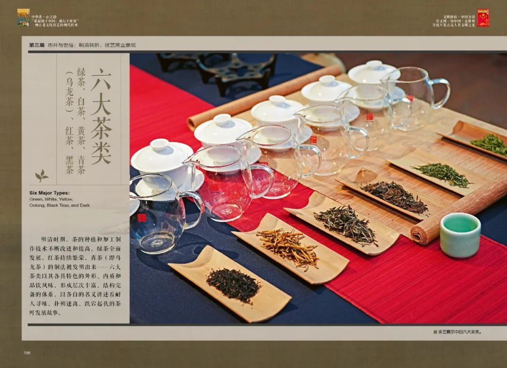
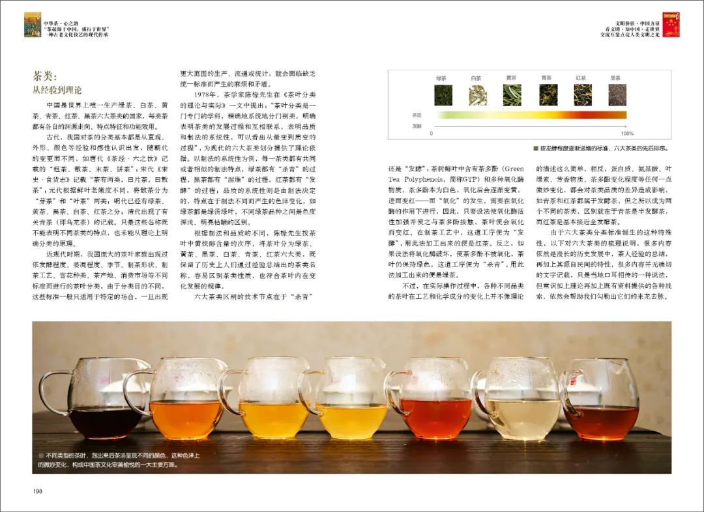
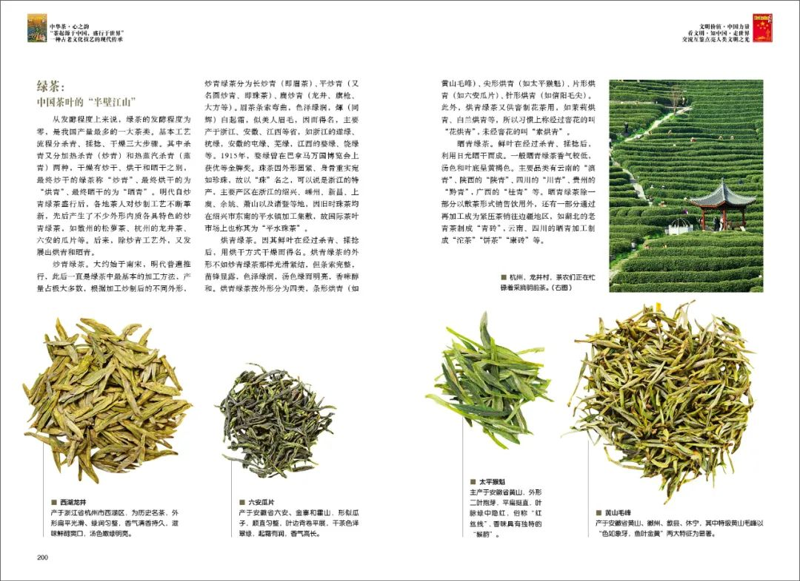
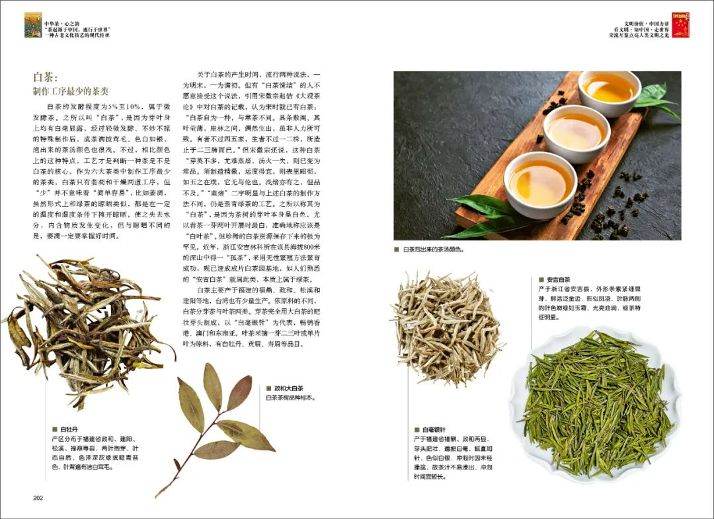
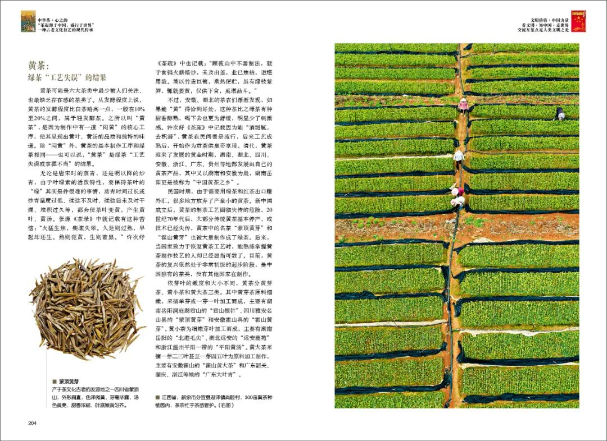
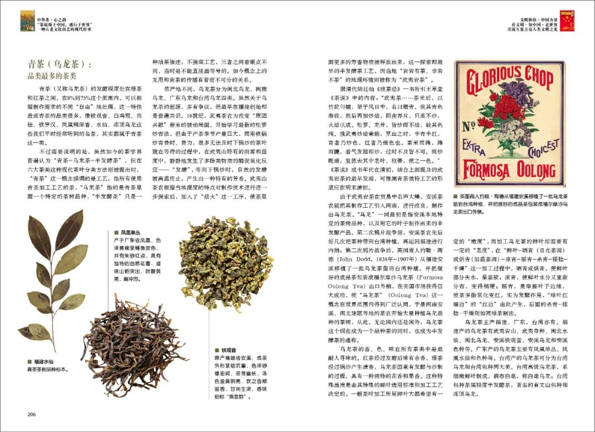
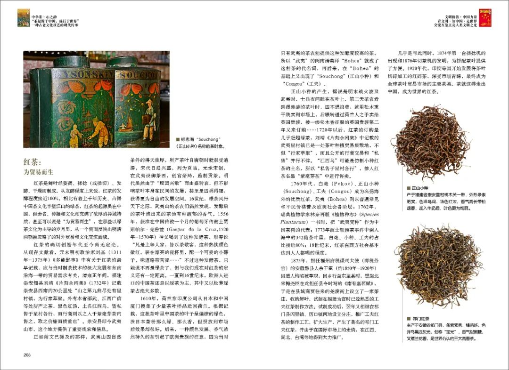
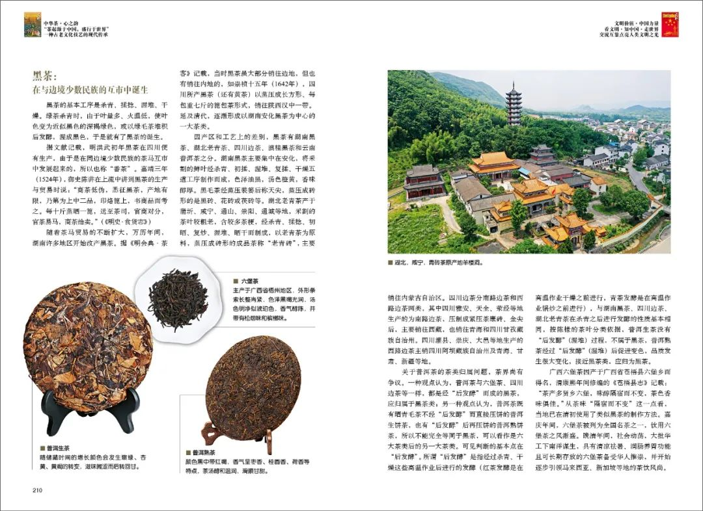

  

  
  
  

茶类：
 **从 经 验 到 理 论**
  

中国是世界上唯一生产绿茶、白茶、黄茶、青茶、红茶、黑茶六大茶类的国家，每类茶都有各自的渊源走向、特点特征和功能效用。
  

古代，中国对茶的分类基本都是从直观、外形、颜色等经验和感性认识出发，随朝代的变更而不同，如唐代《茶经·六之饮》记载的“粗茶、散茶、末茶、饼茶”；宋代《宋史·食货志》记载“茶有两类，曰片茶，曰散茶”；元代根据鲜叶老嫩度不同，将散茶分为“芽茶”和“叶茶”两类；明代已经有绿茶、黄茶、黑茶、白茶、红茶之分；清代出现了有关青茶（即乌龙茶）的记载。只是这些名称既不能表明不同茶类的特点，也未能从理论上明确分类的原理。
  

近现代时期，中国庞大的茶叶家族出现过依发酵程度、萎凋程度、季节、制茶形状、制茶工艺、窨花种类、茶产地、消费市场等不同标准而进行的茶叶分类，由于分类目的不同，这些标准一般只适用于特定的场合，一旦出现更大范围的生产、流通或统计，就会面临缺乏统一标准而产生的麻烦和矛盾。
  

  

  

1978年，茶学家陈椽先生在《茶叶分类的理论与实际》一文中提出：“茶叶分类是一门专门的学科，精确地系统地分门别类，明确表明茶类的发展过程和互相联系，表明品质和制法的系统性，可以看出从量变到质变的过程”，为现代的六大茶类划分提供了理论依据。
  

根据制法和品质的不同，陈椽先生按茶叶中黄烷醇含量的次序，将茶叶分为绿茶、黄茶、黑茶、白茶、青茶、红茶六大类，既保留了历史上人们通过经验总结出的茶类名称，容易区别茶类性质，也符合茶叶内在变化发展的规律。
  

  

绿茶
 **中 国 茶 叶 的 “半 壁 江 山”**
  

从发酵程度上来说，绿茶的发酵程度为零，是中国产量最多的一大茶类。基本工艺流程分杀青、揉捻、干燥三大步骤。
  

其中杀青又分加热杀青（炒青）和热蒸汽杀青（蒸青）两种，干燥有炒干、烘干和晒干之别，最终炒干的绿茶称“炒青”、最终烘干的为“烘青”、最终晒干的为“晒青”。明代自炒青绿茶盛行后，各地茶人对炒制工艺不断革新，先后产生了不少外形内质各具特色的炒青绿茶，如徽州的松萝茶、杭州的龙井茶、六安的瓜片等。
  

炒青绿茶。大约始于南宋，明代普遍推行，此后一直是绿茶中最基本的加工方法，产量占极大多数，根据加工炒制后的不同外形，炒青绿茶分为长炒青（即眉茶）、平炒青（又名圆炒青、即珠茶）、扁炒青（龙井、旗枪、大方等）。
  

眉茶条索弯曲，色泽绿润，煇（同辉）白起霜，似美人眉毛，因而得名，主要产于浙江、安徽、江西等省，如浙江的遂绿、杭绿，安徽的屯绿、芜绿，江西的婺绿、饶绿等。1915年，婺绿曾在巴拿马万国博览会上获优等金牌奖。
  

珠茶因外形圆紧、身骨重实宛如珍珠，故以“珠”名之，可以说是浙江的特产，主要产区在浙江的绍兴、嵊州、新昌、上虞、余姚、萧山以及诸暨等地，因旧时珠茶均在绍兴市东南的平水镇加工集散，故国际茶叶市场上也称其为“平水珠茶”。
  

  

  

烘青绿茶。因其鲜叶在经过杀青、揉捻后，用烘干方式干燥而得名。烘青绿茶的外形不如炒青绿茶那样光滑紧结，但条索完整，苗锋显露，色泽绿润，汤色绿而明亮，香味醇和。烘青绿茶按外形分为四类，条形烘青（如黄山毛峰）、尖形烘青（如太平猴魁）、片形烘青（如六安瓜片）、针形烘青（如信阳毛尖）。此外，烘青绿茶又供窨制花茶用，如茉莉烘青、白兰烘青等，所以习惯上称经过窨花的叫“花烘青”，未经窨花的叫“素烘青”。
  

晒青绿茶。鲜叶在经过杀青、揉捻后，利用日光晒干而成。一般晒青绿茶香气较低，汤色和叶底呈黄褐色。主要品类有云南的“滇青”、陕西的“陕青”、四川的“川青”、贵州的“黔青”，广西的“桂青”等。晒青绿茶除一部分以散茶形式销售饮用外，还有一部分通过再加工成为紧压茶销往边疆地区，如湖北的老青茶制成“青砖”，云南、四川的晒青加工制成“沱茶”“饼茶”“康砖”等。
  

  

白茶
 **制 作 工 序 最 少 的 茶 类**
  

白茶的发酵程度为5%至10%，属于微发酵茶。之所以叫“白茶”，是因为芽叶身上均有白毫显露，经过轻微发酵、不炒不揉的特殊制作后，成茶满披茸毛、色白如银，泡出来的茶汤颜色也很浅。不过，相比颜色上的这种特点，工艺才是判断一种茶是不是白茶的核心。
  

作为六大茶类中制作工序最少的茶类，白茶只有萎凋和干燥两道工序，但“少”并不意味着“简单容易”，比如萎凋，虽然形式上和绿茶的晾晒类似，都是在一定的温度和湿度条件下摊开晾晒，使之失去水分，内含物质发生变化，但与晾晒不同的是，萎凋一定要掌握好时间。
  

  

  

关于白茶的产生时间，流行两种说法，一为明末，一为清初。白茶主要产于福建的福鼎、政和、松溪和建阳等地，台湾也有少量生产。依原料的不同，白茶分芽茶与叶茶两类。芽茶完全用大白茶的肥壮芽头制成，以“白毫银针”为代表，畅销香港、澳门和东南亚。叶茶采摘一芽二三叶或单片叶为原料，有白牡丹、贡眉、寿眉等品目。
  

  

黄茶
 **绿 茶 “工 艺 失 误” 的 结 果**
  

黄茶可能是六大茶类中最少被人们关注、也最缺乏存在感的茶类了。从发酵程度上说，黄茶的发酵程度比白茶略高一点，一般在10%至20%之间，属于轻发酵茶。之所以叫“黄茶”，是因为制作中有一道“闷黄”的核心工序，使其呈现出黄叶、黄汤的品质和独特的味道。除“闷黄”外，黄茶的基本制作工序和绿茶相同。
  

无论是唐宋时的蒸青，还是明以降的炒青，由于叶绿素的活泼特性，要保持茶叶的“绿”其实是件很难的事情，蒸青时间过长或炒青温度过低、揉捻不及时、揉捻后未及时干燥、堆积过久等，都会使茶叶变黄，产生黄叶、黄汤。
  

不过，安徽、湖北的茶农们渐渐发现，如果能“黄”得恰到好处，这种茶比之绿茶有种甜香醇熟，喝下去也更为舒缓，明显少了刺激感。许次紓《茶疏》中记载因为能“消垢腻，去积滞”，黄茶在民间很是流行，后来工艺成熟后，开始作为贡茶供皇帝享用。清代，黄茶迎来了发展的黄金时期，湖南、湖北、四川、安徽、浙江、广东、贵州等地都发展出自己的黄茶产品，其中又以湖南和安徽为最，湖南岳阳更是被称为“中国黄茶之乡”。
  

  

  

民国时期，由于需要用绿茶和红茶出口赚外汇，很多地方放弃了产量小的黄茶。新中国成立后，黄茶的制茶工艺面临失传的危险，20世纪70年代后，大部分传统黄茶基本停产，或技术已经失传，黄茶中的名茶“蒙顶黄芽”和“霍山黄牙”也被大量制作成了绿茶。后来，当国家致力于恢复黄茶工艺时，能熟练掌握黄茶制作技艺的人却已经屈指可数了。目前，黄茶的复兴依然处于非常初级的起步阶段，是中国独有的茶类，没有其他国家在制作。
  

依芽叶的嫩度和大小不同，黄茶分黄芽茶、黄小茶和黄大茶三类。其中黄芽茶原料细嫩，采摘单芽或一芽一叶加工而成，主要有湖南岳阳洞庭湖君山的“君山银针”、四川雅安名山县的“蒙顶黄芽”和安徽霍山具的“霍山黄芽”。黄小茶为细嫩芽叶加工而成，主要有湖南岳阳的“北港毛尖”、湖北远安的“远安鹿苑”和浙江温州平阳一带的“平阳黄汤”。黄大茶采摘一芽二三叶甚至一芽四五叶为原料加工制作，主要有安徽霍山的“霍山黄大茶”和广东韶关、肇庆、湛江等地的“广东大叶青”。
  

  

青茶
 **品 类 最 多 的 茶 类**
  

青茶的发酵程度处在绿茶和红茶之间，在8%到75%这个范围内，可以根据制作需求的不同“自由”地处理，这一特性造成青茶的品类很多，像铁观音、白鸡冠、肉桂、铁罗汉、凤凰鸭屎香、水仙、冻顶乌龙这些我们平时经常听到的名茶，其实都属于青茶这一类。
  

不过需要说明的是，虽然如今的茶学界普遍认为“青茶=乌龙茶=半发酵茶”，但在六大茶类这种现代茶叶分类方法刚被提出时，“青茶”这一概念强调的是工艺，指所有使用青茶加工工艺的茶，“乌龙茶”指的是青茶里面一个特定的茶树品种，“半发酵茶”只是一种结果描述，不强调工艺，三者之间着眼点不同，当时是不能直接画等号的。如今概念上的互用和青茶的传播有着密不可分的关系。  

  

依产地不同，乌龙茶分为闽北乌龙、闽南乌龙、广东乌龙和台湾乌龙四类。虽然关于乌龙茶的起源，多有争议，但最早在福建创始却是普遍共识。
  

16世纪，武夷茶农为改变“废团兴散”带来的被动局面，开始学习最新的松萝炒青法，但由于产茶季节产量巨大，而用铁锅炒青费时、费力，很多无法及时下锅炒的茶叶就在等待的过程中，在武夷山特有的雨雾和湿度中，静静地发生了多酚类物质的酶促氧化反应——“发酵”，等到下锅炒时，自然的发酵被高温终止，产生出一种特有的芳香。武夷山茶农根据当地湿度的特点对制作技术进行进一步探索后，加入了“焙火”这一工序，使茶里面更多的芳香物质被释放出来，这一探索即最早的半发酵茶工艺，因当地“岩岩有茶、非岩不茶”的地理环境而被称为“武夷岩茶”。
  

  

  

由于武夷岩茶在贸易中名声大噪，安溪茶农就把其制作工艺引入闽南，进行改良，制作出乌龙茶。“乌龙”一词最初是指安溪本地特定的茶树品种，以及用它的叶子制作出来的半发酵产品。第二次鸦片战争前，安溪茶农先后好几次把茶种带到台湾种植，再运回福建进行内销；第二次鸦片战争后，英国商人约翰·陶德从福建安溪移植了一批乌龙茶苗到台湾种植，并把做好的成品茶包装成福尔摩沙乌龙茶出口外销，在美国市场获得巨大成功，使“乌龙茶”这一概念在世界范围内得到广泛认同。
  

乌龙茶的香、色、味在所有茶类中是最耐人寻味的。红茶经过发酵后味有余香，绿茶经过锅炒产生清香，乌龙茶因兼有发酵与炒制的过程，具有一种独特的花香和果香。这种特殊品质是由其特殊的鲜叶选用标准和加工工艺决定的。一般茶叶加工所用鲜叶大都希望有一定的“嫩度”，而加工乌龙茶的鲜叶却需要有一定的“老度”，在“鲜叶-晒青（日光萎凋）或烘青（加温萎凋）-凉青-摇青-杀青-揉捻-干燥”这一加工过程中，晒青或烘青，使鲜叶部分失水，呈萎软；凉青，使鲜叶水分又重新分布，变得稍硬；摇青，是摩擦叶子边缘，使茶多酚氧化变红，实为发酵作用，“绿叶红镶边”的“红边”由此产生，后面的杀青-揉捻-干燥则如同绿茶制法。
  

  

红茶
 **为 贸 易 而 生**
  

红茶是鲜叶经萎凋、揉捻（或揉切）、发酵、干燥而制成。从发酵程度上来说，红茶的发酵程度接近100%。相比有着上千年历史、占据中国茶文化半壁江山的绿茶，红茶的起源虽在中国，但命名、传播和文化却充满了浓厚的异域特质，甚至可以说是“为贸易而生”，在那些以绿茶文化为主导的岁月里，从一个侧面反映出明清两朝被忽略了的对外贸易和文化交流面貌。
  

16世纪，绿茶风行天下之际，武夷山的茶农们偶然发现，发酵后的茶叶泡出来的茶汤有种馥郁的香气。不过这种发酵茶，只能说不再是绿茶了，但与我们现在对红茶的定义还有一定距离。
  

1610年，荷兰东印度公司从日本和中国厦门搜集了少量茶叶样品运回荷兰。根据记载，这批茶叶里中国茶的叶子呈偏棕的绿色，没日本茶粉那么绿、那么香，但投放到市场后效果却很好。后来，一种颜色发黑、香气浓烈持久的茶引起了欧洲贵族的注意，因为当时只有武夷的茶农能提供这种发酵度较高的茶，所以“武夷”的闽南语英译“Bohea”就成了这种茶的代名词，再后来，在“Bohea”的基础上又出现了“Souchong”（正山小种）和“Congou”（工夫）。
  

  

  

正山小种的产生，据说是明末战火波及武夷时，士兵夜间睡在茶叶上，第二天茶农看到湿漉漉的茶叶时，因不想浪费，就用松木熏干贱卖到市场上，后辗转通过荷兰人之手卖给英国贵族，被一缕松木香征服的英国贵族第二年又来订购……1720年以后，红茶的订购量几乎赶超绿茶，刘靖《片刻余闲集》中记载的武夷星村镇已是一处茶叶种植贸易集散地，不但“行家萃聚”，而且公开的行商交易和“私售”并行不悖。“江西乌”可能是仿制小种红茶的土名，所以“私售于星村各行”，掺入红茶名品“紫毫芽茶”中进行售卖。
  

1760年代，白毫、正山小种、工夫成为名扬海外的优质红茶，武夷则以普遍常见和平民价格普及欧美社会各阶层；1762年，瑞典植物学家林奈再版《植物种志》一书时，把“武夷变种”作为中国茶树的代表；1773年波士顿倾茶事件中倒入海中的342箱茶叶里，白毫、小种、工夫的占比接近80%；18世纪末，红茶在西方社会基本达到人人都喝的程度。
  

1875年，担任福州府税课司大使（即税务官）的安徽黟县人余干臣因遭人构陷被革职，回乡行至东至县时，想起北宋梅尧臣在此担任县令时写的《南有嘉茗赋》，于是在县城商贾往来的尧渡街上设立了一家茶庄，收购鲜叶，试制在福建为官时已经熟悉的工夫红茶制作方法。试制成功后，翌年又相继在祁门县闪里镇、历口镇两地设立分庄，推广工夫红茶的制作工艺，扩大生产，产生了著名的祁门工夫红茶，并由于在国际市场上的走俏，在江西、湖北、台湾等地得到大力推广。
  

几乎是与此同时，1874年第一台揉捻机的出现和1876年切茶机的发明，为拼配茶叶提供了方便。1920年代，印度等国开始发展将茶叶切碎加工的红碎茶，深受市场青睐，最终成为全球茶叶贸易市场的主要茶类。茶就这样走出中国，成为世界的红茶。
  

  

黑茶
 **在与边境少数民族的互市中诞生**
  

黑茶的基本工序是杀青、揉捻、渥堆、干燥。绿茶杀青时，由于叶量多、火温低，使叶色变为近似黑色的深褐绿色，或以绿毛茶堆积后发酵，渥成黑色，于是就有了黑茶的诞生。
  

据文献记载，明洪武初年黑茶在四川便有生产，由于是在同边境少数民族的茶马互市中发展起来的，所以也称“番茶”。随着茶马贸易的不断扩大，万历年间，湖南许多地区开始改产黑茶。据《明会典·茶客》记载，当时黑茶虽大部分销往边地，但也有销往内地的，如崇祯十五年（1642年），四川所产黑茶（还有黄茶）以蒸压成长方形、每包重七斤的篦包茶形式，销往陕西汉中一带。延及清代，逐渐形成以湖南安化黑茶为中心的一大茶类。
  

  

  

因产区和工艺上的差别，黑茶有湖南黑茶、湖北老青茶、四川边茶、滇桂黑茶和云南普洱茶之分。
  

广西六堡茶因产于广西省苍梧县六堡乡而得名，清康熙年间修编的《苍梧县志》记载：“茶产多贤乡六堡，味醇隔宿而不变，茶色香味俱佳。”从茶味“隔宿而不变”这一点看，当地已在清初使用了类似黑茶的制作方法。嘉庆年间，六堡茶被列为全国名茶之一，饮用六堡茶之风渐盛。晚清年间，社会动荡，大批华工下南洋谋生，具有清凉祛暑、润肠养胃功能且可长期存放的六堡茶备受华人推崇，并开始逐步引领马来西亚、新加坡等地的茶饮风尚。
  

  

