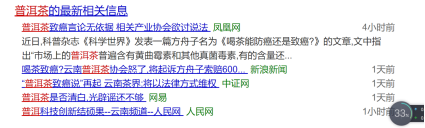
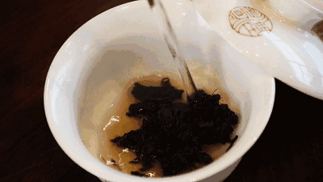
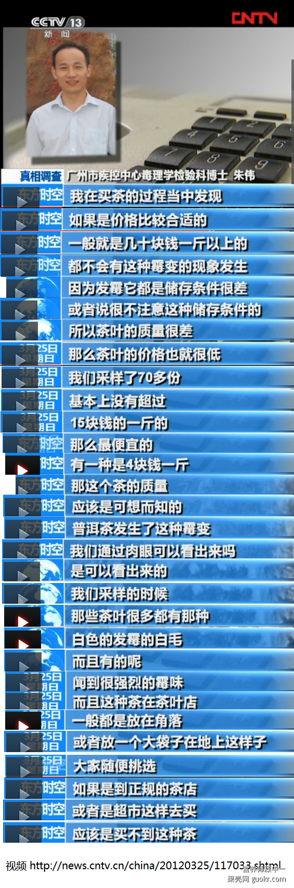
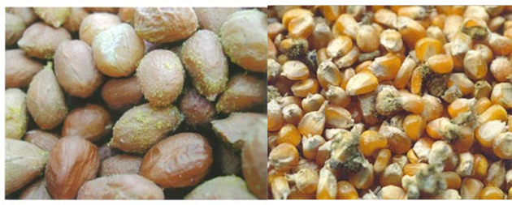
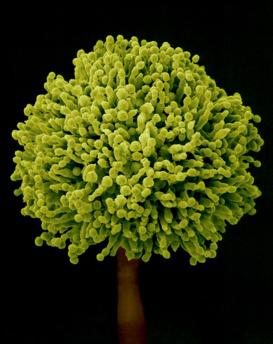
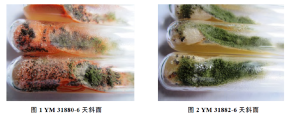
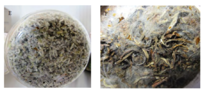

有着三千多年历史的普洱茶，就在最近几天，再次成为了人们讨论的焦点。事情的起因是科普作家方舟子发表文章，提出了普洱茶可能致癌的说法，云南普洱茶协会随即发表声明进行澄清，并声称要诉诸法律程序，还普洱茶清白。
那么，深受中国民众喜爱的普洱茶到底有没有致癌性？本文将从科学的角度利用实验数据来对此问题做些探讨。

  普洱茶是什么茶？
普洱茶是以中国云南省一定区域内云南大叶种（云南省大叶类茶树品种的总称）晒青毛茶为原料，经过发酵加工而成的散茶和紧压茶。
普洱茶分为 **生茶和熟茶** ，生茶是新鲜的茶叶采摘后以自然的方式陈放，未经过渥堆发酵处理。经过渥堆工序，人工发酵的则为熟茶。因此，普洱茶根据其种类又分为 **不发酵茶 (普洱绿茶)，轻发酵茶（普洱青茶，普洱黄茶，普洱白茶），全发酵茶（普洱红茶），后发酵茶（普洱紧茶，普洱黑茶）**等。
决定普洱茶种类和品质的关键，就是 **发酵和陈化工艺** 。经过不同温度、湿度、通风条件下地发酵和陈化，茶的发酵程度有所不同，其中后发酵茶相对流行，并为人们所熟知。
普洱茶多得自于产量很高的老木，矿物质含量丰富。来自国内一些机构的研究认为，喝普洱茶可以降低血压，改善血液循环，其通便，减肥等功效也有所报道。当然普洱茶的这些保健作用，与茶的品质有很大的关系。
以上的段落简单介绍了普洱茶的定义、分类以及制作工艺，这次普洱茶致癌的争议，就出现在普洱茶的制作工艺上。争议的核心在于， **普洱发酵（陈化）过程中的潜在不安全因素，也就是霉变的可能性到底有多大，霉变后的后果又有多严重。**
  普洱茶含有致癌物？
自然发酵和后发酵茶需要在常温下20-30度储藏发酵，之后还要经历长年的陈放。陈放工艺控制得当，即为上等的普洱茶，如果陈放过程中储藏不当，则极易产生霉菌等有害微生物，制成的普洱茶产品就很可能对人体健康产生不利影响。

**普洱茶含有致癌物？**
**普洱茶本身并不含有致癌物，普洱茶致癌是因为储存不当，导致黄曲霉素超标，黄曲霉毒素才是罪魁祸首。**
方舟子提到过下面这项研究，广州市疾病预防控制中心研究人员2011年对广州某茶叶市场上70份湿仓普洱茶样品进行了检测，各样品中均可检出黄曲霉毒素B1，70份样品中超过5微克/公斤的有8例，占11.43%[1]。
但是这篇文章的作者也指出，**检测所采用的样品，均为较为低价的产品，即湿度较高的仓储条件下储藏的产品。**
为什么要采用湿仓进行储藏陈化？因为湿度较高的地方，普洱茶会变得更黑，看上去和长年储藏的茶外表相似，可以说是一种投机取巧的手段。下图为采访广州疾控中心朱伟的一段视频截图。

******黄曲霉毒素（ Aflatoxin，AF）**是黄曲霉菌和寄生曲霉的代谢产物。在合适的基质、温度、pH、相对湿度下，粮食谷物坚果若未及时晒干，就会引起黄曲霉菌种滋生，并产生黄曲霉毒素。

**图，被黄曲霉菌污染的玉米和花生。**
黄曲霉毒素对健康危害极大，是引起肝细胞癌的主要物质。它至少分为13种类，其中B1毒性最强。其他具有毒性的还有B2, G1, G2, M1, M2等几种。
它诱发癌症的机制，主要是动物或人体摄入其后，经过肝脏的代谢酶细胞色素P450的活化，和DNA形成复合体，而该复合体会阻碍DNA复制，进而激活细胞癌化的启动开关。
黄曲霉毒素极强的致癌性已被各种文献确认，动物实验显示，用含有15 g/kg B1的饲料喂养大鼠，全部的大鼠都发现肝癌迹象[2]。国际癌症研究机构(IARC)将其列为一类致癌物质，根据急性毒性动物实验的推算，黄曲霉毒素的半数致死量为B1 - 18.2 g、B2 - 84.8 g、G1 - 39.2 g、G2 - 172.5 g。摄入后20%可以从尿中排泄掉，大量摄入会导致急性中毒，症状有黄疸、急性腹水症等。持续微量摄入可引起慢性肝脏损害，诱发肝癌。如果是B型肝炎患者的话，摄入后会增加肝癌的发生几率。
**因此，它是目前食品天然污染物中，毒性最强的物质之一。**

**图，黄曲霉菌的放大图**
最为可怕的是，黄曲霉毒素经普通烹调加热处理后并不能分解。在氧气存在的条件下，只有经过紫外线照射，强酸pH3或者强碱pH10处理后才能分解。一般的家庭烹调不能分解黄曲霉毒素，因此非常危险。
**普洱茶如果储存环境潮湿，温度适宜，是非常容易被黄曲霉菌污染的。如果泡饮已经霉变的普洱茶，自然存在致癌的可能性** 。
也就是说，普洱茶可能致癌的大前提就是，普洱茶被霉菌污染。
  接下来要讨论的，首先是普洱茶是否容易被霉菌污染。
**作为普洱茶爱好者，最初接触这一网络热点事件后，首先就联想到确实有严肃的科学研究讨论过这一课题。** 我们选用一篇科学文献[3]，来揭示普洱茶和黄曲霉菌之间的那些恩怨纠葛。
如文章片头所说，对于后发酵普洱茶，渥堆发酵是关键加工工艺，这其中所要用到的 **有益发酵菌种就是黑曲霉菌。** 虽然与黄曲霉菌仅有一字之差，性质上来说却大相径庭，黑曲霉菌是发酵工业中的重要菌种，在制酱、制醋、制茶、酿酒、生产酶制剂及有机酸等行业地位重要。
**渥堆加工需要放置22-24天，在此期间，黑曲霉菌发挥功用将普洱茶发酵，产生有机酸。**
在这一过程中，如果由于储藏方式不当感染了黄曲霉菌，那么普洱茶会发生什么变化？黄曲霉菌含量会超标吗？会产生致癌剂量的黄曲霉毒素吗？ 
在此实验中，两个菌种——分别是菌种1 YM 31880，来源于ATCC（美国菌种保藏中心）和菌种2 YM 31882，来源于IM-CAS（中国科学院微生物研究所）——被接种到普洱茶中，并完全模仿渥堆发酵过程，将其培养22天，使其熟成。

**图，培养基中的黄曲霉菌**
两类菌种均在接种第1-8天的发酵前期迅速繁殖，在第8天时达到最高，之后呈下降趋势，在22天，接种1号黄曲霉菌的普洱茶检测不出黄曲霉菌，2号仍可以检测出少量黄曲霉菌，同时两组都没有检测到黄曲霉毒素。从自然界分离到的黄曲霉菌，只有10%能产生毒素。
所以就算是产品污染了黄曲霉菌，也不一定会产生毒素，这与产毒环境存在一定关系。
**从该实验也可以看出，在普洱茶的发酵过程中，普洱茶的营养成分和环境，并不适合黄曲霉素的生长和产毒，到发酵后期，由于环境缺乏，黄曲霉菌甚至得不到生长。**

**图，将黄曲霉菌，接种到普洱茶叶中照片**
**同时该研究也比较了黄曲霉菌和黑曲霉菌的竞争生长关系。**
如前所述，黑曲霉菌是普洱茶后发酵过程中的有利菌种，黄曲霉素和黑曲霉菌在到第8天为止时，均呈现迅速增长的趋势。后期两者均减少，前期黄曲霉菌增长迅速，而后期黑曲霉菌则作为优势菌种，其生长速度较快，说明两种微生物之间存在竞争作用。
研究也表明，黑曲霉菌抑制了黄曲霉菌的生长、产毒，还可以起到降解黄曲霉毒素的作用。
另外，实验还设有一个发酵过程中没有人工加入黄曲霉菌的对照组，结果发现对照组自始至终没有检测到来自于自然污染的黄曲霉菌。
该研究的结论认为：
1，普洱茶在后发酵渥堆过程中，不易产生黄曲霉菌和其毒素。
2， 后发酵黑茶，如果在湿度大，温度高，通风条件差的环境下，容易受到黄曲霉菌污染，并可能产生黄曲霉毒素。如果发现茶叶有苦涩味，霉味，则不应饮用。
普洱茶作为中国茶文化的重要组成部分之一，近年来人气不断走高。对于它的研究，不仅仅是功效方面，卫生安全方面一样需要更多更广泛的深入钻研。
我们希望给出的忠告是，请在正规的经销处，购买质量过硬的产品，尽量选择真空包装，慎重购买在不洁净的环境下散装出售的普洱茶。不要因为贪图便宜而伤害自己的身体健康。
  食品安全中的潜在危险性和普遍安全性
普洱茶致癌传言的风波真相，相信您看了这篇文章后已经有所判断。普洱致癌同很多食品安全卫生领域的命题一样，都是潜在危险性和普遍安全性之间的矛盾。从潜在的可能性上来说，质量低劣的普洱产品确实可能在发酵（陈化）过程中产生黄曲霉毒素，从而危害人体健康。然而从普遍的行业发展状况和工艺水平角度而言，经过正规发酵（陈化）手段生产，通过国家检验标准的普洱产品，其致癌可能性完全可以忽略不计。
我们常吃的香肠、火腿等熏制食品，以及臭豆腐、松花蛋、泡菜等腌制、发酵食品，乃至各类烧烤油炸食品，在生产过程中可能产生的致癌物质可谓是五花八门无奇不有。
然而，它们还是作为餐桌上的美食，满足着世人挑剔的味蕾。现代食品工业已经在尽最大努力去减少食品生产过程中的有害物质污染，因噎废食的矫揉造作并不值得鼓励。如果不分青红皂白就讲普洱致癌，那么试问还有什么食物是绝对安全的？
在潜在的危险性面前，我们倾向于相信整个食品行业的专业性以及背后国家制定的食品安全标准和实施的严格检验监管，从而认为这些食品是普遍安全的，可以放心食用的。食品安全领域的不良个案不能作为否定整个行业的积累和努力的借口，但我们可以呼吁政府投入更大的精力去完善食品安全相关的立法和监管。
正如普洱发酵（陈化）不当会产生致癌物质，所谓的农家自产安全安心并不能保证食品质量，分散的生产模式往往代表了低水平和少监管。规模化集约化的工业模式，才是真正提高食品安全性的终南大道。
  参考文献
[1]陈建玲,李文学,杨光宇,周志涛,陈雯,朱伟,刘华章. 广州某茶叶市场普洱茶中多种生物毒素污染现状调查[J]. 癌变 畸变 突变,2011,(1)
[2] “カビ毒（アフラトキシン） (PDF)”. 『くらしと健康』第8号. 東京都健康安全研究センター. pp. 1-6 (2005年8月)
[3] 李亚莉;康冠宏;杨丽源;祝红昆;李治滢，普洱茶发酵过程中外源接种黄曲霉产毒研究。茶叶科学.2014
[4] 朱金国 文国华 张运北 李云浩 袁智能，茶叶霉菌污染及其相关因素的调查与分析，检验检疫科学，2003, 13(4)

