---
title: 
authors: Wen Young
pubDatetime: 2025-07-10
draft: false
featured: false
tags: 
    - 
    - 
    - 

description: 

  简单写几句冷泡茶的操作建议!
首先，冷泡在操作上不如热泡那么敏感。冷泡与热泡类似凉拌和热炒，凉拌的宽容度明显大很多，而热炒对于放多少油、炒多长时间等约束条件多，没炒熟的话也许会腹泻，炒过头焦了也肯定难吃!
  
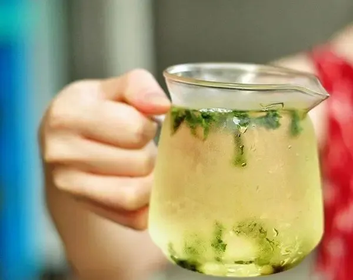
冷泡的水和茶叶的比例可以很宽泛，很少出现过浓的情况。比热泡时的茶水比高出3~5倍我觉得最常见，譬如有个500ml的容器的话，5克茶叶左右，1000ml的容器放10～15克茶叶都行。有时候不清楚容量多少没关系，试一两次投放就有数了。
不管多少容量的容器，不建议投放茶叶小于2克，否则风味打骨折了
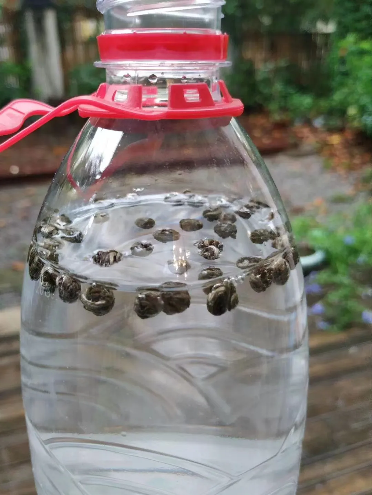
农夫山泉瓶子里放了茉莉龙珠
用纯净水和矿泉水都行，不同水和不同茶叶之间加分减分的复杂关系在冷泡时则变得单纯简单。在容器里放好茶叶，灌入凉水，室温下放置最好4小时以上，冰箱最好2小时以上。隔夜放置可以，别隔两次夜!
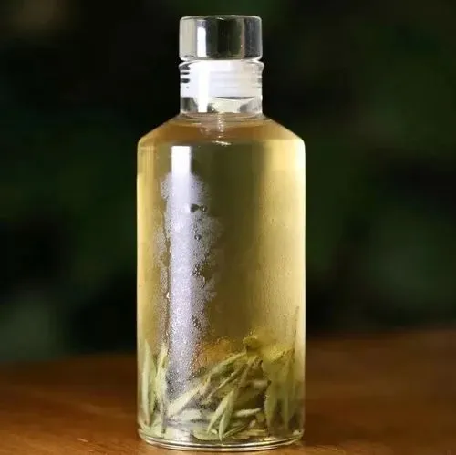
容器选择上，密封的就行。如果想晒朋友圈好看的，网上各色各样的玻璃或塑料瓶瓶罐罐，淘宝搜“冷泡瓶”即可。其实就是许多新式茶饮店、网红店用的容器，设计特定标贴即可。

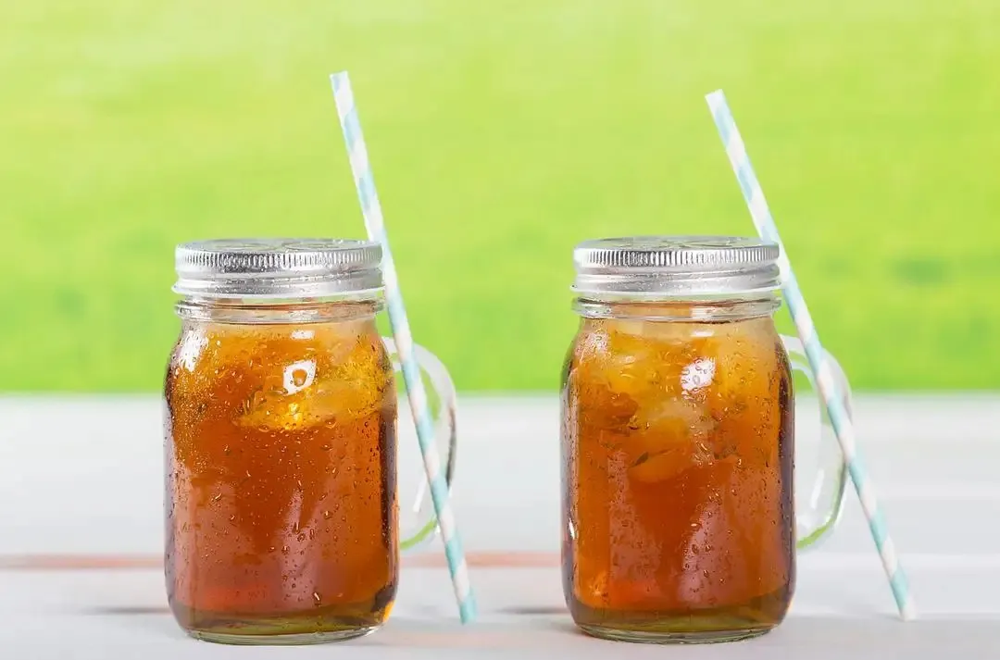
瓶瓶罐罐的档次和价格差异大，有些其实原料不大好，微塑料释放过多，特别是一次性使用的瓶子。
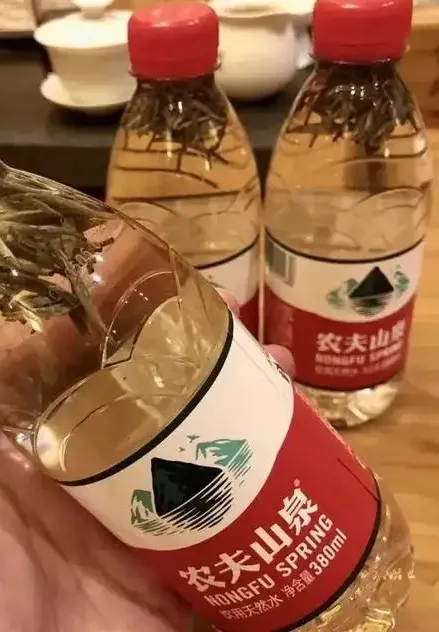
***这种偶尔用用就好***
家里用则密封性好的餐饮级别的塑料或玻璃容器为宜。
除了常规的纯粹冷泡茶，还可在茶中加入柠檬、蜂蜜、或牛奶、果汁、水果、或青梅、青橄榄、薄荷等各色物质进行调味，即自制花式饮品。
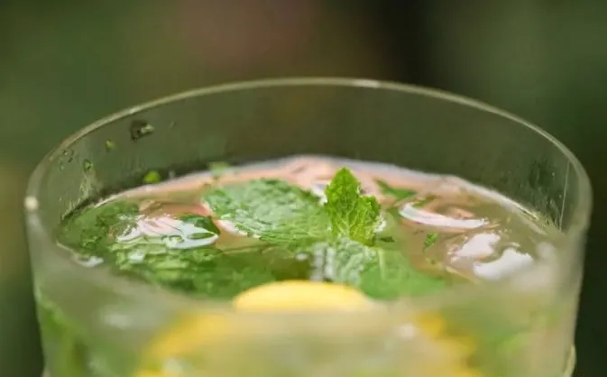
***自制绿茶mojito***
但，别指望冷泡出冰棍雪糕的风味，不添加香精是搞不出来的
比冷泡要高阶的冷萃，建议买专门的冷萃壶，和咖啡冷萃壶完全通用。
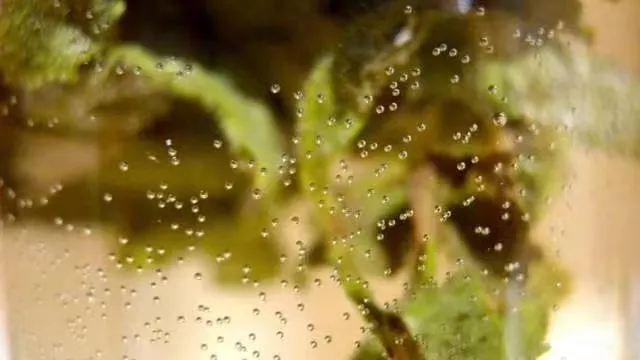
  
不用冷萃壶的话，那就是搞定冰块，找个容器，把茶叶和冰块放在一起，等冰块融化后就能喝了，不过效果不如冷萃壶。
  
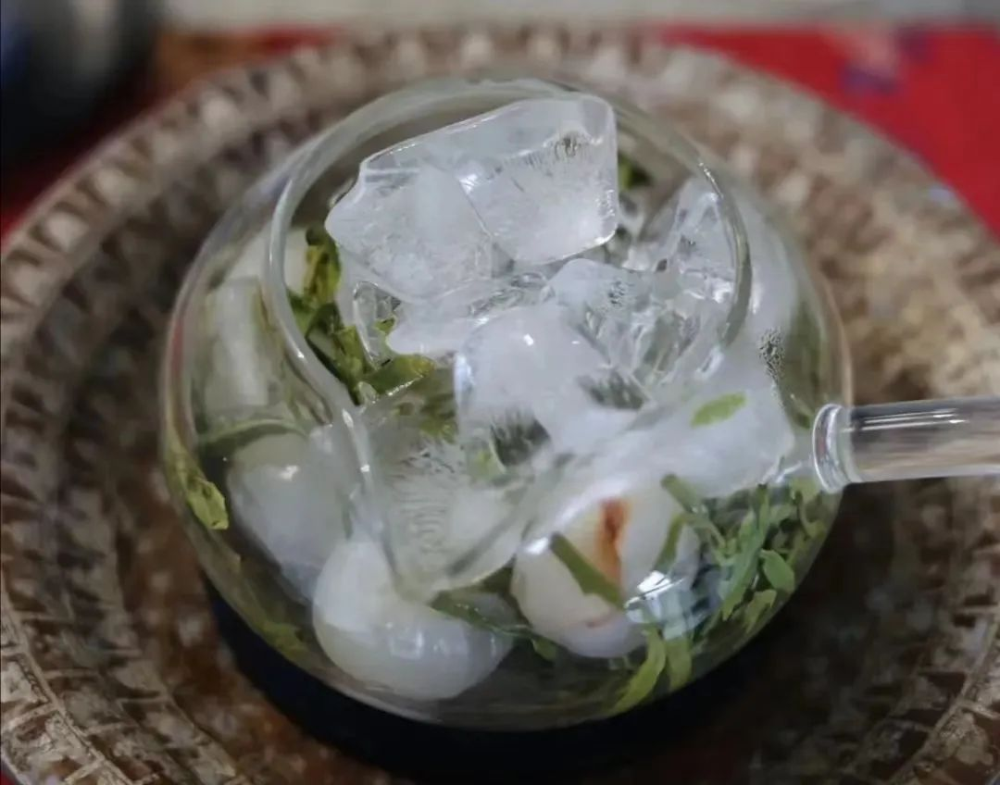有的茶友有洁癖，习惯要洗茶的，但心理上觉得凉水洗茶没啥效果，那其实可以热水洗茶后再灌入冷水的，不必担心经过热水浸润后茶味会过分流失。
冷泡后一旦打开，即茶汤如果较长时间暴露空气中亦可能沾染不洁之物，建议半天内喝掉为宜
  

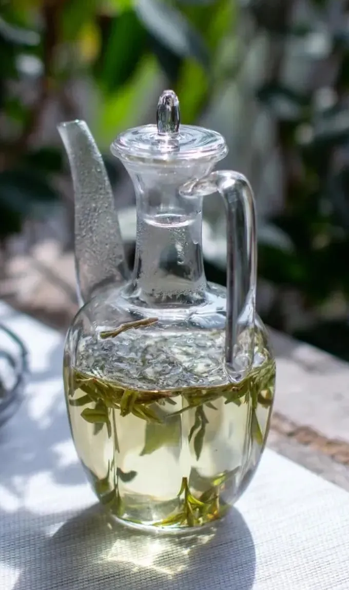
  哪些茶冷泡为宜？
林清玄曾写道："曾经制造过数十种冷泡茶，若要品评高下，以台湾的高山茶、杭州的明前龙井、江苏洞庭山的碧螺春、湖南的君山银针可并得第一，君山银针更是翘楚。"
林清玄的观点中，发酵轻的台湾高山乌龙（老式冻顶、木栅铁观音这种台湾乌龙不合适）、上乘的细嫩绿茶确实是冷泡茶的优选。君山银针则极其冷门，跟它价位偏高有关，我觉得对于黄茶类，冷泡莫干山的黄小茶黄大茶已经相当出彩了
  
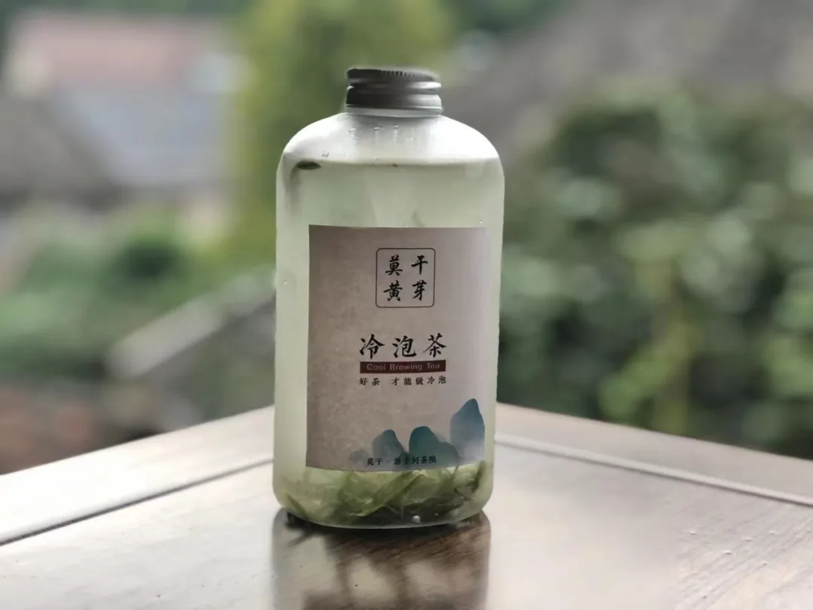
***总的来说，冷泡茶的选型是：选新茶，不选老茶。冷泡绿茶和茉莉花茶最清香，冷泡乌龙最清醇***
  

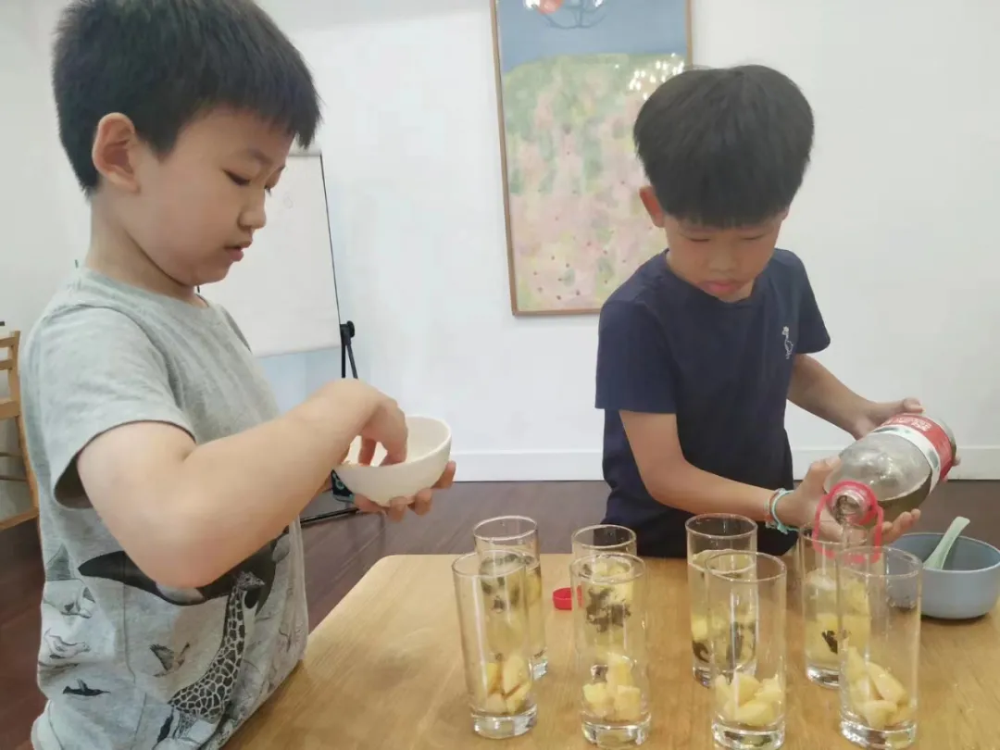
***几年前的亲子活动中，大家DIY桃子乌龙冷泡茶，不放香精的哈***
对于白茶类，白毫银针和白牡丹新茶可以，虽然还没转化好，但老白茶冷泡我觉得风味上被打成骨折。总的来说，不建议对白茶进行冷泡。
选生茶，少选熟茶。生普明显冷泡要优于熟普。我冷泡过几种黑茶，喝起来真的是一言难尽但，老生普冷泡浪费，新生普有刺激性，所以总的来说，我也不建议对普洱进行冷泡。
  

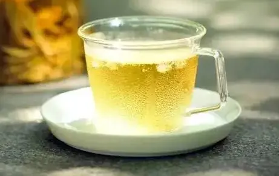
***生普冷泡***
一般来说，发酵程度重的茶类，茶中的含磷量相对高，含磷不会伤害人体，但影响冷泡风味，譬如红茶、岩茶、黑茶类不合适，特殊试验情况下偶有还可以的。
  

冰红茶不属于冷泡茶，是先热泡的再冷却.此外，如果体寒、脾胃虚弱的茶友就不要喝冷泡茶了，最多是喝常温冷泡的，不要喝冰箱冷藏的冷泡茶。
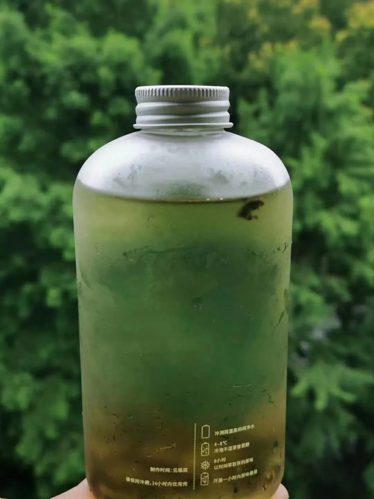
  冷泡茶的科学依据是啥？
茶叶中最重要的两大功效物质是茶多酚和咖啡碱。茶多酚是多种儿茶素的混合物，从人体吸收角度，它在冷泡后基本上和热泡是一样的。
咖啡碱，从人体吸收角度，在冷泡后会比热泡少了很多，会让茶汤的厚重感明显降低，提神效果打折厉害，但对于咖啡碱敏感人群倒是好事。
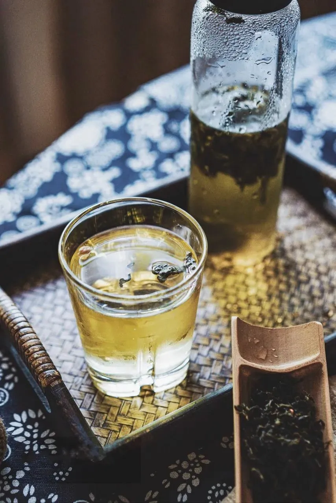
从风味上看，冷泡茶的苦涩程度会下降明显，口感甘甜清醇得多。比例本就占茶叶很少的芳香物质由于没有高温的激发而被弱化，嗅觉享受远不如热泡。
有的茶友会觉得冷泡有着热泡没有的独特风味，这是很私人化的感受，当然可以啦
总之，炎炎夏日，喝上自制的冷泡茶，清凉解渴，别有一番滋味，何乐而不为呢？
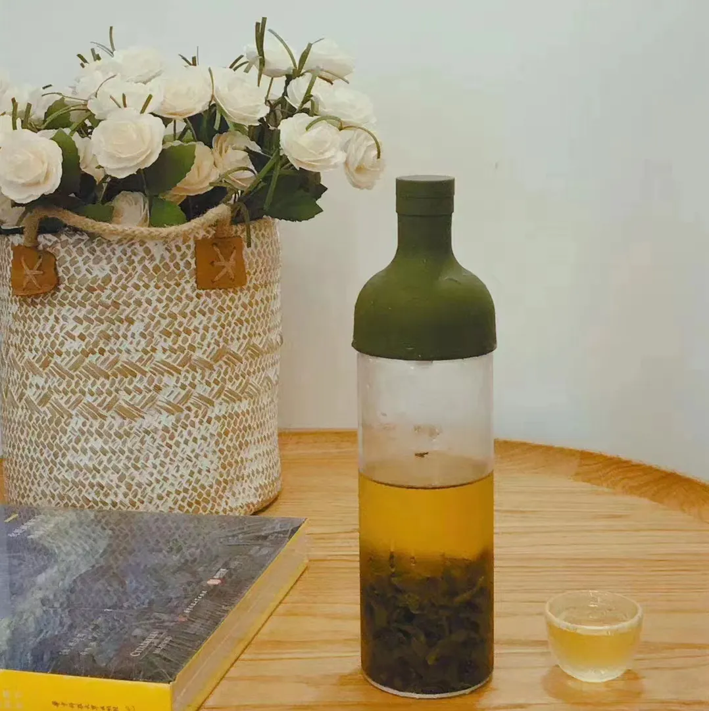

