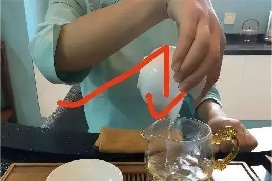

## 茶艺起源与定义
  

中国是茶文化的发源地，《茶经》记载，“茶之为饮发乎神农氏”一说。然后茶文化于周鲁公，兴于唐朝，盛于宋代，普及于明清之时。茶艺主要是与泡茶和品茶相关的技巧和艺术，是一种茶事活动，属于生活美学和艺术的范畴。
  

## 功夫茶艺主要有三种，分别是盖碗式、茶壶式和功夫茶法。本篇主要介绍盖碗式和功夫茶法。
  

## 茶壶式
  

自古以来民间最主要的饮茶方式，即以大茶壶冲泡分饮，乾隆年间画家丁观鹏所绘的“太平春市图”最能表示此种饮茶方式。  

  

## 盖碗式
  

  

乃近代饮茶最主要的方式，上至朝廷、宫府，下至民间，都以盖碗饮茶，清朝康熙年间画家冷枚的赏月图，最足以代表这种茗饮方式。
  

盖碗茶又称“三炮台”包括茶盖、茶碗、茶船。茶盖为天、茶船为地、茶碗为人。一般茶盖比茶碗小，为盖扣于碗的内口形，也有天盖地式。材质主要有瓷胎和紫砂陶胎两种，常见有青花、珐琅彩、粉彩及单色釉等品种。
  

## 盖碗式茶艺基本步骤
### 第一步赏茶。取少量茶叶置于茶荷上，观察茶叶的形态与色泽，细嗅茶叶的清香。
  

### 第二步投茶。用茶匙轻轻的从茶荷投入盖碗中，再此过程中要避免将茶叶撒到外面。

### 第三步洗茶。
### 接着往盖碗中注入开水接着立即将茶汤倒掉，陈年茶叶则需洗多道茶。
  

### 第四步注水。
### 注入使用的茶叶所需温度的热水。注水高度以盖子不浸到水为原则。不同种类的茶叶需要的水温不同。
  

### 第五步浸泡。
注水后盖上杯盖浸润一段时间即可倒出。出汤时间太慢会导致茶汤发苦变涩，使之后几泡的茶汤味道变淡。宁快勿慢，多加练习就能把握好时间。
  

### 第六步 **倒茶** 。将碗盖倾斜，留出一道缝隙，使得茶水可以流出而茶叶不能。快速倾倒茶碗，将茶汤倒入公道杯。这个动作要注意沉肩、沉肘、提腕。

### 第七步分茶。
### 将公道杯中的茶汤分倒入小茶杯中，尽量控制在八分满，便于饮茶人端茶。
## 盖碗泡茶常见手法
### 抓碗法
用整个手直接由上至下捏住盖碗。拇指按在盖纽上，其他手指按个人习惯托住碗底。这种方法操作简单大气，但容易烫手。

### 三指法
最常见的手法。先调整碗盖的出汤角度，食指放在盖纽上，拇指和中指捏住碗沿两侧，无名指和小指弯曲并在中指边上。步骤倒茶中展示的方法就是三指法。

  

## 功夫茶法
  

### 茶意
“功夫茶”即为“潮汕工夫茶”，但其并非一种茶叶或茶类的名字。而是一种泡茶的技法与茶具的结合。之所以叫做功夫茶，是因为这种泡茶的方式极为讲究。操作起来需要一定的工夫和特有的茶具，此功夫，乃为沏泡时的学问，品饮的工夫。

  

### 茶源
苏辙有诗曰：“闽中茶品天下高，倾身事茶不知劳。”功夫茶起源于宋代，在广东的潮汕地区及福建的漳州、泉州一带最为盛行,乃唐、宋以来品茶艺术的承袭与深入发展。
  

### 茶味
功夫茶以浓度高著称，初次尝试似嫌其苦，习惯后则嫌其他茶不够滋味了。其采用的是乌龙茶叶，如铁观音、水仙和凤凰茶。乌龙茶介乎红、绿茶之间，为半发酵茶，只有这类茶才能冲出工夫茶所要求的色香味。

  

### 茶益
 补虚扶正·益气润肺·提神益志·养颜回春
  

### 茶法
 基本方法与盖碗法类似，但核心由盖碗变成茶壶。

#### 第一步赏茶，与盖碗式相同。
#### 第二步温壶。未放置茶叶之前，先将开水冲入空壶，再将水倒出至茶船。
#### 第三步装茶。通常将茶叶装至茶壶的三分之二，甚至满溢。
#### 第四步润茶。沸水冲入壶中至满，用竹筷刮去壶面茶沫，当即倾于茶海。
#### 第五步冲泡。往壶中冲入开水，但不要沸滚的，这便是第一泡茶。
#### 第六步浇壶。盖上茶盖后浇之开水，使壶内壶外温度一致。
#### 第七步温杯。等待茶水泡好后，用刚才温壶及润茶的茶水，在茶船中清洗茶杯。
#### 第八步 **运壶** 。在泡好第一泡茶时，提壶沿茶船边沿运行数周，俗称“游山玩水”，为的是不让壶底水滴入茶杯串味。
#### 第九步 **倒茶** 。将温洗好的小茶盅一字排开，依次来回浇注，又称“巡河”，或将壶中茶水先倒入茶海再注入杯中，切忌倒茶时一杯倒满再倒第二杯，免得浓淡不均，这是一般饮者容易犯的错误。
  

## 茶韵
品茶不仅是品茶，还可以用茶的文化底蕴为自己添一抹神韵，用茶的清香之气冲淡生活的烦恼，松弛绷紧的神经，充实自己的情感。朋友相聚，知己相逢，不妨一同细细品味这功夫茶中的韵味所在。

  

