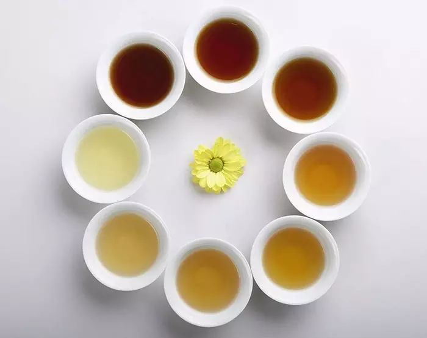
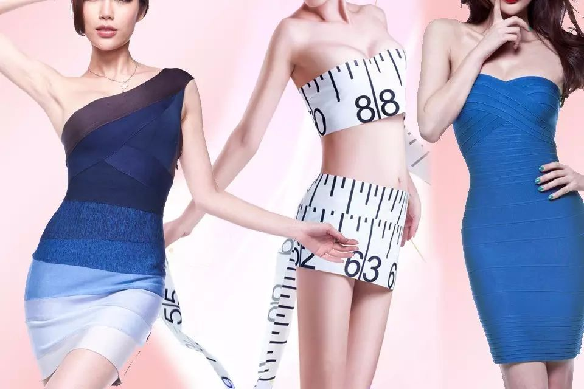

  

喝茶减肥吗？关于这个问题，研究界已经做了大量深入的研究，并且在很多方面达成了一致。国家食品安全风险评估中心的陈君石在《茶的保健功能——个人之见》一文中，对目前饮茶减肥研究的现状描述得比较客观：
  

他说：国外的证据相当充分（Hursel and Westerterp-Plantenga,2013;Sae-Tan et al.,2011;Grove and Lambert,2010），唯一的不足是中国数据少了点，主要是样本量和观察指标不够。
## 不同茶类的减肥效果
多项流行病学研究显示， **饮茶与血清中总胆固醇、脂蛋白胆固醇含量等呈负相关性。** 日本学者调查发现，每天饮用超过10杯绿茶，可增加血清中高密度脂蛋白胆固醇含量（俗称“好胆固醇”），降低低密度和极低密度脂蛋白胆固醇（俗称“坏胆固醇”）、总胆固醇和甘油三酯水平，但对体重无影响。
  

红茶提取物可以显著改善高糖饮食所致的高血脂和高胆固醇症。红茶提取物干预18天后，高血脂大鼠甘油三酯水平趋于正常，干预25天后胆固醇水平趋于正常，但是红茶提取物对血清中高密度脂蛋白胆固醇水平无影响。
  

**有研究通过动物和细胞试验发现，普洱茶提取物能显著抑制大鼠体重增加，降低甘油三酯和总胆固醇水平。**
  

乌龙茶水提取物可以增强脂肪组织中去甲肾上腺素诱导的脂肪分解，降低胰脂肪酶活性，增强脂滴的分解而不影响激素敏感性脂肪酶活性，从而抑制肥胖和高脂血症的发生和发展。
  

## 哪类茶减肥效果最好？
从各项研究可以看出，饮茶对减肥的确是有一定的辅助作用的。很多茶友也都认可这样的科学判断，但还是会有茶友经常问小懂，几大茶类中，哪一类茶的减肥效果最明显呢？
  

刘仲华、李勤等专家在《茶的降脂减肥功效及作用机理》一文中，引用了多项研究成果，对几大茶类的减肥效果逐一做了剖析，并且深入分析了茶多酚、儿茶素、茶黄素、咖啡碱的减肥作用及机理。里面说到的东西太专业啦，今天小懂争取用人话来跟大家简单介绍一下哈。
  

其实各种茶类都能使肝脏甘油三酯（TG）和心脏总胆固醇（TC）含量显著降低并趋于正常，但对高密度脂蛋白胆固醇含量（俗称“好胆固醇”）并没有显著影响。绿茶可能具有比乌龙茶更强的降血脂作用，其原因可能是绿茶对脂肪吸收有显著的调控作用。
  

据《茶的降脂减肥功效及作用机理》介绍，Kuo等研究者比较了绿茶、乌龙茶、红茶、普洱茶降血脂和减肥的效果，**在减肥作用效果方面，乌龙茶＞普洱茶＞红茶＞绿茶** 。

普洱茶、乌龙茶与绿茶、红茶相比，具有更强的降低三酰甘油的效果。而普洱茶、绿茶与乌龙茶、红茶相比，具有更强的降低总胆固醇的效果，不仅可以降低“坏胆固醇”含量，还能提高“好胆固醇”含量。这些结果表明， **全发酵、半发酵的普洱茶、红茶、乌龙茶，比未发酵的绿茶具有更显著的降脂减肥功效。**
  

唯一的遗憾是，黄茶和白茶没有列入试验对比之中。事实上黄茶、白茶在减肥效果方面也是不容小觑的。刘仲华教授的团队曾经专门对白茶的减肥降脂做过试验。
  

试验证明：根据白茶对高脂血症小鼠体重、肝体比与血清生化指标、抗氧化指标的影响，白茶表现出明显的减肥和降血脂效果，对肝损伤有很好的修复作用。
  

当然，任何研究成果都不是绝对真理，关于喝茶减肥的问题，以及哪类茶最能减肥的问题，也欢迎亲们多多补充哦！
  

## 参考资料：
## 《茶叶的保健功能》，陈宗懋、甄永苏主编，科学出版社2014年版。
  

