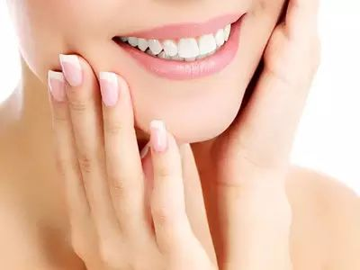
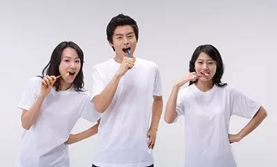

喝茶会造成牙齿发黄吗？这真是个好问题，也是所有茶友都关心的问题。且不说牙齿发黄是否有害，单说这洁白的牙齿变成一嘴黄牙，也绝对会让自己的形象大打折扣啊！
## 茶与牙齿的关系
此事关系到健康和颜值的问题，不容小觑！为了彻底弄明白，小懂先跟大家来了解一下茶和牙齿的关系。
  

茶叶中含都有一定的氟，而且所含的氟正是我们牙齿所需的一种微量元素。氟又是美白、固齿的重要物质。氟跟牙齿中的磷灰石结合，还能够起到抗酸、防蛀效果。这就是为什么我们使用的牙膏中大多都是含氟的原因所在了。
  

**不仅如此，茶叶中的茶多酚还能增加牙齿表面的保护层，保护牙齿的牙釉面，防止我们的牙齿“被上色”。**

## 牙齿变黄的可能
那既然如此，为什么还是有不少茶友反映说，自己长期喝茶后，牙齿变黄了呢？而且在网上，也有很多人认可此种说法。
  

牙齿之所以会变黄，由外界环境因素和牙齿本身的因素两方面造成。牙齿本身会随着年龄增长自然变黄，食用或接触易染色物质也会造成牙齿变色。
  

事实上，很多茶友说的喝茶后牙齿变黄的可能性也是存在的。茶叶中的多酚类氧化物虽然不是我们常说的色素，但会附着于牙齿表面，如果长期不清洗，表面就会积有一层 “茶锈”。特别是在不易清洁的隐蔽部位，如牙齿的舌腭侧面（牙齿的光滑面不易着色）。
  

但要出现这种情况也不是那么轻而易举的，主要有两种可能：一是，茶友太不注意口腔卫生了，刷牙、漱口不勤快，茶叶中的多酚类氧化物就赖在牙齿上不走了。二是，茶友喝茶的量太大或太浓。
  

中国工程院院士陈宗懋先生分析道，氟是双刃剑，有益有害的分界点很接近。浓度适量时是有益，如牙膏中加一点可预防龋齿。但成分太高了就有害，反过来造成氟斑牙和氟骨症。陈先生所说的氟牙症，就是色素牙的一种，牙齿呈黄色损害。
  

所以说，茶中含氟，适量喝茶对牙齿有利，但是如果长期大量饮用浓茶，就有氟超标的风险，后果也是很严重的哦！

## 如何预防？
为了防止出现牙齿变化，我们在日常饮茶过程中，还是要以预防为主：
  
第一：专家说，喝茶后应该用清水漱一下口，一天2-3遍认真刷牙，如果能做到这些，爱喝茶的人牙齿也不容易染色。
  

第二：还有一个小小的窍门也跟大家分享一下，平时刷牙的时候，可以加一点点食盐（或小苏打）来清理牙齿，效果也不错哦！
  

第三：不要过量喝茶，不喝浓茶。喝多少茶才算是适量呢？浙江大学茶学系屠幼英教授的建议是(《茶与健康》，屠幼英主编，2011年)：成人的饮茶量，通常以每天泡饮干茶5-15克为宜。泡这些茶的总体用水量可控制在400-1500毫升。
  

当然，如果不注意以上这些事项，哪天真的出现了黄牙现象，估计刷牙也帮不了你了，只能去正规的牙科医院洗牙了。
  

最后，用自己的经历来做个总结吧！如果你很爱喝茶，就不用太担心牙齿会因为喝茶而变黄。只要培养正确的饮茶习惯，不喝浓茶，不大量喝茶；只要注意日常的口腔卫生，勤刷牙，勤漱口，就基本无忧啦！博主天天喝茶，牙齿依然洁白如新，嘿嘿！
  

