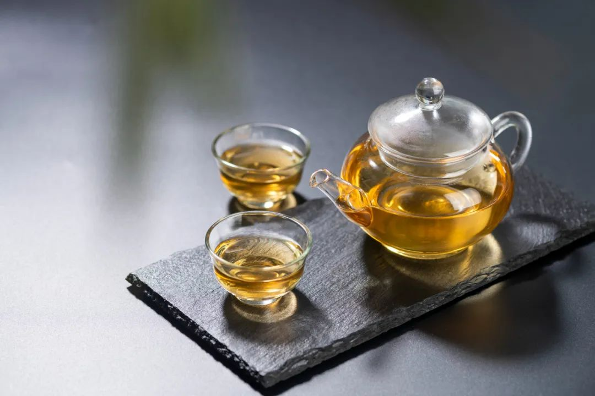
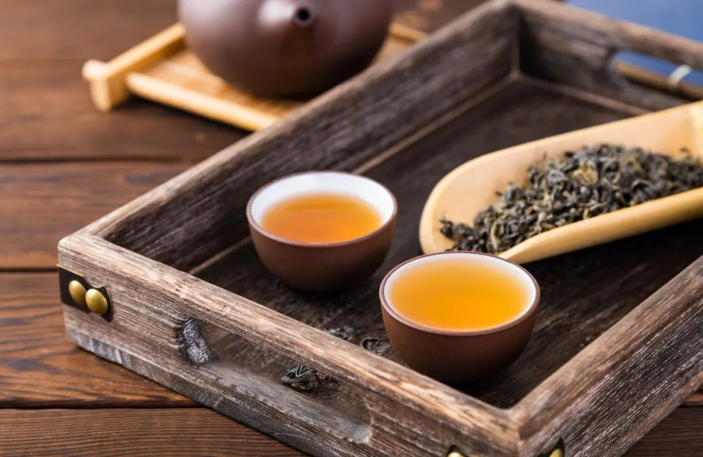

茶是除了水之外，全球喝得最普遍的饮品了。在我们国家，茶更是国饮，很多人爱茶都爱到了“宁可一日无食，不可一日无茶”的境界。尤其是夏天，喝茶既解暑又解腻，很多人饭后都会来几杯。
  那你知道每天喝茶，对身体会有哪些好处吗？我们一起来聊聊~
  

  喝茶对身体有哪些好处？
  

 # 1降低 2 型糖尿病风险
  

分别纳入 22 项随机对照（RCT）研究和 17 项 RCT 研究的两大 meta 分析（研究人数近 5 万）一致认为：糖尿病高风险人群喝茶，有利于血糖的控制，改善胰岛素敏感性；糖尿病患者喝茶则有利于降低空腹血糖和糖化血红蛋白浓度。
  

  

同时，喝茶的对健康的这种好处并无种族差异。对美国 ≥45 岁的 3.8 万名中老年女性，平均随访 8.8 年的研究显示，跟不喝茶的女性相比，每天喝 ≥4 杯茶的女性，2 型糖尿病的风险降低 30% 。
  

对中国 48 万成人随访 11 年的研究则显示， **与过去一年从未喝过茶的参与者比，日常饮茶者的 2 型糖尿病风险降低 8% 。**
  

 # 2降低中风风险
  

对 82369 名日本男性和女性平均随访 13 年的研究显示，每天喝 2~3 杯绿茶的人，中风风险降低 14%，每天喝 4 杯或更多杯风险降低 20%。
  

喝绿茶之所以能降低中风风险，主要是因为 **绿茶中的儿茶素可以通过抗氧化、抗炎、抗增殖、抗血栓形成等多种机制保护血管。**
  

 # 3降低高血压风险
  

对中国 7.6 万成人的研究显示， **喝茶可降低高血压风险，其中喝绿茶可使高血压风险降低 6%** ，即使不是每天都喝，每次喝的量也不多，只要坚持喝，长期也能起到降低高血压风险的效果。
  

机制可能包括两方面：
绿茶富含的儿茶素可以促进一氧化氮的产生，而一氧化氮可以扩张血管，起到降血压的效果；另外儿茶素还能抑制血管紧张素酶的产生，这种酶被抑制后可以使血管舒张，血容量减少，从而起到降低血压的效果。
  

 **喝红茶则能使高血压风险降低 26%，风险可以降低这么多** ，主要是因为 **喝红茶能使收缩压和舒张压都显著降低** ，对此的解释主要有两个：一是红茶富含的茶红素、茶黄素，可以保护血管内皮免受自由基的损伤，让血管光滑和有弹性，从而起到舒张血压的作用；二是钙通道阻滞剂是用于降血压的药物，红茶富含的各种成分就能发挥类似钙通道阻滞剂的作用。
  

 # 4降低死亡风险
  

2022 年发表在《内科医学年鉴》上的一项研究，针对 40~69 岁之间的 50 万饮茶者随访了大约 11 年，结果发现， **每天喝 ≥2 杯茶的人，全因死亡风险比不喝茶的人低 9%～13%。**
  

  茶叶对身体的好处怎么可以发挥到最大？
  

天天喝茶的你，没想到喝茶竟然有这么多健康益处吧！下面我们来看看，要最大程度地获得这些健康益处，茶叶应该怎么存放、茶水应该怎么喝。
  

 # 1茶叶密封、避光、低温储存
  

茶叶容易吸潮也容易串味，让茶喝起来“鲜爽”的茶氨酸容易损失。抗氧化的茶多酚也容易氧化损失，而且温度高时损失更严重， **所以茶叶要密封、避光、低温储存，短时间不喝的茶还可以抽真空后冷冻起来。**
  

 # 2冲泡温度适宜
  

 **一般建议绿茶用 80℃ 左右的水冲泡，红茶和乌龙茶用沸水冲泡** ，这样可以平衡咖啡因、茶多酚、茶氨酸等成分的溶出，冲出的茶更好喝。
  

  

 # 3茶放凉再喝
  

潮汕地区的功夫茶讲究滚烫的时候趁热喝，但是真不建议这样，因为高温会损伤食道，增加食管癌风险，世界卫生组织下属的国际癌症研究机构（IARC）认为饮用温度 **超过 65℃ 的热饮料可能会致癌，所以用沸水冲的茶，建议放到不烫嘴再喝。**
  

 # 4多喝淡茶、少喝浓茶
  

浓茶含有更多的咖啡因，容易引起恶心、胃灼热、心悸等问题，下午或晚上喝也会影响睡眠，所以要少喝。另外浓茶富含的鞣酸还会影响铁的吸收，缺铁性贫血者最好不喝。
  
看完这篇文章，爱喝茶的你是不是更爱喝茶了，不爱喝茶的你有没有喜欢上喝茶？
  

  

  参考文献
[1] Yang WS, Wang WY, Fan WY, Deng Q, Wang X. Tea consumption and risk of type 2 diabetes: a dose-response meta-analysis of cohort studies. Br J Nutr. 2014 Apr 28;111(8):1329-39. doi: 10.1017/S0007114513003887. Epub 2013 Dec 13. PMID: 24331002.
[2] InterAct Consortium; van Woudenbergh GJ, Kuijsten A, Drogan D, van der A DL, Romaguera D, Ardanaz E, Amiano P, Barricarte A, Beulens JW, Boeing H, Bueno-de-Mesquita HB, Dahm CC, Chirlaque MD, Clavel F, Crowe FL, Eomois PP, Fagherazzi G, Franks PW, Halkjaer J, Khaw KT, Masala G, Mattiello A, Nilsson P, Overvad K, Ramón Quirós J, Rolandsson O, Romieu I, Sacerdote C, Sánchez MJ, Schulze MB, Slimani N, Sluijs I, Spijkerman AM, Tagliabue G, Tjønneland A, Tumino R, Forouhi NG, Sharp S, Langenberg C, Feskens EJ, Riboli E, Wareham NJ. Tea consumption and incidence of type 2 diabetes in Europe: the EPIC-InterAct case-cohort study. PLoS One. 2012;7(5):e36910. doi: 10.1371/journal.pone.0036910. Epub 2012 May 30. PMID: 22666334; PMCID: PMC3364250.
[3]Song Y, Manson JE, Buring JE, Sesso HD, Liu S. Associations of dietary flavonoids with risk of type 2 diabetes, and markers of insulin resistance and systemic inflammation in women: a prospective study and cross-sectional analysis. J Am Coll Nutr. 2005;24:376–84.
[4] Jia Nie and others, on behalf of the China Kadoorie Biobank Collaborative Group, Tea consumption and long-term risk of type 2 diabetes and diabetic complications: a cohort study of 0.5 million Chinese adults, The American Journal of Clinical Nutrition, Volume 114, Issue 1, July 2021, Pages 194–202, https://doi.org/10.1093/ajcn/nqab006
[5]Kokubo Y, Iso H, Saito I, Yamagishi K, Yatsuya H, Ishihara J, Inoue M, Tsugane S. The impact of green tea and coffee consumption on the reduced risk of stroke incidence in Japanese population: the Japan public health center-based study cohort. Stroke. 2013 May;44(5):1369-74.
[6] Zhao Y, Tang C, Tang W, Zhang X, Jiang X, Duoji Z, Kangzhu Y, Zhao X, Xu X, Hong F, Liu Q. The association between tea consumption and blood pressure in the adult population in Southwest China. BMC Public Health. 2023 Mar 13;23(1):476. doi: 10.1186/s12889-023-15315-5. PMID: 36915113; PMCID: PMC10010002.
[7] Inoue-Choi M, Ramirez Y, Cornelis MC, et al. Tea Consumption and All-Cause and Cause-Specific Mortality in the UK Biobank: A Prospective Cohort Study. Ann. Intern. Med. August 30, 2022. DOI: 10.7326/M22-0041
 **  

