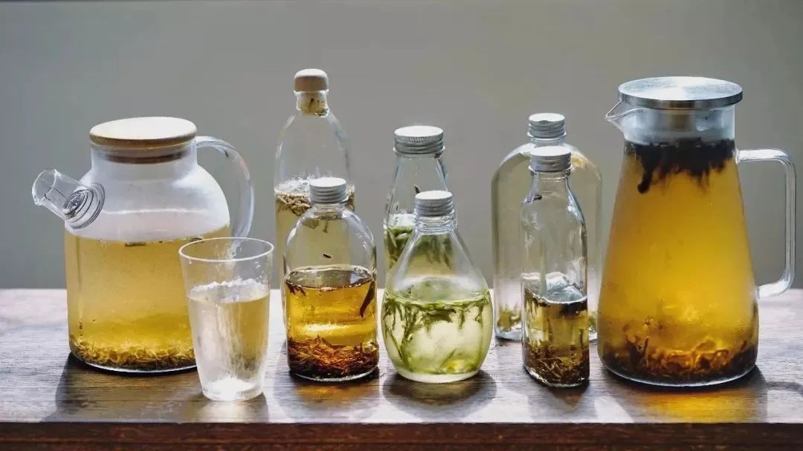
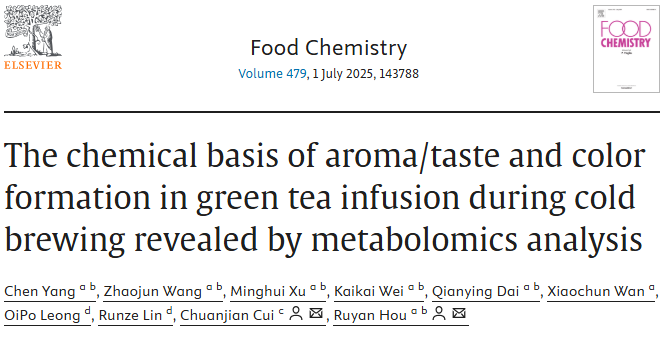
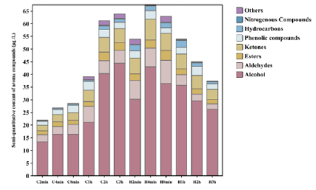
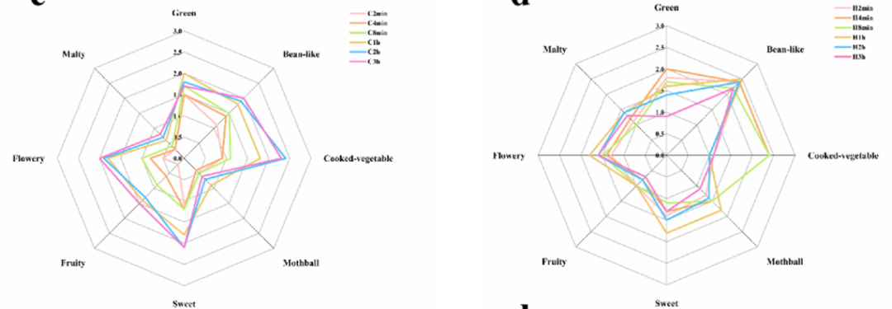
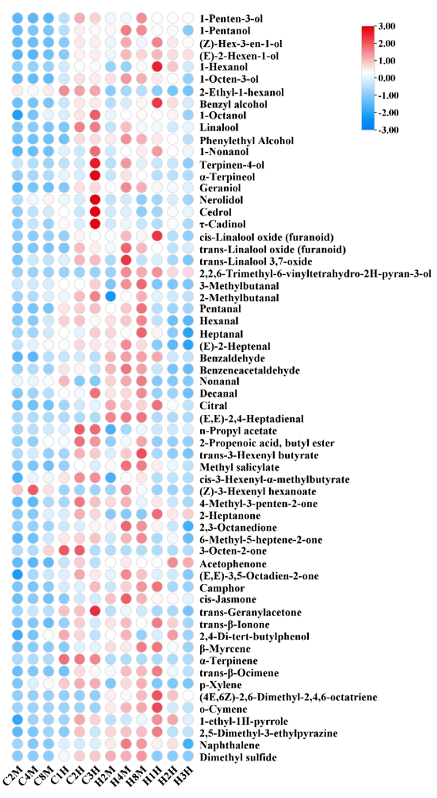
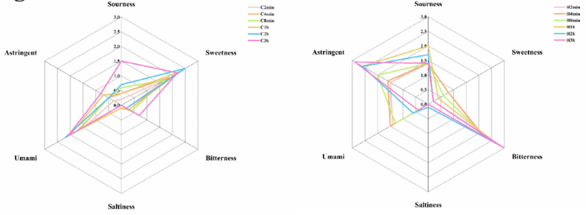
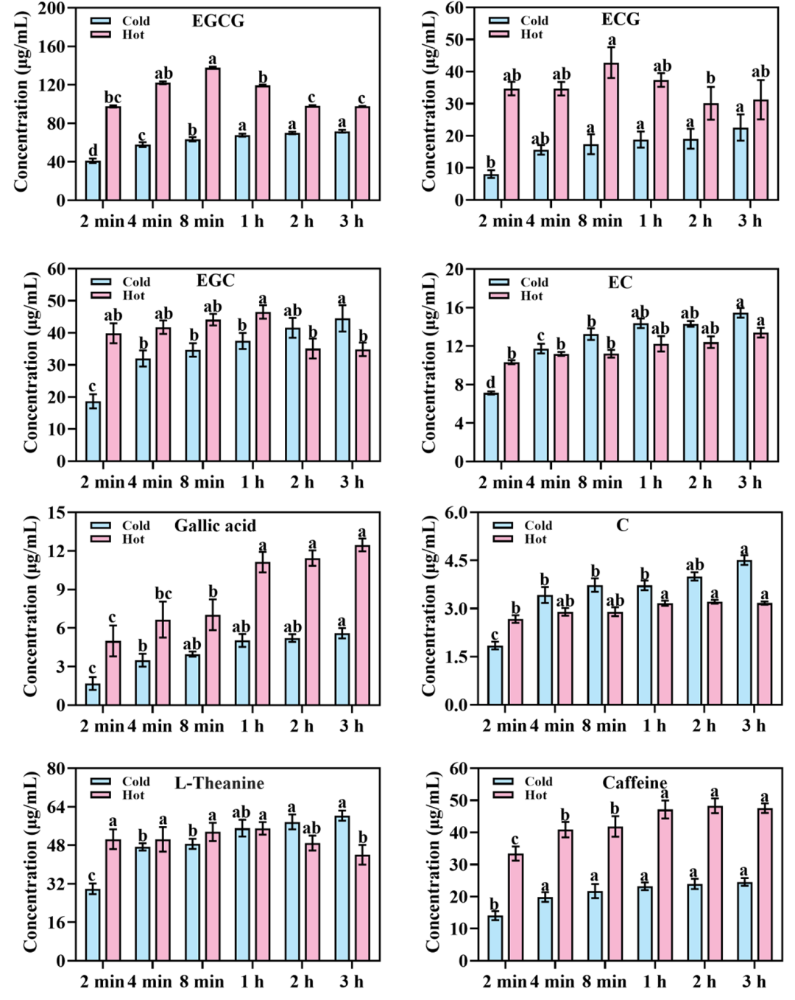
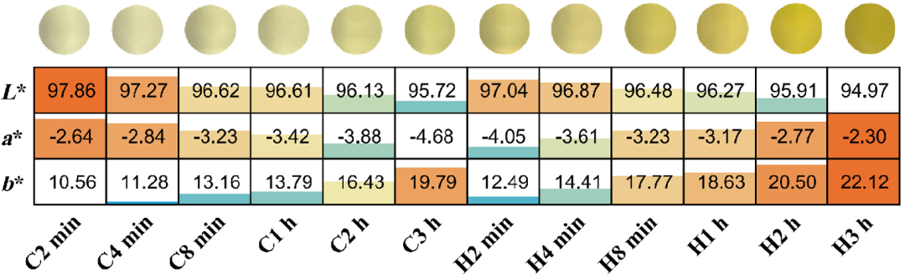

在快节奏的生活中，冷泡茶以其清爽不苦涩的口感悄然走红。
与传统热水泡茶不同，冷泡茶是将茶叶置于冷水中浸泡数小时，让茶叶中的风味物质缓慢释放。
  

  

近期， **安徽农业大学** 的团队在《Food Chemistry》发表题为“代谢组学分析揭示冷泡绿茶茶汤香气、滋味及色泽形成的化学基础”的研究论文，发现冷泡（4℃）绿茶在1小时后形成独特的品质特征。
  

  

## 研究结果
## 01低温酿造花香
研究人员此次选用了安吉白茶作为试验对象，并采用相同的茶水比（1:50 g/mL）。在冷泡（4℃）和热泡（80℃）的条件下，分别测试了2分钟、4分钟、8分钟、1小时、2小时、3小时的茶汤。
  

图1 不同种类挥发性化合物含量随浸泡时间的变化
  

结果发现， **冷泡初期（2-8 分钟）** ，茶叶中的低沸点醇类（如 3-甲基-1-丁醇）少量释放，带来微弱的草本气息，但此时花香尚不明显。
  

而当 **冷泡时间延长至 1 小时** ，关键香气物质开始 “发力”：芳樟醇、香叶醇等具有百合花与玫瑰香的醇类浓度显著升高，茶汤逐渐呈现清晰的花香轮廓；
  

 **冷泡 3 小时后** ，这些醇类物质积累至峰值，香气从 “隐约可闻” 变为 “馥郁持久”，仿佛将整朵鲜花的芬芳融入水中。
  

与之对比， **热泡（80℃）** 的醇类在 **8 分钟** 内就快速释放，但高温加速了香气挥发 —— **1 小时后** ，热泡茶汤中的醇类浓度反而低于冷泡，花香随之衰减。
  

图2 冷泡和热泡下茶汤香气特征随时间的变化
  

另一方面， **冷泡1 小时内** ，醛类物质（如己醛、戊醛）的溶出量随时间线性增加，为茶汤注入青草与柑橘的清新感；
  

 **超过1小时后** ，(E)-2-庚烯醛等醛类浓度进一步上升，让“清香”香气更加突出。而酮类物质如4-甲基-3-戊烯-2-酮，在 **冷泡1-3小时** 内持续积累，为花香增添了一丝独特的果香底蕴。
  

 **热泡则呈现相反趋势** ：醛类在 **4分钟内** 大量溶出，(E,E)-2,4-庚二烯醛带来强烈的脂肪香，但 **8分钟后** 因挥发而快速减少；酮类中的反式-β-紫罗兰酮在热泡 **1 小时** 达到峰值，赋予茶汤浓郁的花香，但冷泡时该物质的提取量始终低于热泡。
  

图3 不同挥发性化合物随浸泡时间的变化
  

## 02冷泡茶更鲜、更甜、不苦涩
**研究发现，冷泡初期（2-8 分钟），咖啡因仅少量溶出，茶汤几乎无苦味；**
  

 **1 小时后** ，咖啡因浓度达23.20 μg/mL，约为热泡 4 分钟（40.90 μg/mL）的57%，苦味仍较温和；
  

**若继续冷泡至3小时，咖啡因提取率增速放缓，苦味不会显著加重。**
  

图4 冷泡和热泡下茶汤滋味特征随时间的变化
  

同时，涩味物质EGCG的释放更“克制”： **冷泡1小时** ，EGCG 含量为 45.6 μg/mL，仅为热泡2分钟（97.56 μg/mL）的47%；
  

直到3小时后，EGCG浓度才缓慢升至71.82 μg/mL，涩感始终维持在“微乎其微”的水平。
低温如同给苦味和涩味物质按下了 “慢速键”，避免了热泡时的 “猛烈释放”。
  

图5 冷泡和热泡下儿茶素、茶氨酸和咖啡因随时间的变化
  

鲜味方面， **冷泡1 小时** ，鲜味物质L-茶氨酸的提取率比热泡 4 分钟提高 9.2%，茶汤开始呈现明显的鲜爽感；
 **延长至 3 小时** ，L-茶氨酸浓度持续上升，鲜味从 “清淡” 变为 “饱满”，仿佛融入了春日嫩叶的清甜。
可溶性糖（葡萄糖、蔗糖）的溶出则是“时间越久，甜味越显”：冷泡1 小时， 糖含量为热泡的85%；

 **3 小时后** ，其浓度接近热泡的95%，与L-茶氨酸协同作用，让茶汤从 “微甜” 升级为 “清甜回甘”。
  
## 03为什么冷泡茶更绿
绿茶的绿色源于叶绿素。冷泡时，低温抑制了叶绿素降解酶的活性，使叶绿素a和b得以大量保留。
  

数据显示， **冷泡 3 小时后** ，茶汤的 a值（代表绿色）从-2.64降至-4.68（负值越大越绿），而热泡同时间内 a值从-4.05 升至-2.30（绿色减弱）。这就像给叶绿素穿上了 “保护罩”，让茶汤始终保持鲜嫩的绿色。
  

另外，热泡时，高温会加速黄酮类物质的溶出，这些化合物不仅带来涩味，还会让茶汤偏黄。
  

冷泡则显著减少了黄酮类的提取，同时抑制了叶绿素向褐色降解产物（如脱镁叶绿素）的转化，双重作用下，冷泡茶的颜色更接近新鲜茶叶的翠绿。
  

图7 冷泡和热泡下茶汤颜色随时间的变化
  

## 结语
冷泡并非简单的“低温浸泡”，而是通过调控分子运动速率和化合物稳定性，实现了风味物质的“精准提取”——保留鲜味、甜味和花香，抑制苦味和涩味，同时锁住天然绿色。
  

冷泡的魅力，在于用时间换风味——随着时针转动，茶汤中的香气物质层层绽放，滋味从清鲜走向醇厚，而低温始终守护着那份独特的嫩绿。下次冷泡时，不妨分时段品尝：1 小时的清爽、3 小时的浓郁，感受一杯茶在时间里的奇妙蜕变。

  

