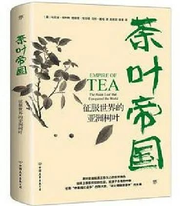

中国传统的茶叶，按照发酵程度与制作工艺，可以分为六大门类，分别是绿茶、红茶、白茶、黑茶、黄茶与乌龙茶，它们各具特色，背后也都藏着丰富的故事。时至今日，饮茶已经成为现代人的生活习惯，小小的茶叶对于我们来说早已司空见惯，但这些故事可能并不一定为人所熟知。比如，现在特别火的“抹茶”是怎么来的?从一次意外中诞生的红茶，又为何最终遍布世界各地？接下来的这篇文章，将从多个不同的角度，带你了解六种茶叶背后缤纷的文化。
  
## 绿茶：最具代表性的主流茶叶
绿茶是茶叶中最庞大的分类，占据了茶叶生产总量的70%。如今，正逢清明时节，第一批“明前茶”应该已经采制完成，这是每到春季都会被茶商炒起来的概念，然而，明前茶真的就意味着高档茶叶吗？在中国占据主流地位的绿茶，到了隔海的日本，又衍生出了什么变化呢？  
绿茶历史悠久的原因，一部分是因为它在发酵程度上属于不发酵茶（发酵程度在5%以下），比较接近茶叶本真的味道，而且由于古代制茶技术尚不完善，从神农尝百草直到春秋战国，食用方式基本都是之前提过的“吃茶”。随着冲茶技术的发展，绿茶渐渐成为人们不可或缺的饮品，我们今天耳熟能详的很多名茶，都来自于绿茶家族，例如西湖龙井和碧螺春。当然，这两种茶叶能够跻身中国名茶的前两位，还是沾了清朝皇帝康熙和乾隆的光，比如碧螺春，本来的名字叫做“吓煞人香”，传说因为采摘时过于娇嫩，茶农担心会在筐子里被碰烂，于是专门交由少女装在怀里带回，冲茶的时候所谓的茶香清香体香交织一体，又名“女儿香”，估计是连庸俗的乾隆都听不下去了，知道这个名字后觉得不雅，下令改名为碧螺春。  
绿茶的分布范围十分广阔，几乎中国的每个地方都能找出具有特色的绿茶。在宁静的室内，人们沏上一杯茶叶，品鉴其中的茶色、浮叶与香气。为了一杯口感上乘的绿茶，人们对每个细节精雕细琢，包括沏茶使用的水，工具，以及茶叶采摘的时间。说到这一点，就得提一下绿茶中负有盛名的“明前茶”和“雨前茶”。  
“明前茶”指的是清明节之前采摘的茶叶，而“雨前茶”指的则是清明之后谷雨之前采制的茶叶，二者都属于春茶，因为据说经过整个冬天的沉淀，此时的茶叶养分充足，又比较鲜嫩，深受爱茶人士的喜爱。这其中，明前茶要更为珍贵，大多数茶树在清明节前并不能生长出符合采摘标准的茶叶来，所以数量比较稀少。那么，明前茶的质量真的名副其实吗？  
其实，季节只是判断茶叶质量的标准之一。清明之前采摘的茶叶的确更加鲜嫩，但具体质量如何，还要考虑茶叶自身的品质，当地的气候等等，比如一些高山茶树，生长缓慢，清明节前采摘就明显不是一个好的选择。另外，每一年的气候都会有所差异，如果清明节前的光照与气温状况并不理想，那么，也还不如让茶叶在树上多呆几个月，让它们成长得更为饱满一些。即使采摘到了优质的茶叶，茶厂的加工手法也会影响茶叶的品质。所以，只看采摘季节，就断言明前茶是上等茶叶的观点，毫无疑问是片面的。  
纪录片《茶叶中国》截图  
在加工方面，绿茶一共有四大分类，分别是炒青、烘青、晒青以及蒸青。炒青指的是在茶叶杀青后，利用手工锅炒、滚筒炒干机等方式加工而成的茶叶；烘青则使用炭火或烘干机进行烘焙；晒青使用的是传统日晒方法，不过这种加工方式较为粗糙，因此晒青的绿茶基本只用作毛茶，用于茶饼、沱茶的加工原料。最后一类是蒸青，利用水蒸气的热量来破坏茶叶中的酶，从而完成茶的发酵。蒸青技术在中国有很古老的历史，不过后来，蒸青技术出产的茶叶渐渐稀少，反而由日本发扬起来，如今日本的主流绿茶，基本都是蒸青茶。  
日本在12世纪之前便已经从中国引进茶叶，可惜日本民众并没有养成喝茶的习惯，直到13世纪初期，在荣西禅师的推广下，饮茶之风才在自然灾害频发的日本盛行。当时荣西禅师在《喝茶养生记》中推广茶叶的原因是“在中国，人皆好茶，是故心脏病痛少有，而人皆得长寿。但观我国人多菜色，瘦骨嶙峋。究其缘由，盖不喝茶也”。荣西禅师在日本选了个地方培育他从中国带回来的茶籽，这个地方的土质非常理想，光照条件也很难得，由此出产的茶叶至今都是日本茶叶中的上品。这个地方的名字就叫做宇治。  
在灾难频发的日本，喝茶除了荣西禅师所说的强身健体之用外，很大程度上也是日本人的精神慰藉。借助泡一盏茶的工夫，享受一下静谧的时光。类似的心理治愈在现代历史中也经常看到，例如二战时期丘吉尔要求保证英国居民即使在被轰炸期间也能够喝到一杯热茶，以此来增强人们的信心，保持对生活的热情。德国的芬达，美国士兵的可口可乐，虽然饮品不同，但原理也是一样的。因为需要用喝茶来起到抚慰内心世界的作用，所以，日本人并不介意在喝茶的过程中投入大量时间，并为此增添了大量的仪式感。从沏茶的方式，再到使用的茶具，茶道由此在日本盛行。  
在16世纪，被誉为日本茶道大师的千利休更是运用自己在幕府中的地位，将茶道进一步规范化。他认为不同的季节要使用不同的工具喝茶，所有茶具（茶碗、茶筅、水勺、茶勺）都必须轻拿轻放。之前日本普通人偏爱的茶具是中国的釉碗，而千利休本人更偏爱日本岛内烧制的乐烧茶碗。此后，日本人对茶具风格的选择也发生了变化。如果有读者不太清楚乐烧茶碗是什么样子的话，那么另外一件事情是，千利休发起的这个改变，在日本形成了一种新的审美风格——侘寂风，就能大概明白不加修饰的乐烧碗是什么样子了。  
但在此时，日本茶道以抹茶道为主。也就是借鉴宋朝的点茶法，将茶叶变成茶粉，然后冲饮。而在18世纪中期，另一个盛行的茶道流派煎茶道正式出现。煎茶道的关注点和抹茶道恰好相反，抹茶道崇尚喝茶的仪式感与过程，对场景、器具、动作的要求都很高，而煎茶道崇尚茶叶本真自然的味道。相传煎茶道的祖师是名为“卖茶翁”的柴山元昭，他在京都卖茶的时候，就是烧一碗开水，等水煮沸，然后直接抓一把茶叶投入。这个简单质朴的喝茶方式立刻受到了日本民众的欢迎。  
《茶的真实历史》，作者: （美）梅维恒 / （瑞典）郝也麟，译者: 高文海，版本: 生活·读书·新知三联书店2021年6月。  
当然，抹茶道在后来也有更新。它所使用的末茶，很成功地将中国自宋朝后就失传的冲制方法继承了下来，而且，如今的甜点制品中，抹茶也是非常契合年轻人的口味。其实，真正使用抹茶道冲制出来的纯茶，口感要比煎茶法苦涩许多，很多人第一次尝试的话未必能够适应。另外，如果是自己想要制作茶点，购买抹茶粉的话，一定要注意，只有使用蒸青技术制造出的末茶，才能被称为抹茶粉，其他发酵手段制造的绿茶末茶，只能被称为绿茶粉。随着化学技术的更新，想要从外观上区别二者已经有些困难，但只要记住一点，抹茶粉和绿茶粉虽然只是发酵方式不同，价格却是天壤之别，抹茶粉的价格应该是绿茶粉的上百倍。
## 红茶：从意外走向世界的茶叶
如果说，绿茶是东亚饮品的形象大使，那么，红茶的身影已经遍布世界各地。从中国到东南亚、北美、非洲，都能经常看到红茶的身影。这个在意外中诞生的茶叶，随着茶叶知识的普及，已经成为国际化的饮品。  
明末清初时期，一支军队路过福建武夷桐木村，占据了当地的茶厂。士兵们没有地方睡觉，就露天睡在茶厂堆积满地的茶叶上，第二天等士兵们走后，茶农们发现士兵们躺了一夜的茶叶已经变红，为了避免损失，茶农们勉强将这些“劣等茶”烘干冲泡，低价出售。冲出来的茶叶散发着一股浓郁的松香味。  
当地人都知道这是制作失败的绿茶，没有人愿意买来喝。他们可能没有想到，没过几年，这种失败的茶叶将风靡全球，并且成为清朝对外贸易的主要货物之一。它的名字就是红茶。  
现在我们看到的很多欧洲茶叶，都是以红茶为基底，但其实，作为最早大规模与中国进行茶叶贸易的国家，英国人接受红茶也经历了漫长的过程。当茶叶通过荷兰东印度公司传入欧洲的时候，英国人在东南亚还没有统治权，所以只能从荷兰人那里转手购买茶叶。这个来自东方的神秘树叶在欧洲旅行者的描述中，变成了极为珍贵的奢侈品，它可以治疗疾病，延缓衰老，同时又象征着文明、休闲与教化。再加上对于茶叶的种植和制作工艺技术，被中国历代王朝视为高等国家机密，欧洲人除了能从商人那里拿到现成的茶叶外，对茶叶的原料，种植地，种类等等知识都一无所知。从中国进口的茶叶极为有限，16~17世纪，葡萄牙人选择从日本进口茶叶，然而，随着丰臣秀吉的灭教运动，大量欧洲基督徒在日本被屠杀，茶叶贸易也近乎中断。  
1650年，英国1磅茶叶的价格在6~10英镑左右，换算成今天的价格，就等于500~850英镑，也就是说，当时在英国最便宜的茶叶，大概也卖到了相当于今天4000元/斤的价格。这还是随着贸易量增加，茶叶价格回落的结果。等到1689年，英国东印度公司正式与清政府接触，从官方渠道批量进口茶叶，英国茶叶的价格才跌到了1英镑以下。然而，对于从中国进口的茶叶，英国人一直搞不太懂品质问题，总觉得中国茶叶的质量不是特别稳定。  
  
《茶叶帝国》，作者: [（英）马克曼·埃利斯] 
1717年，托马斯·川宁（就是今天TWININGS品牌的创始人）在伦敦开设了第一家茶室。他的商业法宝是推出了不同种类的调配茶，至于创制调配茶的原因，就是因为不同茶叶之间的口感差异极大。川宁的孙子曾经解释过祖父的这一做法，“如果拿出二十箱茶来细细品茶，他会发现每箱味道各有不同：有的浓而涩，有的淡而浅……通过将不同箱里的茶叶混合搭配，我们可以得到一种比任何一箱茶叶都可口的混配茶。另外，这一做法还是确保茶叶质量稳定的唯一途径”。同时代英国船员也在自己的见闻录中记载，与中国商人打交道时要提高警惕，有些茶叶颜色发黑，一看就知道不会是什么好茶。但其实这种茶，极大可能就是中国生产的红茶。  
直到后来，英国人才知道红茶与绿茶不同，从而引起了喝红茶的兴致。英国牧师约翰·奥文顿从中国旅行回国后，向英国人介绍中国有三种茶叶：武夷茶、松萝茶和饼茶，其中武夷茶被中国人推崇为第一”。由此，英国人开始了喝上等武夷红茶的风潮。  
不过，由于清政府对茶叶知识的绝对保密，大部分英国人并不知道不同种类的茶叶是加工导致的区别，还误以为有单独的绿茶树、红茶树等等。  
红茶制作工序中，比较重要的环节就是萎凋和发酵。萎凋的目的是散发掉茶叶中含有的水分，主要有日光萎凋、室内自然萎凋和加温萎凋三种方式，现代红茶生产多以最后一种方式为主。发酵过程是要催逼出茶叶内含有的茶黄素、茶红素等成分，这也是红茶会呈现暗红色的原因。按照制作工艺和茶叶用料，人们习惯将红茶分为三种，分别是小种红茶、工夫红茶和红碎茶。要额外一提的是，很多人会将工夫红茶写为“功夫红茶”，其实二者含义并不一致，而且闽南方言中“工夫”和“功夫”的发音也不一样，正确的写法应当是“工夫红茶”。  
工夫红茶和红碎茶是常见的出口商品，后者多用于袋泡茶。作为出口的大宗茶叶，红茶在19世纪影响到的国家并不仅有英国。从雍正五年与沙俄签订条约起，中国开始与俄国通商，红茶也就此传入俄国。对于身处寒带的俄国人而言，红茶是理想的保暖饮料，与英国人不同，俄国人嗜喝浓茶，还会在大剂量红茶中加入果酱、柠檬片、白兰地或者朗姆酒，再搭配面包、烤饼等点心，几乎可以作为一顿正餐。  
法国人饮用红茶的模式和英国相似，注重闲适感，会在红茶中加入牛奶与糖或者鸡蛋，在家中举行茶会，并配置烘焙甜点。印度人则几乎在饭后必须要喝一杯由红茶制作的奶茶，其制作方法也很独特，将红茶、牛奶、丁香、小豆蔻一起放入锅中煮，再将配料倒掉，制作出这种名为“马萨拉茶”的饮品。  
红茶与各种原料间理想的匹配度让它风靡世界。19世纪，英国人为了能够保证红茶的供应量，积极鼓励殖民地种植茶叶，并且随着淘金潮开始向其他地区推广饮茶文化。19世纪末期，澳大利亚和新西兰成为人均饮茶量最大的国家。在种植地方面，除了鼓励印度与锡兰的红茶种植互相竞争之外，英国人还在非洲国家开辟了茶叶种植园，其中最具代表性的国家就是肯尼亚。经过一个世纪的发展，今天的肯尼亚已经成为世界第三大红茶生产国，不过受限于土壤及气候条件，肯尼亚红茶的质量并不理想，虽然产量极大，但大部分只能用于茶包原料。  
在红茶种植兴起的浪潮下，如何打响自己的品牌成为红茶商家需要苦思冥想的事。在这方面，当年的优胜者毫无疑问是立顿。据说立顿是个每天24小时都要构思红茶宣传的狂热者，有一次立顿所在的货船出现了故障，船长告诉乘客们要向海中抛弃掉一些货物，立顿马上表示愿意将自己的红茶全部扔掉。在扔掉装红茶的箱子之前，他在每个箱子上写上立顿公司的名字。这些被扔到海中的箱子顺着洋流漂浮到了阿拉伯半岛，在海滩拣到它们的阿拉伯人冲饮后立刻迷上了这个饮品，立顿用几乎零投资的方式打入了阿拉伯市场。鉴于立顿本人除了是个广告大师外也是个吹牛大师，所以他口中这个故事的真伪有待证明。不过，红茶在世界范围内的激烈竞争与争奇斗艳的形势，由此可见一斑。  
《有茶气：谬误与传说中的中国茶》，作者: 曾园 
## 白茶与黑茶：温和的现代饮品
白茶和黑茶的品种都不算多（如果不将普洱茶算进来的话），但是在六大类茶叶中，它们的优点都特别明显。白茶具有茶叶中最佳的抗氧化效果，而黑茶口感醇和，饮用手法多样，都可以算得上是适合当下人的现代饮品。  
前文提到，绿茶是中国历史最悠久的茶叶，不过这点也存在一些争议，也有人认为，白茶才是中国人最早饮用的茶叶。关于白茶的起源和定义众说纷纭，原因在于我们没有办法搞明白，“白茶”一词在历史中究竟指的是什么。  
关于白茶的说法之一，是历史上的白茶就是指白色的茶叶。茶树因为变异或真菌感染等原因，患上了白化病，茶叶在树上的时候就是白色的，因此得名为白茶。说法之二，是茶叶上天然带有一层银白色茸毫的茶叶，这种茶树的确存在，例如今天的福鼎大白、福安大白等等。说法之三，才是现代通常理解的那种白茶，通过发酵和氧化程度，按照六大类划分的白茶。不同的说法都能在历史典籍中找到依据。陆羽的《茶经》最早出现白茶一词，只有一句话，“永嘉县东三百里有白茶山”，关于茶叶的外观和制作方法只字未提，因此无法得知详情。宋徽宗的《大观茶论》中也提到了白茶并且详细记载了制作工艺，然而，按照宋徽宗记载的工艺，很明显做出来的是蒸青绿茶。  
在历史起源方面，也有研究者认为，结合中国古代人茶叶药用的使用方法和当时尚不成熟的储存条件，古人不会对茶叶进行炒揉和发酵，而是经过日晒后储存，这种方法制作出来的大概率就是白茶。鉴于尚无明确说法，史料中存在着词义变化，因此我们这里所说的白茶，就单指现代工艺分类中的白茶。  
白茶非常适合现代养生。独特的日晒萎凋加工方式，使得白茶中的黄酮含量是所有茶类中最多的。其他茶类的黄酮含量都只有0.1mg/g，而白茶的黄酮含量达到了2.2mg/g。在茶水的口感中，黄酮主要影响的是苦涩味，所以按理来讲白茶应当是喝起来最苦的茶叶，但奇妙的是，白茶的氨基酸含量也远远高于其他茶类（第二高的绿茶氨基酸含量为1.4%，而白茶达到了3%），氨基酸又在茶汤中影响着甜味。因此，好的白茶喝起来会带有非常明显的甜爽回甘。  
氨基酸和黄酮含量的领先，让白茶在抗氧化方面具备了独特的优势，特别是陈年的老白茶。陈期20年的老白茶中黄酮含量能达到惊人的13mg/g。黄酮在人体内可以清除自由基，达到抗氧化的作用，在对抗电子屏幕辐射方面有一定的效果。对于都市上班族而言，白茶是理想的茶叶。不过，白茶的主要制作过程只有萎凋，没有揉捻，保留了自然植物原始的寒性，在六大茶类中，属于茶性最寒的一种，所以对于本身就体虚性寒的人来说，饮用白茶一定要适量。相比之下，颜色与之相反的黑茶，性情就要温和得多。  
  
《白茶新语》，作者: 李建国 版本：文化发展出版社2019年1月。
## 黄茶与乌龙茶
 **命运迥异的“宠儿”与“弃儿”**  
同为六大茶类，黄茶和乌龙茶的命运却截然相反。乌龙茶种类繁多，无论是冲泡清饮还是调配茶还是瓶装饮品，乌龙茶都可谓人们眼里的宠儿，而反观黄茶，非但规模在缩减，而且还有不少茶类渐渐并入绿茶，2019年的统计显示，黄茶产量在六大茶类中仅占0.35%，可以说是很边缘化的茶叶了。  
黄茶处境尴尬的原因之一是它模糊的定位，它和绿茶之间的区别并不很大，只是多了一道“闷黄”的工艺。（所谓闷黄，就是将杀青或揉捻后的茶叶趁热堆积，让茶叶在热量中发生泛黄的反应）闷黄并不容易控制，堆积前的温度与湿度都会对最终黄茶的品质形成很大影响。它的外表看起来像是不新鲜的绿茶，再加上不少人喝绿茶的时候追求清澈透绿的茶汤，当看到黄茶那绿中泛黄的茶汤后，就会误以为是买到了劣等的绿茶。除此之外，论口感，黄茶也比较中庸，不如绿茶清新，不如红茶香甜，又不如白茶清爽，和黑茶比又缺了一份口感中的浓郁。现在不少黄茶都被用于制作速溶茶和瓶装饮料，黄茶中含有的可溶性糖是所有茶类中最低的，所以很适合作为低糖饮料使用。  
如果人们想要提升黄茶的存在地位的话，或许只能从养生的角度入手了。因为论及历史文化，黄茶的文化背景也并不深厚，只是在明朝才正式出现用于交易的砖茶。在保健方面，黄茶对于消化道的改善作用是比较明显的，在降血糖和降脂上，实验证明黄茶中相关的提取物成分也更为显著——不过这些实验对象都仅限于黄茶中最浓郁的黄大茶，如果是味道比较平淡的黄芽茶和黄小茶的话，那所带来的功效和其他茶叶相比也没有明显区别。  

