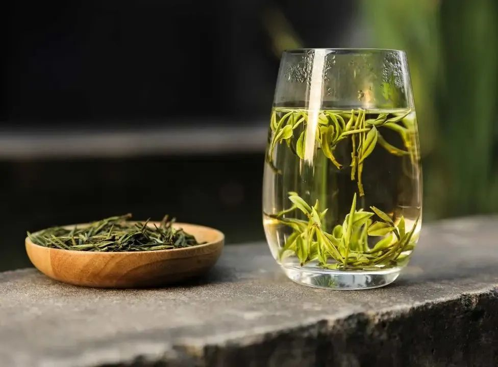
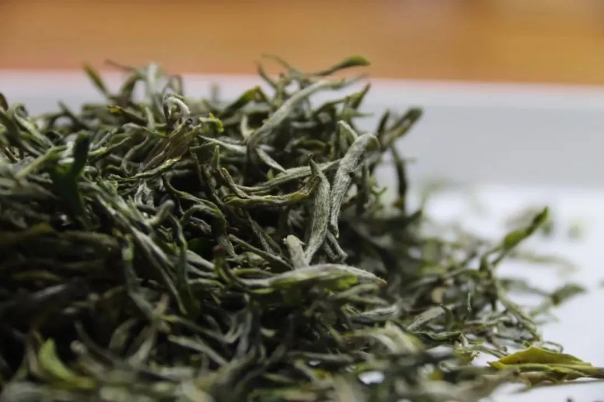
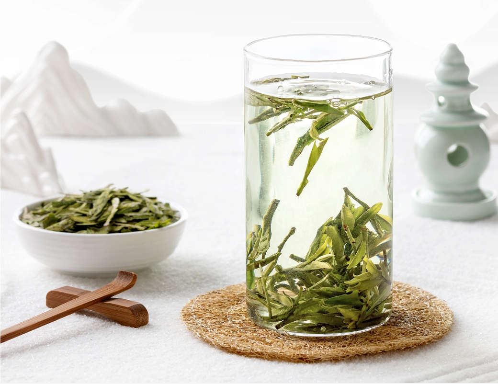
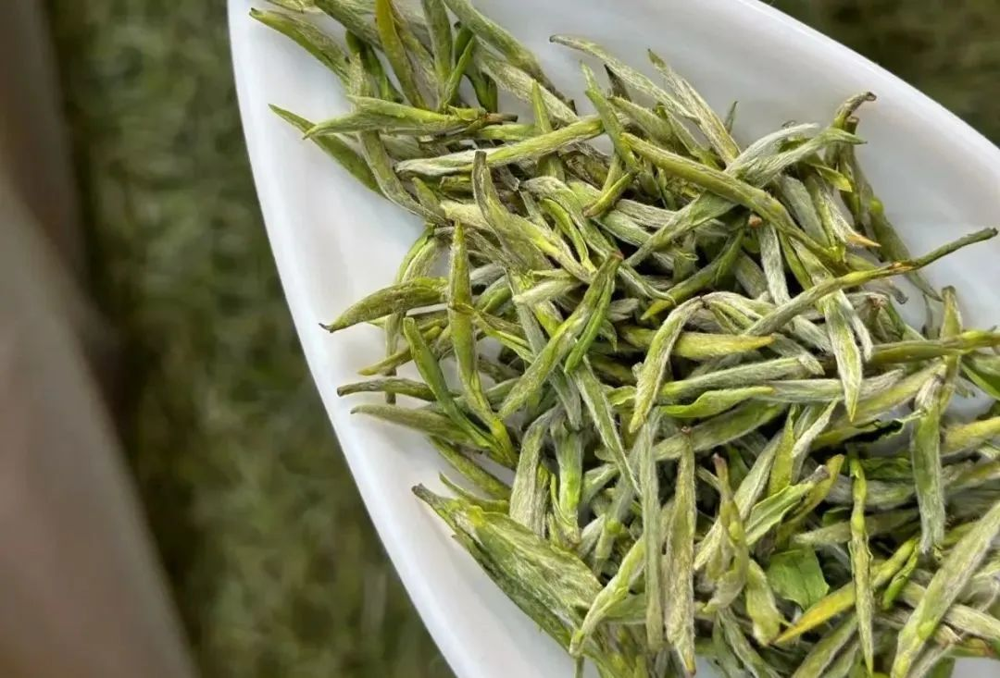
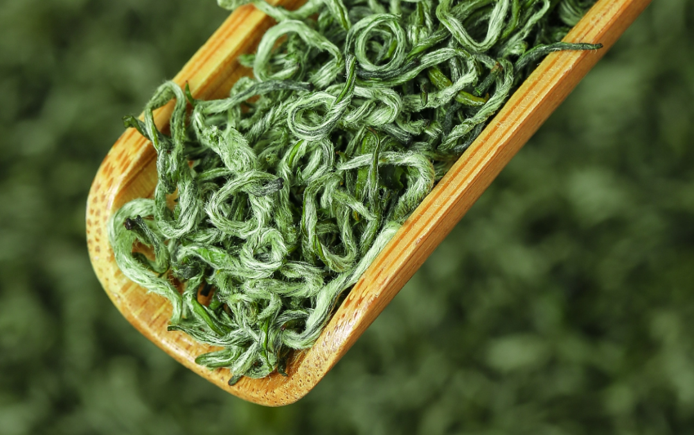
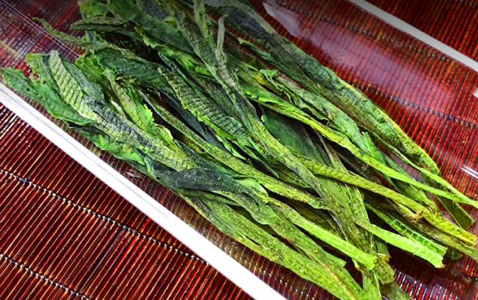
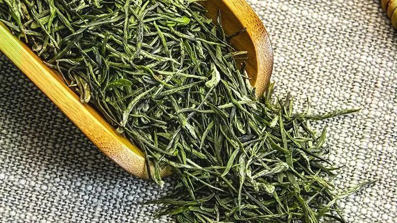
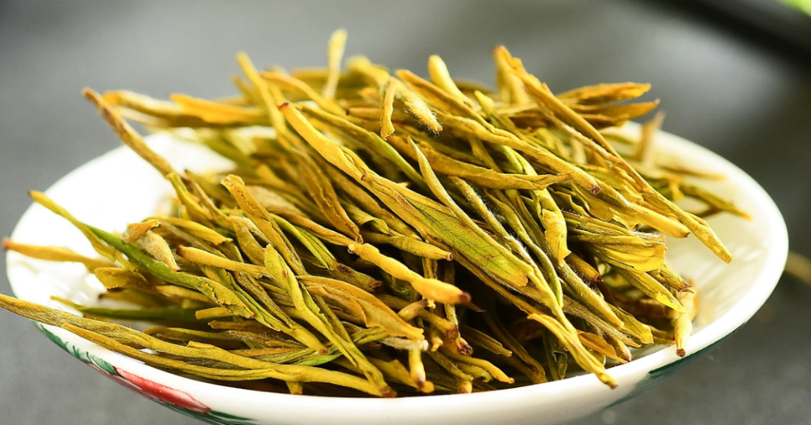

说到绿茶，大家的第一反应肯定是它的清新与鲜爽。的确，绿茶是最具春天气息的茶，一杯清汤绿叶的茶水，闻一闻就神清气爽，喝一口鲜甜甘醇，似乎将春天装进了茶杯里。
但是，不同的绿茶，由于生态环境、茶树品种及加工工艺的不同会呈现不同的香气特征。让我们一起来了解一下吧~

## 绿茶香型由什么决定？

### 1.茶树品种
从茶树品种来说，在相同的加工条件下，不同茶树品种，构成了不同的绿茶香气。举个明显的例子，比如龙井43号、龙井群体种、迎霜、鸠坑群体种等制成的龙井茶，在香气组分上就有不小的差异。

### 2.生态环境
茶树所在的海拔、光照、土壤等都会影响茶叶香气的形成。
比如，高海拔茶园相对云雾较多、低温高湿，漫射光丰富，茶芽生长较缓，比较利于香气物质的积累和形成，一般来说花香比较显著。

### 3.采摘时间
绿茶的采摘时间也有讲究。早春茶的采摘早，嫩度高，香气是清香中透嫩香。而较晚的雨前茶，香气就会比较高爽，部分有花香。采摘过早或过晚，都会影响茶叶的品质和口感，这也是形成绿茶香型的一个重要因素。

### 4.杀青方式
杀青是决定绿茶品质的关键工序，也是香气转化的重要程序。
杀青对于香气的影响，主要体现在不同杀青温度的作用下，会挥发掉小分子、低沸点、气味刺激的醛类物质，从而凸显芳香醇物质。
***因此不同杀青温度会形成不同的香型：低温杀青利于嫩香形成，而高温杀青利于栗香、烘焙香、豆香的形成。***

## 常见绿茶代表香型
### 1.栗香
闻起来像板栗香，也被形容为烘炒香。根据栗香的香气程度和持久度差异，又可分为嫩栗香、板栗香、熟栗香3个细分香型。
通常来说，低温出嫩栗香，香气偏柔和、优雅，多见于原料细嫩的高档绿茶；中温出类似坚果的板栗香；熟栗香则一般出现在火功较高的绿茶中，类似炒板栗的香气。
***板栗香的代表有信阳毛尖、日照绿茶、湄潭翠芽等***

### 2.豆香
豆香在扁形炒青绿茶中经常出现，其中最出名的代表茶就是西湖龙井茶。
而上好的西湖龙井的豆香并不是炒黄豆香，而是豆花香，香气清爽鲜醇，辨识度极高。据《钱塘县志》载：茶出龙井者，作豆花香，名龙井茶，色清味甘，与他山异。这里的豆花香，是一种类似蚕豆花的香气。
这种香型很多时候容易和栗香混为一谈，但相比板栗香，豆香会显得更加张扬，对于嗅觉的刺激也会更激烈一些。

### 3.清香
在未经炒制的烘青绿茶中比较常见，清香型绿茶香气清新淡雅，像雨后翠竹一般清爽淡然，散发着清鲜的春天气息，自然而纯净
***清香型绿茶代表茶有黄山毛峰、安吉白茶。***

### 4.花果香
花果香一般在红茶、乌龙茶中更常见，不过，部分绿茶也有花果香。
比如洞庭碧螺春就有怡人的花果香。有人认为，这是因为茶树中有很多果树，茶叶吸收了果树的香气所以导致出现了花果香。但也有人持不同的看法，他们认为碧螺春的果香是地域香与工艺香以及品种香的结合，这种说法更令人信服。

### 5.兰花香
兰花香在绿茶中比较少见，是部分高档绿茶才会出现的香型，且多出现于采制烘青工艺制作的绿茶之中。兰花香的绿茶香气清幽如兰，沁人心脾。
***比如太平猴魁、顶级的西湖龙井和黄山毛峰等。***

### 6.海藻香
海藻香，是一种闻着类似海藻或海苔的香气，是绿茶中比较独特的一种香型，一般存在于传统蒸青绿茶之中。这是因为蒸青绿茶用高温蒸青杀青的方式，使茶叶中低沸点的芳香物质得到较多的保留，从而形成了独特的海藻香。
***代表茶有湖北的恩施玉露，还有一些日本的蒸青绿茶，例如玉露茶、抹茶等。***

### 7.奶香
通常乌龙茶中比较常见奶香型，在绿茶中也不是没有，那就是被誉为“茶中熊猫”的 **黄金芽** ，因其具有“三黄”特征，即干茶黄亮、汤色明黄、叶底鹅黄，没少被误认为黄茶，但实际上是绿茶。
杀青工艺为烘青，冲泡之后，叶底呈乳白色，而且由于氨基酸含量很高，所以茶汤非常鲜甜，品质高的会有馥郁的奶香。

当然，绿茶的香气可不止以上几种，比如大部分毛尖、毛峰类茶都具有嫩香；茶毫较多的绿茶还具有毫香，比如碧螺春，黄山毛峰等，而且往往一款茶会出现多种香型，还希望茶友们能够仔细去品鉴。
  

  

  

  

  

  

  

  

  

  

  

  

