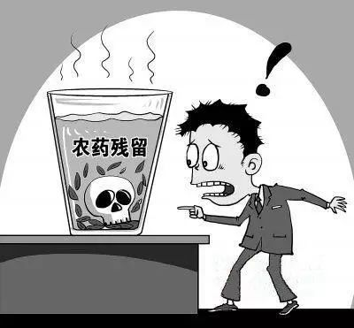

茶的农残问题，该怎么理解？
  这个问题应该是在茶方面最为关注的了。为此，这几天我也请教了多位懂茶专家，翻阅了大量资料，希望能给茶友们做一个客观、全面的解释，尽量做到既不妖魔化农残，又不掩盖真实存在的问题。
  

  农残≠农残超标
  
现实中，很多茶友一谈到茶叶农残就色变，甚至咬牙切齿。其实完全没必要动这么大的火气，农残与农残超标完全是两码事。
只要使用农药就难免会在产品中出现农药残留，国家标准对农产品中的农药残留量有一定的标准，只要残留量在限值之内，就是安全的，虽然这标准目前还远算不上完善，但总是有规可循。
  
想起一句食品安全科普名言说得很好：“离开剂量谈毒性，都是耍流氓。”

  
  大部分农药不溶于水
  
福建省农科院茶科所副所长、植保专家吴光远曾经向媒体表示，大部分农药是脂溶性的，不溶于水。检测所用的是有机化学方法，目的是为了检测出其农药残留量。但用水泡茶时，其农残分解出来的量只是有机化学检测量的10%至20%。所以在理论上，农残标准合格的茶叶泡出的茶水是安全的。
因为要避免所施农药被雨水从叶面上冲掉，所以现在使用的农药大多都是脂溶性的。
  
我国人均饮茶量每天不足10克，加之大部分农药不溶于水，即使茶叶中有少量的农药残留，泡出的茶汤中农药含量极低，通过饮茶摄入的农药也在安全范围内，不会对人产生健康风险。
  
资深茶人施水广也说，茶叶农残在我们的食物摄入量中占比是非常少的，也许喝三天茶，也比你吃一餐无公害蔬菜的摄入量还少。所以好茶之人大可不必为此而纠结。

  

  关于国内标准和国外标准
  
经常有茶友质疑中国的农残检测标准，认为中国的茶叶农残标准过低，不利于国人健康，而欧盟、日本的标准则要严苛许多。调查后发现，这种观点其实是只知其一，不知其二。
  

中国工程院院士、茶学专家陈宗懋介绍，在标准问题上，茶叶生产国和消费国之间会有利益的博弈。欧盟茶叶主要靠进口，倾向于制定更为严格的标准。
  

我国是主要产茶国中农残标准较多的国家之一，如国际食品法典标准中涉及茶叶的农药残留标准有15项，我国已制定27项标准，而印度只有5项标准。所以说，如果茶叶农残符合国家标准，对人体的危害是微乎其微的。
  

欧洲不是茶叶生产国，却是消费大国，他们只能通过提高农残标准来树立贸易壁垒。1999年中国入世后，欧盟连续提高农残标准，检查农药品种从最初的7项，增加到2007年的220项。2006年，日本进口茶叶残留检测项目由71项增加到276项。欧盟对别国要求很严，对自己的农药使用标准却宽得惊人。
  

陈宗懋曾讲过一个故事：氰戊菊酯类农药，在1999年6月30日到7月1日，标准一天之间就下降了100倍。他就质问欧盟的有关专家：“原先的标准与现在的相差100倍，哪一个才是科学的呢？”
  
欧盟专家无言以对，只好说：“用科学解释不清，这是政治和生意方面的事。”一语道破天机！

  茶叶农残超标在我国确实存在
  
说了那么多科学和标准的问题，让我们回到现实吧。不得不告诉大家的事实是，农残超标在我国的确是存在的，而且并不罕见。
现在有些地区的茶农，为了保证茶叶高产，完全置国家的法律法规于不顾，大肆喷洒农药。本来茶叶一般是只采2季的（有些野生茶树只采1季），大量喷洒农药之后的却可以采3-5季。
  
恰如北京马连道茶城市场部主管孙晔所言，目前市场上许多的产品连国家标准都达不到，之所以会出现这种情况，主要问题就出在田间管理上。负责茶园管理的大量分散茶农，并不对自己的产品负责，他们只是出售原料给茶企，为了眼前利益，并不顾及农药的合理使用。
  
孙晔说，茶叶加工企业面对这种原料市场，想要规范根本无能为力，毕竟不可能每一个分散的茶园都派人蹲守。所以，在目前这种茶叶种植情况下，这个问题几乎没有根治的可能。
  
对此，孙晔的建议是，如果实在担心，尽量选择大厂的产品，至少他们会有相对严格的质控，出现农残超标的产品，一般会在出厂前检查出来。
  
还有一种办法，就是找到可靠的源头，从源头直接拿到放心的茶。小懂接触过很多茶农，坚守在自己的一亩三分地里，不求大富大贵，只求对得起良心，做一份好茶。如果能找到这样的人，我们也能喝上放心的、甚至品质更纯正的好茶。
  

好了，说了这么多，希望大家能对茶叶农残有一个客观的认识，喝茶时不必太恐惧。同时也希望，我们国家的农残标准、监控和溯源机制能尽快完善起来，让农残超标无处遁形，让每个人都喝上健康好茶！
  

