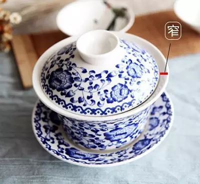
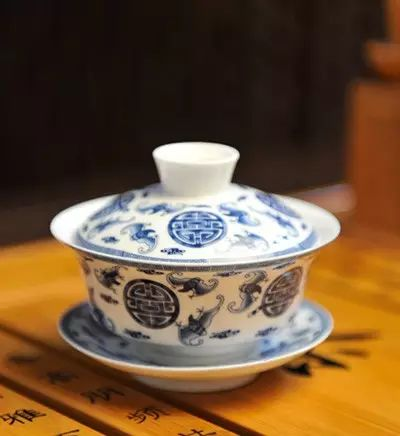
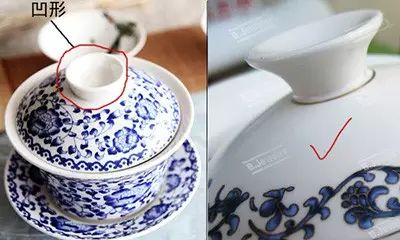
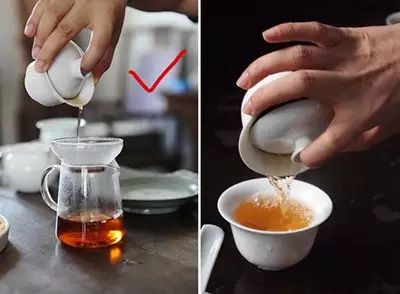
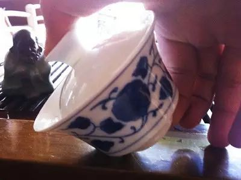

近期，有好几位茶友问到如何用盖碗泡茶的问题。其实，这是一个很多茶友都关注的话题。盖碗几乎可以用来泡所有的茶，使用范围非常之广。
  

悄悄告诉大家，博主平时最常用的茶具也是盖碗哦！什么茶都能用盖碗冲泡，茶叶的形态能看得一清二楚，清洗又方便。今天，我们就来跟大家聊聊如何选购盖碗、如何用盖碗泡茶。
## 如何选购盖碗
首先建议您在选购盖碗时，问清楚店家盖碗的容量。
  
一般 **泡红茶的克数是5克，绿茶是3.5至4克，白茶是3至5克，岩茶、铁观音、凤凰单枞等乌龙茶是8克** 。这些克数是市场上茶叶包装（泡袋装）的标准克数，也是行业里审评茶样时的克数。
  

所以使用 **130CC—145CC** 的盖碗最适合（120cc也可以，不过如果是喝茶偏浓的茶客，比如潮汕人，他们泡的茶多为12克左右，所以130cc的盖碗更能够灵活冲泡茶叶）。
  
容量小，没把握好浸泡时间会泡浓。容量大，水倒太多会淡，如果是女生，手不够大也抓不住。  
  
说完容量，现在说外观，其实任何盖碗都会烫手，即使是行家，也常被烫，但只要选对了盖碗，就能尽量避免。  
  
下图是我找出几个容易烫手的盖碗特点（图片来自网络）  

碗身口与盖子边的距离窄，这样茶水容易溢出烫到手。宽口的就不会，茶杯也一样。
 **  
**

 **从这个角度上看，碗身口是不是比较平。整个碗身看去比较矮。**  
 **使用这种外形的盖碗泡茶，茶水除了容易溢出之外，碗口边的热度也会加高。**  
  

 **还有一个是盖子，左图的盖子标注地方，盖纽** **是凹进去的，盖纽离盖短，手指按在上面其实也烫。** **而右图就不同了，盖纽做的比较高，这里不多描述相信也看的明白。**
## 使用盖碗的技巧
盖碗的好处在于好控制，因为它出水快，洗茶刮沫方便，出水后看叶底，闻叶底能够很直观的表现出来。
其实要控制好盖碗并不难，但前提是要选对盖碗，具体的前面已经说了。
  
然后就是 **茶叶投置到盖碗后，入水只要水盖过茶叶即可，不能过多。** 有的人入水时很喜欢把水倒满盖碗盖住。这样不烫才怪，水太多，泡出的茶也淡。  
  
还是简单的用图片来直观说明怎样拿盖碗不容易烫吧（如下图）  

## 左图拿盖碗的手势不偏不歪，沿着公道杯慢慢向下让茶水缓缓流出。可以很明显的看到茶水并没有触到手。
  
 **右图** 拿盖碗明显偏了，茶水也就会沿着斜的位置流水，这样极容易烫到。而且在倒茶时被烫，不得不停下来，稍微停下来，没倒出来的茶水又会重新在盖碗里浸泡茶叶，这时口感就会有所改变。
  
所以正确的拿盖碗倒茶手势就是像左图这样， **与公道杯要垂直，别紧张。手指不需要太用力抓着盖碗边缘，越用劲其实越紧张，要放松点。**  
  
既然说到盖碗泡茶，那在顺便说下， **好茶不怕闷，如果你遇到一泡茶，你把握不准这茶的好坏，你就让它多闷上些时间，如果只是浓度增加，没有出现其他不足的地方（比如苦、涩）。那这茶就错不到哪里去，有经验的泡茶师会通过控制水温，入水量，出汤时间的把握来把茶叶的缺点掩盖过去。所以，好茶要经的起闷。**  
  

 **  
**
 **最后补充下，** 如果喜欢用盖碗，但拿碗口边又实在怕烫的话，不妨试下这种手势（如上图）。拇指按着盖子纽口，食指按底部。保证不烫。只是没有拿碗口边那样显得优雅些。

  

